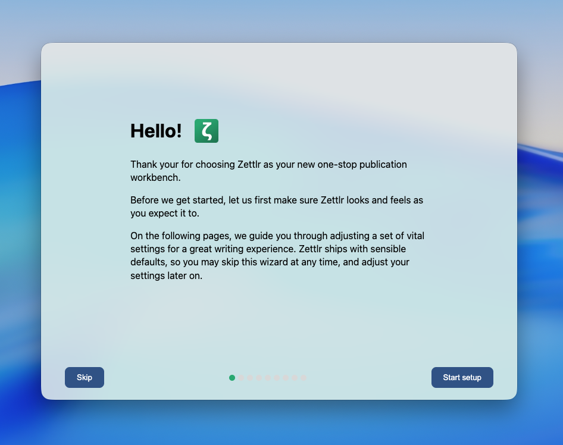
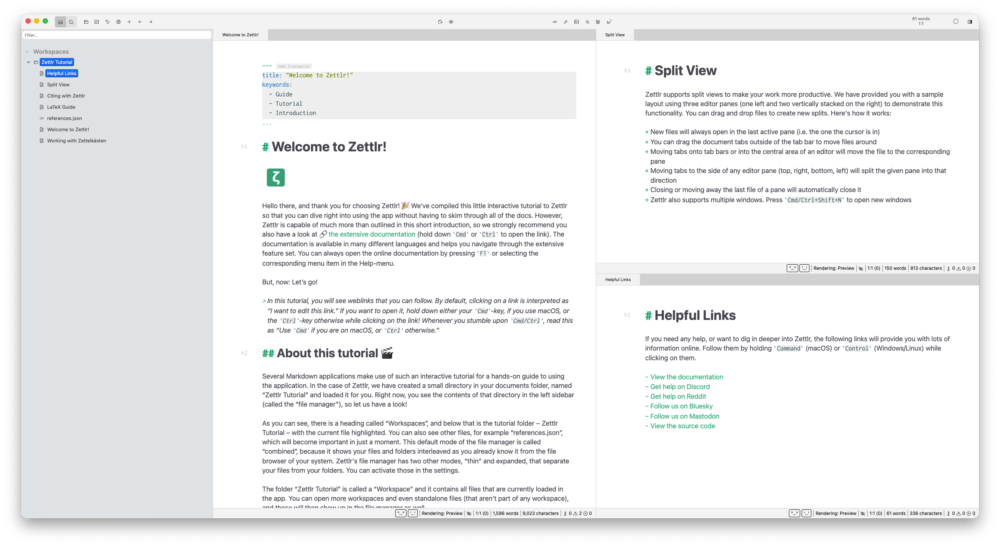

# First Steps

Thank you for choosing Zettlr as your reliable writing companion. We're happy to have you on board. In this document, we provide you with a broad overview over how we imagine Zettlr and guide you through your first interactions with the app. Make sure to also familiarize yourself with the individual concepts more in depth afterwards by visiting the documentation pages we link here. If you have any questions at any point that this documentation cannot answer, please don't hesitate to join our community in the [forum](https://forum.zettlr.com) or on [Discord](https://go.zettlr.com/discord) and ask away!

## What is Zettlr?

Let us first explain very broadly our philosophy behind Zettlr to help you understand how we imagine you using the app. Zettlr is a mature app with almost a decade of work that has shaped its features and design. The app is a product of passion and guided by one central goal: to provide a tool that decisively supports researchers and professional text-workers better than any other tool on the market. It is primarily developed by a group of researchers and open source developers who go to great lengths to validate new features for their usability for researchers and who aim to provide a one-stop experience for authoring texts from the very first idea to the final submitted paper.

Zettlr is a very complex tool that comes with a host of configuration options and capabilities, but the same time, we aim to keep Zettlr extremely simple to use. That means, the route from setup to your first document takes only thirty seconds. At the same time, once you get more proficient with the tool, you will discover many of its features and be able to wield the power of the editor to your advantage. We aim to keep all features out of your way. It is completely possible to use Zettlr as a very barebones note-taking app, but with the addition of custom export profiles and scripting abilities, you can make Zettlr your own and create workflows that give you the ability to produce novel projects with a single click.

We see Zettlr as a community project in which the user comes first. Over time, a large community of researchers has gathered around the app, constantly providing feedback on how well the tool works for the core of its design: writing and publishing papers, articles, and even entire books. We take community serious, and as such it is common to see the lead development team chime in to discussions on Discord or the forum, sharing background on why certain features work the way they do, and answering questions.

All of this means that we see Zettlr as an investment. There is no corporation behind it, so expect there to be a few rough edges. But if you are willing to invest the time to learn the ins and outs of the app, we promise you to take care of your needs. We promise that, as you continue learning how to efficiently work with Zettlr, you will receive continued support, new features, and steady improvements.

## Your First Start with Zettlr

Once you have [installed Zettlr](../getting-started/setup.md) and started the app, it will provide you with an onboarding guide. This guided step allows you to adjust the most important settings very quickly with a few clicks. We highly recommend you carefully move through this dialog to ensure that when you are done, Zettlr looks and feels as you wish. In addition, this setup guide will highlight a few central features the app offers you.

You can also choose to skip this setup wizard and change any setting later after the fact.

::: note
You can't make any mistake here. This setup guide simply changes preference settings that you can change later on in the preferences dialog yourself, if you are dissatisfied with some of your choices in the setup guide.
:::

## A First Glance at Zettlr

Once you have completed the setup wizard, Zettlr’s main window will show. The interface is divided into **three major sections**.

* Front and center is the [**editor area**](../editor/index.md) where you can read and edit your files. As you can see, Zettlr supports viewing multiple documents side-by-side in a [**split-view**](../split-view/index.md). To demonstrate this feature, the app has opened a small tutorial document to the left, and two documents with some helpful information to the right.
* To the left, you can see Zettlr’s [**file manager**](../file-manager/index.md). The file manager is where you can view, search, and manage all your documents, workspaces, and any additional files inside of them. Notably, the file manager is only a view over the files already on your computer. All your data stays in human-readable files on your device, and there is **no vendor-lock-in**.
* Atop of these two sections you can find the **toolbar**, a quick-access way to many of the primary functions of the app. Most of this functionality can also be triggered via [keyboard shortcuts](../reference/keyboard-shortcuts.md), if you prefer.

::: tip The Sidebar
There is also a fourth section, [a sidebar](../sidebar/index.md), to the right. It is not shown by default. You can click the sidebar icon to the right of the toolbar to make it appear. This sidebar includes sections for a table of contents, references, related files, and assets related to whichever file you currently view.
:::

## The Importance of Workspaces

As a new user, it is important to understand that **Zettlr is built around the notion of [workspaces](./workspaces.md)**. Workspaces are simply folders somewhere on your computer that contain all your Markdown documents. Zettlr’s idea is that you create one or more folders on your computer, and place your Markdown documents that you create in Zettlr within these folders. Then, simply load these folders into Zettlr as workspaces.

Zettlr allows you to open arbitrary files, too. Sometimes, you receive a file from a colleague, place it in your Downloads folder, provide feedback on it, send the file back, and then delete it again. These files, which you typically open by double-clicking them in your file browser, will show up under a dedicated “Files” section in the file manager, not as a workspace. These “standalone” or “root” files, as we call them, have fewer features available than workspaces.

Thus, to make the most of Zettlr, we strongly recommend that you designate one or more folders somewhere on your computer as workspaces where you primarily work in. For some inspiration as to what folders you may want to create, the [next section explains workspaces in depth](./workspaces.md).

::: warning
We **strongly** recommend that you regularly back up your workspaces. The simplest method is to use a cloud storage provider (such as Dropbox, Google Drive, OneDrive, or iCloud), and create the workspaces in there. This way, all your files will be automatically backed up. In addition, you should also back up the files onto an external storage device.
:::

## Working Through the Tutorial

Before you dive deeper, we recommend you work through the tutorial. First, read the file titled “Welcome to Zettlr,” and follow the instructions therein. At the bottom, you will see a link to a second tutorial document. In total, there are three such documents, and by working through them, you can get some hands on experience with the app.

After you’re done working through the tutorial, come back here, and continue reading the documentation. Click “Next” to move to the workspaces introduction.
