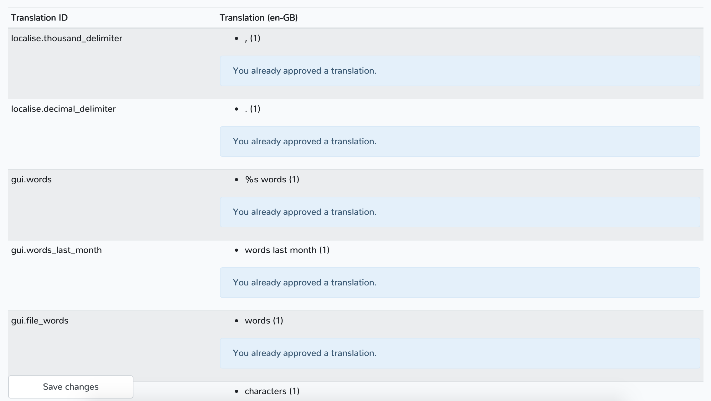

# Get involved

Do you want to make Zettlr an even better app? That's great! Whether you are a user, want to provide a new translation, or get into developing, you've come to the right place!

## General Resources

Zettlr has a vibrant community helping each other all around the net. The following list contains the common places to start for any issue you might have.

* [Zettlr user forum](https://forum.zettlr.com) — Go here to ask general questions, discuss workflows and concepts of Zettlr and even share your custom themes!
* [Zettlr subreddit](https://www.reddit.com/r/Zettlr) — The Zettlr subreddit is meant for the redditors in the community.
* [The official Twitter account](https://www.twitter.com/Zettlr) — Here you can follow the updates to the app in real time. It's the only place where we regularly announce everything we do. Additionally, we engage in most discussions, so if you have questions, you can drop them here.
* [The official Facebook page](https://fb.me/Zettlrapp) — Here you can message us, if you don't have a Twitter account. Normally, we receive notifications and answer asap, but can't promise it. We only have this page because, well — one simply has a Facebook page, nowadays 🤷‍♂️
* [Our YouTube channel](https://www.youtube.com/c/Zettlr) — If you are more like the visual type of person, you can find some introductory videos here.
* [The GitHub issue tracker](https://github.com/Zettlr/Zettlr/issues) — This is the core of our endeavours to make the app better and better. If you spot a bug, have a suggestion or want to propose a feature, here's the right place. Nevertheless, especially when it comes to questions regarding the user workflow or new features, **it's best to discuss your ideas on the forum or on reddit first**.

## User Contributions

As a user who wants a good-looking, well-working writing app, just keep your eyes open for any error the app might produce and, more importantly, tell us how to make the workflow more efficient! We can only judge for our own workflow, so to make the app better for you as well, we need to know how. Always remember: We cannot build a workflow as-is into the design but have to make concessions to other workflows, but we'll try to make features more accessible or working smoother as long as the trade-offs for the existing workflows and the new suggestion are not too hard.

Please report bugs by opening up issues on the GitHub repository. This way we are able to to quickly respond to the report and directly get to handle the problem.

## Translating the App

We welcome any help in translating the app in all languages of this planet. Translations are managed on our Translation Server. To translate, you'll need to create an account, which is only used as an anti-spam measure. Additionally — but only if you want to — you will be credited using your username in all generated translations.

Translating is simple. Just click on any language on the main page to see the list of all identifiers and all existing translations:



On the left side you'll see all translation IDs. They will mostly be self-explanatory. If you don't know where to start, simply have a look at the English translation and at the app. Then you'll know which translation IDs will correspond to which elements.

We've implemented a user-based quality management system in the service, which consists in you being able to vote on existing translations. So even if you don't want to translate yourself, you can look through all translations and vote for the one you deem correct. Whenever somebody downloads a translation, the system will take the best-rated translation strings to ensure all translations are verified by you, our users!

[For more information, please see the short guide to our translation service](https://translate.zettlr.com/welcome).

## Developing

To start developing, simply [fork the repository](https://github.com/Zettlr/Zettlr), work on your features, bug fixes, etc. and then open pull-requests. Please remember to **only PR to the develop branch!** The master-branch is only pushed to once a new release is being drafted. So if you are developing a new feature and a new version of Zettlr is released, you can simply pull the `upstream master` to be up to date again and continue writing your feature.

If you are beginning to develop a feature, it also may be wise to announce that using a new issue to just let the rest know that somebody is already doing it to maximise efficiency!

### Starting to Develop

To set everything up, make sure to start your favourite IDE and spin up your terminal. Zettlr is based on a [NodeJS](https://nodejs.org/)-stack, so you'll need to have the current Node-Server installed on your system, and a Node Package Manager. Zettlr prefers [Yarn](https://yarnpkg.com/), but of course you can also use NPM (this will be installed alongside Node).

Then make sure to initialise everything.

**With Yarn**

```bash
$ git clone https://github.com/Zettlr/Zettlr.git
$ cd Zettlr
$ yarn install
$ cd source
$ yarn install
$ cd ..
$ yarn less
$ yarn handlebars
$ yarn wp:dev
$ yarn reveal:build
$ yarn build:quick
```

**With NPM**

```bash
$ git clone https://github.com/Zettlr/Zettlr.git
$ cd Zettlr
$ npm install
$ cd source
$ npm install
$ cd ..
$ npm run less
$ npm run handlebars
$ npm run wp:dev
$ npm run reveal:build
$ npm run build:quick
```

The second `install` in the source-directory is necessary, because we make use of [electron-builder](https://www.electron.build/)'s [two-directories-structure](https://www.electron.build/tutorials/two-package-structure).
After you run these commands, the successful build can be found in the `release` directory.

### CLI-Commands

Zettlr ships with a lot of useful commands that you can make use of in your development process. Let's list all of them.

> You can run any of these commands either with `npm run <command>` or `yarn <command>`, depending on your package manager. Make sure to run them from the Zettlr main-directory.

* `start`: Starts the application.
* `build:quick`: Quickly builds the app for your operating system (if supported by electron-builder) and outputs it to `/release`.
* `release:this`: The same as `build:quick`, but the app will also be packaged (as a `.dmg`-file on macOS, a `.exe`-installer on Windows, or a Linux package).
* `release:mac`: Explicitly build a release for macOS.
* `release:win`: Explicitly build a release for Windows.
* `release:linux`: Explicitly build a release for Linux.
* `less`: Runs the LESS converter to convert the source files in `/resources/less` to the final CSS files in `source/common/assets/css`. Whenever you make changes to the styles, you should run this command.
* `less:extract`: Extracts all CSS IDs and classes from the source files and outputs them to `/resources/css_list.md`, one per line. This is only used to generate our [Custom CSS reference list](https://docs.zettlr.com/core/custom-css/#complete-css-class-and-id-reference).
* `handlebars`: This starts up the Handlebars precompiler to convert the templates (for dialogs and popups) into those that will be shipped with the app in the directory`/source/common/assets/tpl`. Whenever you change anything in a file in `/resources/templates`, you should run this, lest your changes won't be visible.
* `lang:refresh`: Downloads the most recent version of the default translations `German (Germany)`, `English (United States)`, `English (United Kingdom)`, and `French (France)` from [translate.zettlr.com](https://translate.zettlr.com/) and places them into the directory `/source/common/lang`.
* `reveal:build`: Rebuilds the template for generating revealJS-presentations.

Apart from these commands, there is one "master-command" that we use to run a full release cycle of Zettlr. It resides in `/scripts/make.sh` and is a Shell-command that will run most of the aforementioned commands to generate the installers for Windows, macOS, Debian-based Linux distributions, and Fedora-based Linux distributions. Additionally, it will generate a `SHASUMS.txt`-file containing checksums of all four installers.

> Attention: Currently the Make-script requires Yarn and macOS. It does not work with NPM or on any other platform. This is due to the command to generate SHA256 checksums, which differs between macOS and Linux distributions.

### Project Structure

Now to the real technical stuff: The project's structure! In most respects, the structure adheres to the best practices concerning Electron application development. Nevertheless, the application is _huge_, and therefore you'll need some guidance.

Let's first cover the directory structure (this is a non-exhaustive list; only the folders and files you'll mostly be working on are covered):

```
Zettlr                 // The root directory
|
+ release              // Will be created when you build the app.
|
+ resources            // Contains everything for dev, but won't be shipped.
|  |
|  + less              // Contains the source-files for the CSS
|  |
|  + templates         // Contains the dialog and popup templates.
|
+ scripts               // Contains dev-scripts as mentioned above.
|
+ source                // Contains the actual application source.
|  |
|  + common             // Commonly used files
|  |  |
|  |  + assets          // CSS, Fonts, HB-runtime, images, JS, templates.
|  |  |
|  |  + lang            // Default languages and the i18n module.
|  |  |
|  |  + util            // Utility functions, used around the app.
|  |  |
|  |  + data.json       // Static data for the application.
|  |  |
|  |  + validate.js     // The validation module
|  |  |
|  |  + validation.json // Validation rules.
|  |
|  + main               // The main process files
|  |  |
|  |  + assets          // Assets for the main process
|  |  |
|  |  + commands        // All commands that can be executed reside here.
|  |  |
|  |  + providers       // Contains service providers for the app.
|  |
|  + print              // Source code for the print window
|  |
|  + quicklook          // Source code for the QuickLooks.
|  |
|  + renderer           // The main window code.
|  |  |
|  |  + assets          // Some assets used only in the renderer process.
|  |  |  |
|  |  |  + codemirror   // Contains all CodeMirror plugins
|  |  |  |
|  |  |  + context      // All files needed for the context menu
|  |  |  |
|  |  |  + toolbar      // Contains the toolbar template.
|  |  |
|  |  + dialog          // The modules for all dialogs in the app
|  |  |
|  |  + util            // Utility functions solely used in the renderer.
|  |
|  + main.js            // Entry point of the application.
|
+ CHANGELOG.md          // Contains a detailed list of all changes.
```
