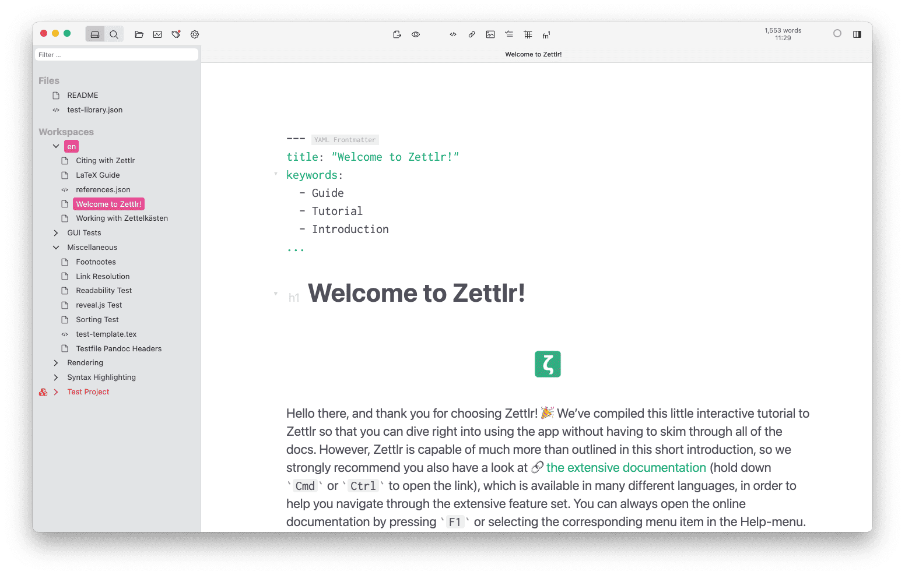

# Getting Started

After setting up Zettlr, you may very likely want to get started with it right away. On the first start, Zettlr will copy a special directory into your Documents folder that contains a very useful interactive tutorial that leads you natively through the first steps with the app. Just follow the instructions there; it will even point you to specific sections of this documentation where you can learn more about the app!

If you have any questions that do not seem to be answered in this documentation, make sure to consult the [Frequently Asked Questions](faq.md) and ask the community on [Reddit](https://www.reddit.com/r/Zettlr/) and [GitHub Discussions](https://github.com/Zettlr/Zettlr/discussions)! We also feature a [YouTube channel](https://www.youtube.com/c/Zettlr/) where we occasionally upload videos on how to use the app and the associated tools.

You can view a series of introductory videos following [this link to our Zettlr HowTo playlist](https://www.youtube.com/playlist?list=PL2ydvDwV-1u5ncnkxQWZhbHQdwpY2fx5f).

> The interactive tutorial will suggest to install LaTeX on your computer. Zettlr depends on LaTeX for exporting advanced PDF files. Without LaTeX you will only be able to export basic PDF files. If you do not intend to export advanced PDF files, you do not need LaTeX. It can be installed at any time, should you change your mind.

All the features used in the tutorial are described in this documentation, so in case you want to read more on them, simply look for the feature here. It is recommended that you follow the tutorial during your first start of the application to get used to different concepts such as the sidebar, the file tree, internal links and the document tabs.

Once you are done with the tutorial, you can either close the directory to unload it from the app or completely delete it, and you can open another folder to work with.
