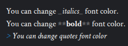
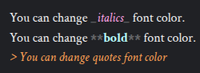
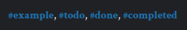
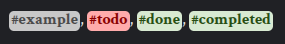
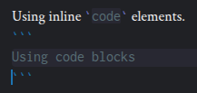
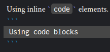

# Custom CSS

Zettlr allows you to fully customize the app’s appearance using Custom CSS ([Cascading Style Sheets](https://en.wikipedia.org/wiki/Cascading_Style_Sheets)). You can find the Custom CSS editor in the [assets manager](../export/assets-manager.md).

!!! warning

    Custom CSS is a feature for advanced users only. There is no official support for customizations, and you perform any customizations at your own risk. Using Custom CSS requires knowledge of HTML and CSS.

If you are unfamiliar with CSS, we recommend that you follow a short [tutorial on CSS](https://developer.mozilla.org/en-US/docs/Learn/CSS/Introduction_to_CSS). There are many guides on the internet, and a quick Google search can also provide you with video tutorials, if you prefer those.

## Writing CSS for Zettlr

CSS allows you to fully customize the appearance, positioning, and geometry of any elements of the app. However, we absolutely advice **against** changing any geometrical properties (move elements around or make them bigger or smaller), since that can cause unwanted behavior. Changing icon or font sizes, or similar sizes, should be fine.

In case some of your changes cause unwanted behavior, and you cannot remove the problematic changes from within the app, you can remove the `custom.css`-file from the app’s data directory. You can find the data directory of your own system by looking at the paths provided in [the setup guide](../getting-started/setup.md).

## Anatomy of Zettlr’s CSS

Zettlr uses primarily identifiers (IDs) and classes to assign styles to elements. Unique elements (such as the file manager) commonly have an ID that you can target, while elements of which there are multiple ones (e.g., tree items in the file manager) usually have classes.

Since the Custom CSS will be loaded last, you can typically target elements easily without being too specific. However, if you need to override a specific rule, you may have to be more specific. In some instances, we apply styles directly to the element (using its style-property). In this case, it may be necessary to use `!important` to ensure your changes get applied. You should generally use `!important` cautiously, since it is a sort of “nuclear option” for overriding CSS.

Now, a few words on some peculiarities of Zettlr’s CSS. To retrieve some global information about the app’s status, you can target the `body`-element. It will get assigned classes based on certain contextual data. Some important classes are:

* `darwin`/`win32`/`linux`: The app is running on macOS (“darwin”), Windows (“win32”), or Linux (“linux”)
* `dark`: If this class is set, the app is in dark mode (`prefers-color-scheme` will also work)
* `fullscreen`: If the body has this class, the app is currently in full-screen mode

Below the `body` element, you will first find a container `<div>` with ID `app`, which is where the entire app lives. This container then has two children, a `<div>` with ID `window-chrome`, which contains the window chrome (including title bar, menubar, and toolbar) and one with ID `window-content`, which includes the window’s content.

Then, depending on which window you are targeting, there are various contents within this content-container. To find them, you will need the developer tools.

!!! note

	Because Zettlr's CSS may change at any time, we do not provide any specific examples for how these contents look, and instead will tell you how to identify what to change below.

## Finding Selectors with the Developer Tools

Zettlr’s styles are subject to constant changes. While they should remain fairly stable, changes can be introduced in any version, and therefore, instead of providing you with ready-made examples, this page covers how you can find the correct selectors easily.

Before you start, make sure to “Enable debug mode” in the preferences → “Advanced.” This option will add a new menubar entry called “Develop” → “Toggle developer tools.” It will also enable a keyboard shortcut for toggling the developer tools. You can press <kbd>Cmd</kbd>+<kbd>Alt</kbd>+<kbd>I</kbd> (macOS) or <kbd>Ctrl</kbd>+<kbd>Alt</kbd>+<kbd>I</kbd> (Windows and Linux).

Once the developer tools are open, you can use them to find elements. To see the HTML structure of the window, choose the “Elements” tab. If the tab does not appear in the tab bar, click the two arrows (`>>`) and select the “Elements” tab from the menu that appears.

Now, the app should look like this:


On the left side, you can see the window contents, while on the right side, you can see the elements tab. You will see that there are two sections in this tab (depending on the size of the developer tools these two section may be stacked vertically): First, the HTML structure, starting with `<!DOCTYPE html>`, and then the styles. As you navigate through the HTML-structure and click elements, the style section will update to reflect the styles of the currently selected element.

!!! tip

	These developer tools are the same as the Chrome developer tools. To learn more about how they work, check out [Google's documentation](https://developer.chrome.com/docs/devtools/overview#elements).

Since the tree-structure of HTML is not always visually obvious from the app’s layout, it is usually cumbersome to navigate through the elements page until you find the correct element. Instead, we recommend the following approach:

1. With the developer tools open, navigate through the app until you find the element that you want to change.
2. Click the arrow in the top-left corner of the developer tools. As you move through the app, various elements will be highlighted. Move over the element you want to inspect, and click the left mouse button.
3. This will now navigate directly through the HTML tree structure to the element you just clicked.

Then click the arrow in the top-left corner of the developer tools. Now you can click any element in the application to focus it in the developer tools. In the bottom area of the developer tools, you will then see the CSS directives used to style all elements of this particular shape.

## Using the Styles Section to Modify Elements

Now that you have found the element you want to change, it is time to test out some changes to the CSS until they work as you wish. For that, you need the styles section in the “Elements” tab. When you have selected the target element, this section has updated to show you all the CSS styles that are currently applied to your element.

There are three broad types of styles. On the top, you will see a section `element.style`. This contains any rules that are applied directly to the element. For example, an element that has the attribute `style="width: 1413px;"` will, in this section, show `width: 1413px;`. This section, therefore, only applies to this *one single instance* of the element. Below that, you will see various CSS rules from various places that apply various rules to elements of this class or ID (for example, `body div.split-view div.view:not(.view-border)` which applies a style to a `div` of class `view` that is contained in a `div` with class `split-view` and does not have the class `view-border`). Often, there are also some cursive styles that say “user agent stylesheet” — these are style rules that come by default with Chrome, and are not contained in any of Zettlr’s CSS files.

You should read the section from top to bottom. Rules that are listed towards the top override rules that are more towards the bottom. For example, if two different CSS rules specify a margin for some element, the one that will be loaded last takes precedence, and thus that rule will be placed more towards the top of the styles section.

To test some changes to an element, we recommend that you write those styles in the `element.style` section. Those rules will then only apply to that single element. You can tweak them, until you are happy. If something breaks, you can reload the app from the “Develop” menu or by pressing <kbd>F5</kbd>, which will reset the styles.

Once you are happy, you should copy those styles into the Custom CSS in the assets manager. As a selector, you should use the rule that best describes which instances of the element you want to target. It is usually one of the rules listed in the styles section. It may take some experience with CSS and customizing Zettlr to reliably find the correct rule. Inside your custom CSS, the new section should look something like this:

```css
body div.class {
    color: green;
    margin: 10px;
}
```

Where `body div.class` is the rule from the styles panel, and everything within curly brackets are the styles you have found to look well.

## CSS Code Examples

In this section, we showcase some examples of what you may change in Zettlr’s styles. This section is neither meant to be exhaustive nor cover your personal wishes. It is only meant to give you some inspiration and show what is possible.

These examples may not work out of the box if we had to change the CSS and forgot to update this section. Should one example not work as expected, please let us know by opening an issue on the [Zettlr Docs Repository](https://github.com/Zettlr/zettlr-docs).

### Using a Custom Editor Font

By default, Zettlr ships with some fonts for its themes that work out of the box and look good. However, you may want to change the editor font to something you find more visually pleasing. Or, if you suffer from dyslexia, you may have the wish to use the Dyslexia font in the editor to be better able to read text.

In the snippet below, replace `<your-font-name here>` with the **full name** of the font you want to use for Zettlr. Please replace `<placeholder>` according to the font:

- In case you want to use a **serif** font, such as Times New Roman, or Georgia, please use `serif`
- In case your font is **sans serif**, such as Arial or Helvetica, please use `sans-serif`
- In case you want to switch to the classic **monospaced** font, please use the placeholder `monospace`

The placeholder will make sure that, even if your font cannot be found, an equivalent font will be used. It serves as a fallback. Also, if your font name contains spaces, make sure to surround it with quotation marks, e.g., `"Times New Roman"`.

```css
.main-editor-wrapper .cm-editor .cm-scroller {
    font-family: "<your-font-name here>", <placeholder>;
}
```

To use the Inter font face, for example, it may look like this:

```css
.main-editor-wrapper .cm-editor .cm-scroller {
    font-family: "Inter", sans-serif;
}
```

### Use Fixed-Width Numbers in the File Manager

If you use dates in your file names (e.g., `2025-12-03 Meeting Notes` or `2025-11-01 Meeting Notes`), you may find that the numbers do not fully line up. You can use tabular numbers to make them line up. The corresponding CSS snippet is simple:

```css
#file-manager {
  font-variant-numeric: tabular-nums;
}
```

!!! note

	The font itself must provide tabular (fixed-width) numbers for this to work. Many modern fonts do.

### Change the Active Line Styling in Typewriter Mode

You can change the styling of the active line in Typewriter mode. Replace `top-border-hex-code`, `bottom-border-hex-code` and `background-hex-code` in the CSS snippets below with your preferred CSS colors. You may want to have different colors for light and dark mode.

```css
/* Light mode */
body .main-editor-wrapper .cm-editor .cm-content .typewriter-active-line {
  border-top: 2px solid <top-border-hex-code>;
  border-bottom: 2px solid <bottom-border-hex-code>;
  background-color: <background-hex-code>;
}

/* Dark mode */
body.dark .main-editor-wrapper .cm-editor .cm-content .typewriter-active-line {
  border-top: 2px solid <top-border-hex-code>;
  border-bottom: 2px solid <bottom-border-hex-code>;
  background-color: <background-hex-code>;
}
```

### Set a maximum width for the text

If you have a large screen, you may find that lines of your text are very long. If you wish to have shorter lines in the editor, with margins on both sides, you can use the following CSS snippet (replace `<preferred-line-width>` with a valid CSS width, e.g., `50vw` or `600px`):

```css
.main-editor-wrapper .cm-content {
  max-width: <preferred-line-width>;
  margin-right: auto;
}

.main-editor-wrapper .cm-gutters {
  margin-left: auto;
}
```

Result:


### Customize font colors

It's possible to change font colors of some markdown elements in other to make them more prominent. Replace `body` with `body.dark` to change the appearance in dark mode.

```css
/* Quotes */
body .cm-editor .cm-quote {
   color: rgba(250, 160, 85, 1);
}

/* Bold */
body .cm-editor .cm-strong {
   color: rgba(182, 249, 250, 1);
}

/* Italics */
body .cm-editor .cm-emphasis {
  color: rgba(255, 165, 230, 1);
}
```

Before:



After:



You can also change the color of Markdown syntax elements, like the `_` for italics or the `*` for bold, making them closer to the background color to reduce distractions. Again, replace `body` with `body.dark` to target elements in dark mode.

```css
/* Bold marks */
body .cm-editor .cm-strong.cm-code-mark {
   color: rgba(204, 204, 204, 0.4);
}

/* Italic marks */
body .cm-editor .cm-emphasis.cm-code-mark {
   color: rgba(204, 204, 204, 0.4);
}
```

Before:


After:


### Customize the Appearance of Tags

You can change the appearance of tags, adding custom colors for each different tag:

```css
/* Generic tags */
body .cm-zkn-tag {
   background-color: rgba(200, 200, 200, 1);
   color: rgba(74, 74, 74, 1);
   padding: 2px;
   border-radius:5px;
}

/* Custom colors for custom tags */
body .cm-zkn-tag-todo > .cm-zkn-tag {
  background-color: rgba(275,171,171, 1);
  color: rgba(138,0,0, 1);
}

body :is(.cm-zkn-tag-done, .cm-zkn-tag-completed)  > .cm-zkn-tag {
  background-color: #d8ead2;
  color: #274e13;
}
```

Before:



After:



### Customize the Scrollbar

You can customize the scrollbar in order to minimize its size at rest, and expand it only when hovering over it.

```css
::-webkit-scrollbar {
  width: 12px;
  height: 12px;
}

::-webkit-scrollbar-thumb {
  background: #ababab;
  border-radius: 10px;
  border: 2px solid transparent;
  background-clip: padding-box;
}

::-webkit-scrollbar-thumb:hover{
  border: 0;
}

::-webkit-scrollbar-track {
  background: transparent;
}
```

### Customize Code Blocks

When using dark mode, code blocks might be harder to read. Therefore, you can customize them to make them more readable:

```css
body.dark .cm-editor .cm-monospace {
   color: rgba(255, 255, 255, 1);
   background-color: rgba(70, 70, 70, 1);
   padding: 2px;
   padding-right: 5px;
   padding-left: 5px;
   border-radius: 5px;
}

.code-block-line {
   background-color: rgba(70, 70, 70, 1);
}
```

Before:



After:

