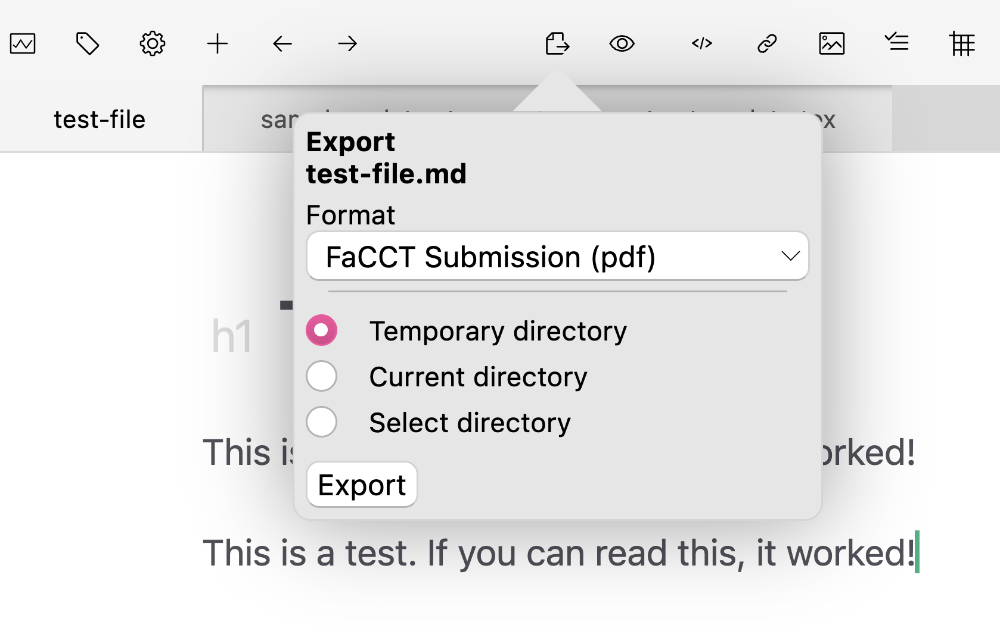

# Submitting to a Journal using a LaTeX Template

One workflow that many users of Zettlr will need is to prepare and submit an article using a LaTeX template provided by a conference or journal. In this guide, we will show you how to add any LaTeX template to Zettlr so that you can write your paper in Markdown and export it to a camera-ready PDF file that you can then submit according to the journal's or conference's requirements.

## Our Example: FaCCT/ACM

In this guide, we will use the current FaCCT (ACM Conference on Fairness, Accountability, and Transparency) template to show you the necessary steps, but of course, this will work with any conference or journal that requires you to use a LaTeX template and submit via PDF.

FaCCT is an Association for Computing Machinery (ACM) conference, so the submission guidelines for the conference will link to the ACM proceedings guide. Thus, we [open the website](https://authors.acm.org/proceedings/production-information/preparing-your-article-with-latex) and download the LaTeX template.

Many LaTeX templates will come as a Zip-file that includes the template itself (a `*.tex`-file), various auxiliary files, and often some example sections to give you an idea of how the template is supposed to be used.

For our purposes, we will download the appropriate [Zip-file](https://portalparts.acm.org/hippo/latex_templates/acmart-primary.zip) and unpack its contents on our computer.

## Move the Files to an Appropriate Location

After retrieving the template, the first step is to find a proper location for it. To make it easier to adapt the template later on, we need to place it in a folder that Zettlr can find. Remember that Zettlr can also open LaTeX files, which will come in handy later. You could use, e.g., a folder named "templates". Copy the entire folder contents over there. Feel free to rename it to a more memorable name.


## Turn the Sample into a Template

Inspecting the template folder, you will see that it **does not contain a single, master template**. Instead you will see that there is a "samples" folder that contains a variety of different example files. We need to take one of these and create an actual template from.

We will duplicate the file "sample-xelatex.tex", but you may need to choose another one. Consult with the conference if you face this situation and ask which template would be the most appropriate to use. Then, move the duplicated file out of the "samples" folder and into the main folder. This is important since LaTeX expects the auxiliary files in the same folder as your template.

!!! note

    Often, the LaTeX-files will contain helpful comments. For example, the ACM template tells you that, "[f]or submission and review of your manuscript please change the command to \documentclass[manuscript, screen, review]{acmart}." Take note of these comments as they may contain important information for your own submission.

Now that we have a "master" template, we have to ensure that it works with Pandoc. For that, we have to place a `$body$` variable somewhere in between the commands `\begin{document}` and `\end{document}`. Many LaTeX templates provide you with some samples to show you how the template is intended to be used.

Remember that, for export, Pandoc will convert your Markdown into LaTeX code, but there are often multiple ways of achieving the same result, and there may be situations in which you'll have to use verbatim LaTeX code in your Markdown files to prevent Pandoc from using the "wrong" commands that the template does not support. If you only write text, this should not be a problem, but be aware that it is a possibility.

For now, since we still have the original sample, we can be radical and delete most of the sample code. Search for the line that contains `\section{Introduction}`, since that is where the actual sample code starts. Delete everything up until the line `\end{document}` everything from in between the document-commands and place a single `$body$`-variable in there.


Additionally, the iteration of the ACM template that we used also includes a reference to an image, "sampleteaser". This teaser image reference needs to be removed as well, because otherwise Pandoc will complain that it does not find the image.

Before continuing to adapt the template, it is a good idea to test out the template to ensure that it works. For that, let us now quickly create an export profile for this and test it out.

## Create a new Export Profile

While you could, in principle, add the template to the default PDF export template, this is not recommended, because this way it would be difficult to export other files to regular PDF files without a specific template.

Therefore, let us first open the assets manager by pressing <kbd>Cmd/Ctrl</kbd>+<kbd>Alt</kbd>+<kbd>,</kbd> and then head over to the export tab.

In the list, search for the "XeLaTeX PDF" template, enter a new name in the filename text field and click on "Rename file". For our purposes, we choose the name "FaCCT Submission".

!!! note

    As the XeLaTeX PDF template is a protected profile, Zettlr has recreated it as soon as you renamed it. However, note that the recreated file will contain only the factory settings. **If you customized your template, you should now copy the entire contents of the "FaCCT Submission" profile and copy them back into the "XeLaTeX PDF" profile to not lose them**.

Now, we can adapt the profile to work with our new template. The only required step is to provide a link to our template so that Pandoc will find it. Therefore, copy the **absolute path** to the template and point the profile to it, for example like so:

```yaml
# ... more contents ...
reader: markdown
writer: pdf
template: /Users/<username>/Documents/Zettlr Workspace/templates/acmart-primary/master-template.tex
# ... more contents ...
```

!!! note

    It is important that you use the absolute path, as Pandoc will always work in the directory of the file you are exporting, which may change depending on the file.

## Test the new Profile

Now let us quickly test out the profile. For this, simply take any file from your Zettlr installation and export it using the profile. You don't have to use a complicated file, a simple one-liner suffices.



The only thing you must ensure is to set a specific frontmatter variable: `pandoc_working_dir`. This is a special property that Zettlr understands for specifying a Pandoc working directory. By default, Zettlr runs Pandoc in the directory where the file you are exporting resides. This is in most circumstances very convenient. However, because we are using a special template, we need to direct Pandoc to use another folder, since LaTeX needs to find all the files that the template ships with.

Using our example path from above, this is what you would need to specify in the YAML frontmatter:

```yaml
zettlr:
    pandoc_working_dir: /Users/<username>/Documents/Zettlr Workspace/templates/acmart-primary
```

!!! note

    Note that you may receive some errors while trying to export, indicating missing packages. [Read this to know how to fix them](../getting-started/installing-latex/#installing-additional-packages).

Afterward, your PDF should open with the contents, but you may notice that there are tons of sample code still in there. This is what we now have to get to:


## Adapting the template further

As you can see, there is still sample code in the abstract section, sample authors, and a sample title. Now that the template works, it is time to polish the template and ensure that you can define all the different information for each submission properly.

!!! note

    In the following, we will not explain too much of what we are doing, since the basics are explained at length in our [documentation on custom templates](../advanced/custom-templates.md). Here we simply apply those guidelines to turn the static template into a dynamic Pandoc template.

First, let us turn the title into a variable. For this, we search for the `\title` directive and replace it with a Pandoc style variable:

```latex
% Replace 
\title{The Name of the Title Is Hope}

% with
$if(title)$
\title{$title$}
$endif$
```

Now you can specify a YAML frontmatter title and it will be used as the title for the submission.

Next, we should ensure that we can properly specify author names in the YAML frontmatter and use them. You will see that the authors are included as such:

```latex
\author{Lars Th{\o}rv{\"a}ld}
\affiliation{%
  \institution{The Th{\o}rv{\"a}ld Group}
  \streetaddress{1 Th{\o}rv{\"a}ld Circle}
  \city{Hekla}
  \country{Iceland}}
\email{larst@affiliation.org}
```

So let us make this proper as well:

```latex
$for(author)$
$if(author.name)$
\author{$author.name$}
$if(author.affiliation)$
\affiliation{%
\institution{$author.affiliation$}
\country{$author.country$}
}
$endif$
$if(author.email)$
\email{$author.email$}
$endif$
$else$
\author{$author$}
$endif$
$endfor$
```

Then you can provide author names in your YAML frontmatter as such:

```yaml
author:
  - name: First Author
    affiliation: Institute for Applied Pandoc
    country: Germany
    email: first.author@example.com
  - name: Last Author
    affiliation: Fairy Department
    country: Iceland
    email: last.author@example.com
```

!!! note

    Note that the ACM templates require the country variable. In these cases, LaTeX will provide an error message. Other templates may be simpler and allow you to get away with less info. Make sure to familiarize yourself with the template.

The last things that we will adapt here are abstract and keywords. There are a few other things, such as the CCS-concepts or the DOI that are out of the scope of this tutorial. With the knowledge from this guide, you should be able to deal with them appropriately.

To change abstract and keywords, we can repeat the steps from above again:

```latex
% Replace
\begin{abstract}
  The abstract text
\end{abstract}

% with
$if(abstract)$
\begin{abstract}
  $abstract$
\end{abstract}
$endif$
```

For the keywords, it's similar:

```latex
% Replace
\keywords{datasets, neural networks, gaze detection, text tagging}

% with
$if(keywords)$
  \keywords{$for(keywords)$$keywords$$sep$, $endfor$}
$endif$
```

Afterward, you will be able to produce the following PDF file using these frontmatter variables:

```yaml
title: This is a test title
author:
  - name: First Author
    affiliation: Institute for Applied Pandoc
    country: Germany
    email: first.author@example.com
  - name: Last Author
    affiliation: Fairy Department
    country: Iceland
    email: last.author@example.com
abstract: |
  This is a test abstract
keywords:
- keyword 1
- keyword 2
- keyword 3
zettlr:
  pandoc_working_dir: /Users/<username>/Documents/Zettlr Workspace/templates/acmart-primary
```


## Final Thoughts

Now you should have all the knowledge you need to create templates for the various conferences and journals you plan to submit to. There is much more that you can do with LaTeX templates, Pandoc variables, and Zettlr.
