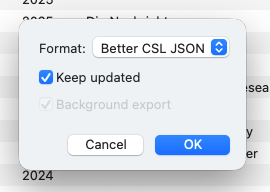

# Reference Manager Integration

In this guide, we lead you through integrating Zettlr with Zotero, one of the most commonly used reference managers. The purpose of this guide is to enable you to cite in Zettlr and have these citations properly show up whenever you export a document or project.

!!! tip

	Zettlr directly supports JabRef, because JabRef works on a plain citation database that you can directly import. The same holds true for BibTeX and BibLaTeX libraries, which are directly supported. This guide only applies for apps that use a database format, like Zotero.

    While this guide specifically targets Zotero, similar steps apply to any other reference manager, too. Essentially, what you will need to do is find a way to export your reference library to a file format that Zettlr understands.

## Step 1: Install BetterBibTex

The first step is to install [the BetterBibTex plugin for Zotero](https://retorque.re/zotero-better-bibtex/installation/). Using BetterBibTex has two important benefits over not using it. First, it keeps all of your citation keys unique across your entire library. Second, it allows you to keep your exported library file up to date so you do not have to re-export it every time something changes.

If you do not utilize BetterBibTex, your citation keys may suffer in clarity, and they may not be unique across all your libraries. However, having good citation keys is a crucial step to make citing easier. Secondly, if you do not use BetterBibTex, you will always have to manually export your library whenever anything changes.

Thus, we strongly recommend BetterBibTex and will assume you have installed the plugin in the next steps.

## Step 2: Export your library

The next step is to export your library into a file that Zettlr can understand. For this, right-click “My Library” at the top of the collection list, and select “Export Library…”

In the dialog that now appears, select as format “Better CSL JSON.” Make sure you check the setting “Keep updated.” This will ensure that the BetterBibTex plugin will always re-export the file whenever something in Zotero changes. This way, if you add new items, or if you fix mistakes, you only need to wait a few seconds for these changes to automagically appear in Zettlr.

Next, Zotero will ask you for a location for this file. We recommend that you pick a folder that is easy to locate. Remember the choice you make.

!!! note

	You can also choose to export the library as either Better BibTeX or Better BibLaTeX. Those formats are also supported by Zettlr. CSL JSON is faster and easier to load, and that is why we recommend this format, unless you have a reason to choose BibTeX or BibLaTeX (e.g., for support with Overleaf).

## Step 3: Load your Library

The final step is to point Zettlr towards your just-exported library. To do so, open the preferences and navigate to “Citations.” Locate the file you just exported.

Zettlr will now automatically open, read, and load the file. Depending on the amount of items in your library, this might take a few seconds. Once this is done, you will be able to reference your citation keys from Zotero in Zettlr and thus cite items.

Zettlr will watch the file for any changes. If BetterBibTex re-exports the file (because you changed a reference item, or added a new one), Zettlr will automatically detect this, and re-read the file to ensure you can always access the most recent changes.