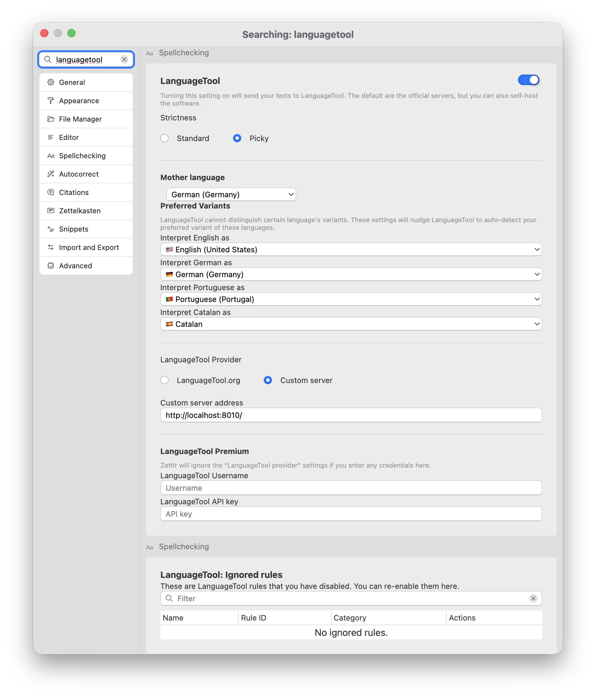
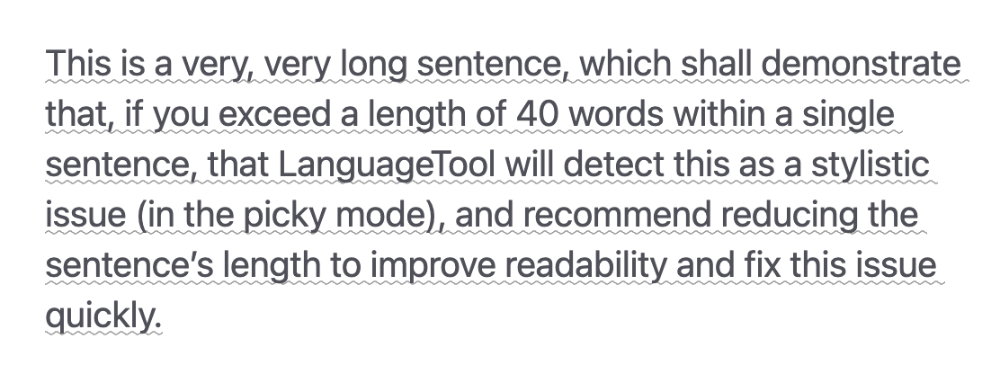
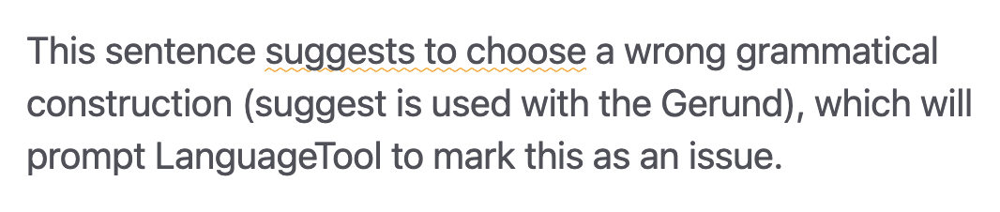
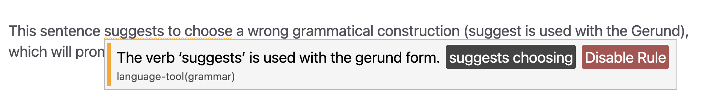

# LanguageTool

Besides a simple spellcheck using dictionaries, Zettlr also features a more comprehensive tool that checks for both misspellings and grammatical issues: LanguageTool.

## What is LanguageTool?

LanguageTool is a service similar to Grammarly. However, unlike Grammarly, it is possible to set up LanguageTool locally. Zettlr integrates with it, as the solution itself is offered as an Open Source-tool.

!!! danger

	By default, Zettlr uses the official servers of LanguageTool. This means that your texts will be transmitted over the internet to LanguageTool.org to check for issues, making the usage subject to [LanguageTool's privacy policy](https://languagetool.org/legal/privacy). To avoid that, you will need to set-up LanguageTool on your computer. [We describe how to do so in our guide](../guides/languagetool-local.md).

    Another benefit of installing LanguageTool locally is that it will also work offline, in trains or on planes.

## Activating LanguageTool

LanguageTool is disabled by default, since it requires an internet connection to the service. Once you activate the corresponding switch in the settings, LanguageTool will begin to check your documents for issues.

To enable LanguageTool, head into the “Spellchecking” section of the preferences.

The section gives you a plethora of options to configure LanguageTool, many of which you may already know from the LanguageTool browser extension, if you use that.

LanguageTool can be enabled with the large switch to the right of the section heading.

Next, you can determine the strictness of the check. Choosing “Picky” will enable a few additional, primarily stylistic rules that can allow for a more thorough check.

In the next section, you can make various language adjustments.

First, you can select your native language, which enables LanguageTool to check for issues that only occur when speakers of a certain language write in another language. The most prominent case of this are “false friends.” For example, a German speaker may confuse the Swedish word “öl” for “beer” with the German word “Öl” for “oil.”

Next, you can select your preferred variants, which is useful for languages with several dialects that can be difficult to distinguish. LanguageTool uses this information to correctly identify, e.g., your English as either British or American.

The third section allows you to pick between the official LanguageTool servers or your own, custom one.

!!! tip

	We strongly recommend setting up LanguageTool locally. We provide an [extensive guide](../guides/languagetool-local.md) for this.

The last section of the main LanguageTool configuration allows you to insert your LanguageTool username and API key, if you subscribe to LanguageTool Premium.

!!! warning

	Leave these fields empty if you run LanguageTool locally. As soon as you enter any text into any of these two fields, Zettlr will automatically switch to the LanguageTool Premium servers, because it cannot distinguish random letters from a valid username/key combination.

The other LanguageTool section on “Ignored Rules” lists any rule that you have disabled from LanguageTool. Remove the rule from this list to re-enable it.

## Using LanguageTool & Features

Once set up, Zettlr sends your text to LanguageTool – either locally, or their official servers – and lets the tool check them.

LanguageTool checks for a broad range of different rules, norms, suggestions, and stylistic choices. Within Zettlr, these are classified into three groups:

* A **gray** line under a word or span of text indicates a mostly stylistic issue that is not wrong, but may improve the readability or tone of your text if fixed.
* A **yellow** line under a word or span of text indicates a potential issue that you should pay attention to for improving your text.
* A **red** line under a word or span indicates almost certainly an error.

An example of a “gray,” or minor issue would be if a sentence becomes too long. LanguageTool will suggest reducing its length, and indicate this by underlining it in gray.

An example of a “yellow” warning would be a potential word duplication or wrong usage of grammatical constructions. Sometimes, this is unavoidable, but LanguageTool highlights this for you.

Finally, an example of a “red” error would be a classical misspelling or if something is definitely incorrect about your text.

Whenever LanguageTool marks an issue, move with your mouse over the affected span of text. This will show a tooltip explaining the issue. Very often, LanguageTool is capable of producing a correction which you can apply by clicking the corresponding action. In the example below, clicking “suggests choosing” would automatically replace the affected phrase “suggests to choose” with the appropriate “suggests choosing.”

Sometimes, you may have a different opinion about certain rules. In this case, you can disable the rule with the red button. If you change your mind or accidentally disable a rule, you can remove it from the list of disabled rules in the preferences.

## LanguageTool in the Status Bar

If you have the status bar enabled, a control is shown to indicate the LanguageTool status.

The control can have three different states:

1. While LanguageTool processes your text, the control shows an hourglass, indicating that it is currently busy checking your text.
2. While LanguageTool is idling, it will show a checkmark, indicating that it has finished linting. It also shows a flag icon indicating for which language it checks.
2. If an error occurs, the control will display it.

You can also click on the control to view a list of all languages that the tool supports. By default, the tool will automatically detect the language, but you can override this here.

!!! tip

	The list of available languages is provided by the server itself. Depending on which version of LanguageTool you use, or if you use the Premium service, this list may differ.

All suggestions produced by LanguageTool are collected in the diagnostics panel. You can see a count of all the various issues in the diagnostics control, which can also open the panel.