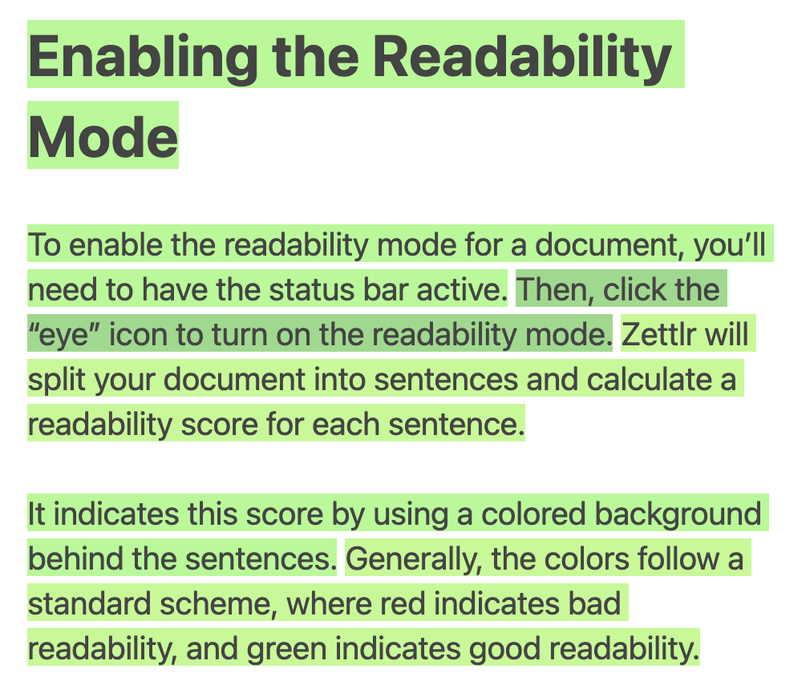

# Readability

Another tool that Zettlr integrates is one to determine the “readability” of your texts. It calculates a “readability” score and assigns a background color for your sentences based on this score.

Readability is a scientific term that originates in the mid-20th century for a set of rules that have been determined to improve the ease with which people can understand a text. Zettlr incorporates four established algorithms to calculate and visualize the readability of your texts.

!!! note

	Since most work on readability comes from U.S.-American education researchers, the mode works best with English texts. Since these algorithms often use word- and syllable-counts, they also generalize to other languages, but they do require a Latin script.

## Enabling the Readability Mode

To enable the readability mode for a document, you’ll need to have the status bar active. Then, click the “eye” icon to turn on the readability mode. Zettlr will split your document into sentences and calculate a readability score for each sentence.

It indicates this score by using a colored background behind the sentences. Generally, the colors follow a standard scheme, where red indicates bad readability, and green indicates good readability.

## Available Algorithms

There is no single metric for readability. In the preferences (“Editor” section), you can select one of four available algorithms to calculate readability scores:

* [Dale-Chall readability formula](https://en.wikipedia.org/wiki/Dale%E2%80%93Chall_readability_formula)
* [Gunning-Fog index](https://en.wikipedia.org/wiki/Gunning_fog_index)
* [Coleman-Liau index](https://en.wikipedia.org/wiki/Coleman%E2%80%93Liau_index)
* [Automated Readability index](http://www.readabilityformulas.com/automated-readability-index.php)

These differ in what they assume to be “difficult” writing, and in the “harshness” of the scores they provide. Not all indices are a good choice for every text. Below, we introduce all four algorithms and provide some guidance.

### Dale-Chall Readability Formula

The Dale-Chall formula was created in the early days of educational research and was authored by Edgar Dale and Jeanne Chall. Its aim was to provide a measurable to determine the readability of texts for school children. It uses a list of 3,000 words that are easy to understand for American fourth-graders and gives a score that approximately ranges from 0 to 10, which roughly translates to the years of education needed to understand a text. That means: If a sentence receives a 10, you'd need a college degree to understand the text, while a sentence with a 1 could be understood by beginners.

!!! tip

    Use Dale-Chall if you are writing texts for a broader audience, as the algorithm will give your text credit for short and concise sentences without pushing you to ridiculously short sentences.

### Gunning-Fog index

Gunning-Fog has been created in the early days of tabloid and easy reading. In 1952, Robert Gunning was searching for a way to make the books and newspapers he was publishing measurable. The Gunning-Fog index returns a score that correlates approximately with the years of formal education required for a reader to understand a text. Still, being a businessman and therefore interested in a high dispersion of his publications, Gunning's algorithm tends to give high scores even to relatively easy to understand texts. If you cycle through the different algorithms, you will note that Gunning-Fog tends to score everything worse than other algorithms.

!!! tip

    Use Gunning-Fog if you want to write short advertisement texts (e.g., for websites) that cannot count on an even basic intrinsic motivation to read.

### Coleman/Liau index

With the plunge of computer prices, computer-aided statistics became a popular option to process huge amounts of data and spit out a meaningful measurable. The Coleman/Liau index is from this era and is an algorithm that does not rely on syllable counts or lists with “difficult words.” Therefore, the Coleman/Liau index is extremely accurate in its implementation in Zettlr. As with the others, it gives a score that approximates the years of formal education needed to comprehend a sentence. Additionally, Coleman/Liau gives reasonable results and does not penalize slightly longer sentences very much.

!!! tip

    Use Coleman/Liau if you need an accurate measurement of the readability of any text. It does not go well with one-word-sentences, but will give reasonable scores even for harder to understand texts.

### Automated Readability Index (ARI)

The Automated Readability Index is in alignment with Coleman/Liau, as it is a newer formula to calculate readability scores based on simple statistical analysis. It is the most “forgiving” of the algorithms and produces reasonable results.

!!! tip

    Use the ARI if you are writing more demanding texts such as academic papers, as it will give better scores even for some difficult sentences.

## A Note on “Difficult Words”

In its own implementation, Zettlr does not ship with a list of easy to comprehend words that the Dale-Chall requires. Instead, it uses a different approach. The list of easy to understand words differs from time to time and, obviously, from language to language. Therefore, Zettlr takes into account another measurable to determine words deemed difficult: Language variance.

Difficult words for Zettlr are defined as being longer than two times the standard deviation of the average word length. As Coleman and Liau have put it in their 1975 paper _A Computer Readability Formula Designed for Machine Scoring_, the length of words is a much better indicator for the difficulty of words than the number of syllables. Therefore, the algorithms can score sentences in any western script language, not only English. You can look up the algorithm explanation [on our readability feature page](https://zettlr.com/readability).

Additionally, Zettlr makes one more change to the algorithms: While all four algorithms were devised to be applied to full texts, the readability mode will take each sentence, one at a time, and therefore leave out their context. In general this approximates the difficulty of the sentence, but obviously may mark some sentences as green that are difficult to understand in their given context, while it will mark some sentences red that still fit into the given context.