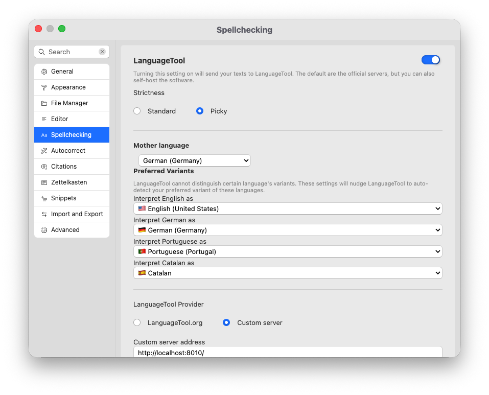

# Spellchecking

Spellchecking is the traditional tool available in almost all writing-focused apps. The easiest way to check your texts for correctness is to use dictionaries. Zettlr supports the common [Hunspell](https://en.wikipedia.org/wiki/Hunspell) standard.

## Activate spellchecking

To activate spellchecking, open the preferences and navigate to the section “Spellchecking.”



This section provides two central settings for spellchecking. First, it allows you to select one or more dictionaries from a table. Second, it allows you to manage your user dictionary.

You can activate multiple dictionaries if you write commonly in multiple languages.

!!! tip

	Zettlr will check each word against all of the active dictionaries. Only when no dictionary reports that a word is correct will Zettlr mark it as a spelling error.

By default, Zettlr ships with several common dictionaries:

* German (Germany)
* English (UK)
* English (US)
* Spanish (Spain)
* French
* Dutch
* Russian
* Turkish
* Ukrainian

You can install additional dictionaries. See the corresponding section further down to learn how to install additional dictionaries.

You can filter the list of available dictionaries by typing a search key into the upper text field.

As soon as you activate a dictionary with the checkbox in its row, Zettlr will load the dictionary and start checking your texts against it.

!!! note

	Loading a dictionary may take a moment. Especially larger ones may make the app briefly unresponsive.

## Disable spellchecking

To disable spellchecking, simply disable all dictionaries via their checkboxes. If there are no dictionaries are activated, Zettlr won't attempt to perform spell checking on your texts.

## Custom Dictionary

You can also add words to your own custom dictionary. To add a word to your dictionary, right-click a marked word, and select “Add to Dictionary.”

To remove words from your custom dictionary, go into the preferences and into the “Spellchecking” section. Here, you can remove words from your user dictionary.

## Adding New Dictionaries

To add additional dictionaries, you'll need to search for Hunspell-compatible dictionaries. In essence, such a dictionary consist of a folder containing two files – a `.dic` file and an `.aff` file. The `.dic` file contains all words in a language with so-called affixes, e.g., features of the word. The `.aff` file contains the definitions of these flags.

An example folder structure for the Italian dictionary would be:

```
it-IT /
  it-IT.dic
  it-IT.aff
```

A good starting point for finding suitable dictionaries is [this repository by the GitHub user wooorm](https://github.com/wooorm/dictionaries). Simply download one of the folders to your computer. Then, in Zettlr, click “File” → “Import Dictionary….” This will open up your computer's file browser with the `dict` folder in Zettlr open. Copy the whole dictionary folder that you just downloaded into the `dict` folder. Then you can select this dictionary from the settings.

Bear in mind that Zettlr will perform some basic tests to determine whether a dictionary is valid. To have Zettlr display the dictionary and being able to select it, the dictionary must follow the following rules:

1. The folder containing the `.dic` and `.aff` files must be named using the corresponding [BCP-47 tag](https://tools.ietf.org/html/bcp47) of the language the dictionary contains. Although you may not be aware of the term “BCP-47,” it's a very common language tag. The German dictionary would be named `de-DE` (for “German German”) or `de-CH` (for Swiss German), or simply `it` (for Italian).
2. Inside this folder, at least two files must be present: a `.dic` file and an `.aff` file. These must be named either using the BCP-47 tag of the folder, or `index.dic`/`index.aff`.
3. The dictionary folder can contain other files (such as a list of authors, or a LICENSE). These will be ignored.

To sum up, Zettlr will make sure a dictionary is valid by checking that the following paths exist:

- `bcp-47/bcp-47.dic` and `bcp-47/bcp-47.aff` _or_
- `bcp-47/index.dic` and `bcp-47/index.aff`
