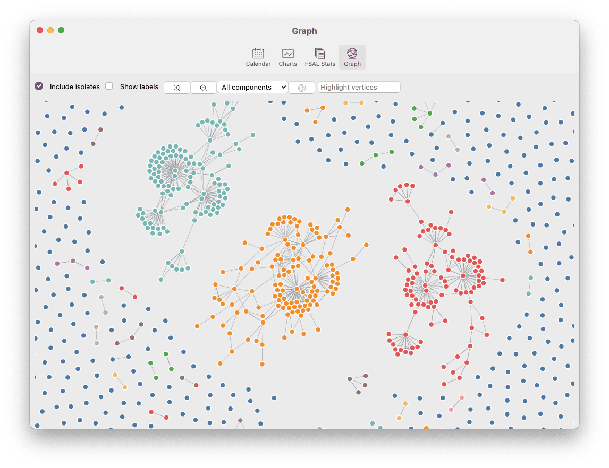
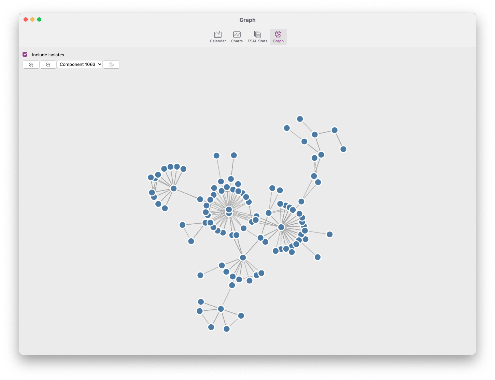

# Graph View

As other applications, Zettlr features a graph view that allows you to view the network that you have created by interlinking your files. This can help you spot clusters as they emerge, find ways of connecting separate components, and gain an overview over all of your files.

!!! note

    Graphs and networks are different kinds of beasts. They can be very powerful, but they can also act as a Rorschach test where you spot patterns that are not there. For a general introduction, we warmly recommend you to read [What is the point of a graph view?](https://www.arthurperret.fr/blog/2022-02-13-what-is-the-point-of-a-graph-view.html) by Arthur Perret as well as -- for a more cautious notion -- the article [Quo Vadis, PKM?](https://www.hendrik-erz.de/post/quo-vadis-pkm) by Hendrik Erz.

## What is a graph?

First, let's start with a crash course in network science. A graph view of a personal knowledge management system (PKMS) database is only loosely related to empirical networks such as social networks, but it can help nevertheless.

A graph is mathematically defined as a set of **vertices** (or nodes), which are connected by a set of **edges** (or links). Edges are called **arcs** when they are directed. Vertices can be either connected to a single other vertex (a dyad), to two other vertices (a triad), or more than that. Vertices can also be isolated, i.e. unconnected. A cluster of connected vertices within a network is called a **component**. Furthermore, a graph can be either **directed** (that is, the arcs between two vertices have a direction, i.e. the arc from A to B is not the same as the arc from B to A) or **undirected** (meaning that the edge from A to B also implies the edge from B to A). A graph can also be **weighted**, in which case its edges will have some number attached to them. Finally, a graph can be either simple or **multiplex**. A multiplex graph does not just have one type of edge, but multiple.

If all of this now sounds very abstract, let us put examples to the definitions:

* Each **file** that is loaded in Zettlr is a **vertex**
* Every **link** between two files is represented as an **arc** (= directed edge) from file A to file B
* A **backlink** then also creates the opposing **arc** from B to A
* A link **weight** could be the amount of times file A links to file B (if you link from several parts of your file, for example)
* A **multiplex** graph would imply that files can not only be connected by links, but also by, e.g., shared keywords or some other feature

There is much more to networks, but for now, we will leave it to that. Feel free to read further online if you're interested!

## Zettlr's graph implementation

Zettlr now implements a subset of the available features to create a graph. Specifically, as of now it will …

* … create one vertex per file that is loaded in Zettlr
* … create one edge per link from one file to another
* … treat all links as *undirected* and *unweighted*

Under the hood, Zettlr uses the library D3 to facilitate the actual rendering of the graph. We utilize a force directed layout (however, not Fruchterman-Reingold, for those who have some experience with network visualizations) that tries to place the different nodes in a way that they don't overlap and that you can see clusters.

!!! warning

    The actual placement of the vertices as well as the distance to other vertices **does not have any inherent meaning**!! This is very important to remember: Only the edges between the various vertices have meaning, not their positions or distance!

## Opening the graph view

The graph view is currently not available via a prominently placed button. You can access the graph view by opening the statistic information window found in the toolbar and navigating with the "more statistics..." button to a seperate window shown in the screenshot below. 

## Interacting with the graph view

Interacting with this network is possible in a number of ways. Hovering over a vertex in the network will show you a tooltip that tells you its filename and which component it belongs to. Click on a node to have it open in your main editor. This way you can keep the graph view open to the side of the main window and navigate your files this way.

Additionally, there are a few controls you have available to customize the display of the graph.

The first checkbox determines if **isolates** are displayed. Especially if you are interested in specific clusters of nodes (components), if might be wise to exclude these isolates, since it makes the visualization much cleaner.

The second checkbox allows you to permanently display the labels next to the vertices. However, especially in dense networks, this can be chaotic, hence it is off by default.

The two zoom buttons allow you to zoom in and out of the graph to gain a bird's eye perspective of your network, or to focus on a specific part of the network.

As you link more and more files back and forth, it might make sense to only look at one specific component that has formed. The dropdown menu next to the zoom buttons allows you to filter for specific components. The number of the component itself is not meaningful (the underlying community-detection algorithm just lists the components in the order of detection), but the list is sorted by the **size** of the component. The biggest components will be at the top of the dropdown, whereas the smallest components (i.e. the dyads) are at the end.

After the dropdown, you will notice a "target" button. This button recenters the view on the graph back to the origin.

The last element is a text field that allows you to filter the vertex. The text you type here will be matched against the absolute paths of the individual files, with those not matching being dimmed, and those matching being highlighted. Additionally, the graph will automatically move the viewport to the center coordinates of the matched elements.
