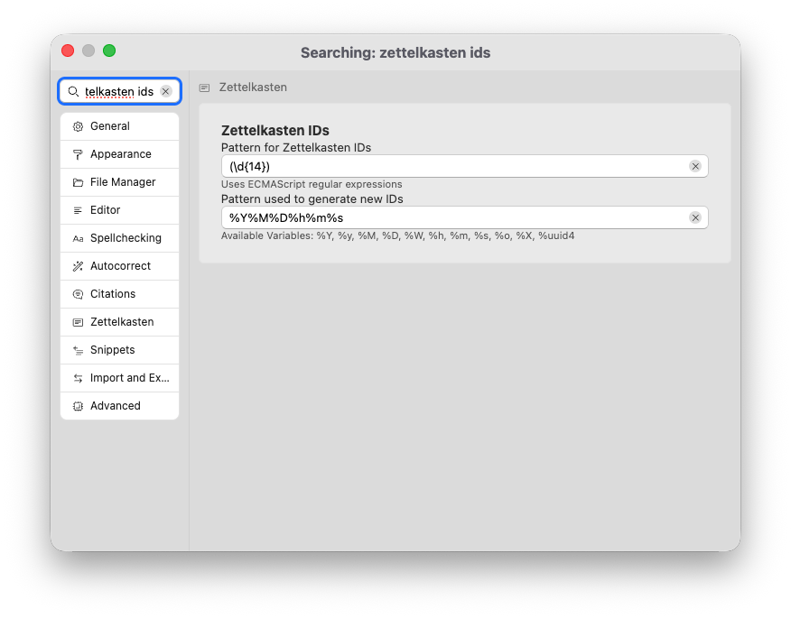
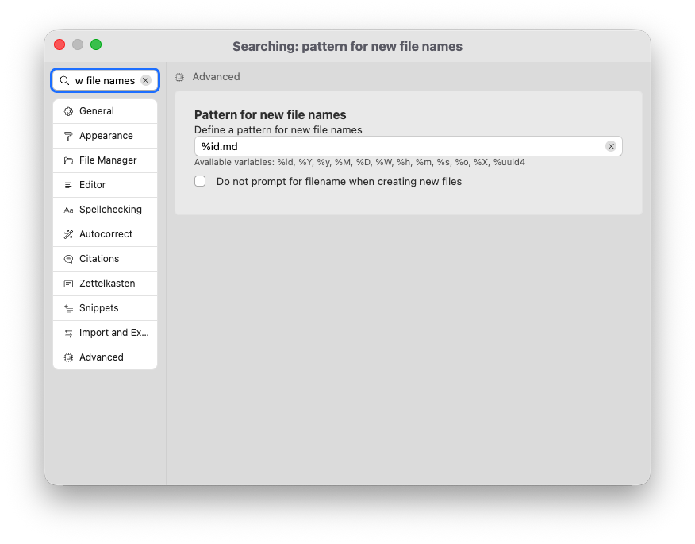
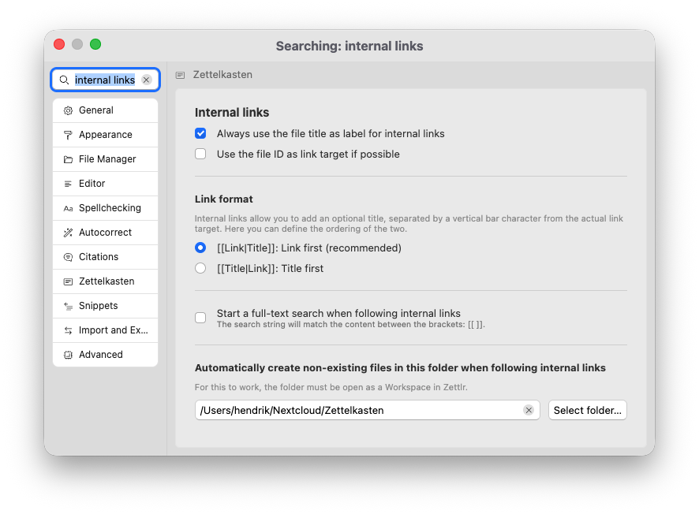

# The Zettelkasten method

The idea to write Zettlr came to my mind several years ago, when we were trying to elaborate on good workflows for academic writing. We tested a lot of different styles and workflow ideas, and one that stuck was the Zettelkasten method. The problem back then was that most of the software did not really succeed in implementing it. But nowadays, there are more and more applications that support some variations of this method.

Originally, the method stems from the German sociologist Niklas Luhmann, who, in an effort to remember everything he's ever read or thought, designed his own (back then analog) Zettelkasten containing cards with some information and numbers on them. The numbers could be used to locate other cards with other information that was in some way related to the content of the card. This was a way for Luhmann to reference back and forth between a set of cards and, as the box filled up with more and more cards, allowed it to somehow get “alive,” showing him connections between certain concepts that he himself had not thought about.

The basic idea, therefore, is to let you create relationships between small notes (or, for that matter, also long files) that enable you not only to move back and forth between files, but also to identify relationships that emerge in your files.

## Manage a Zettelkasten with Zettlr

Three central functions are available in Zettlr to start your Zettelkasten:

1. Generating IDs for files
2. Linking searches and files
3. Tagging files

## File IDs

In order to create links between files, consider first whether to use IDs or file names. You can create links in Zettlr between files using either.

The benefit of file names is that they are self-explanatory. The drawback is that you cannot change the file title, if the content of the note turns out to be slightly different from what you thought it was when you created the file.

That’s why IDs can be a good remedy. By naming files using only numerical IDs, you detach the file ID from its content — the title of the note can change, but the ID remains the same.

By default, Zettlr uses the current timestamp for IDs, in the format `YYYYMMDDHHMMSS`. You can adapt this format in the preferences → “Zettelkasten” → “Zettelkasten IDs.” Here, you have two options: First, you can determine how Zettlr will generate new IDs, and second you will need to tell Zettlr how to detect such IDs.

This ID pattern will be used for new filenames, although you can adapt this in the preferences. Using the setting “Advanced” → “Pattern for new file names” you can change the default suggested filename for new files. By default it generates a Zettelkasten ID, but you have other options.

If you like to give your files descriptive file names, but still want to add IDs to them, make sure that your file is focused and then press <kbd>Cmd/Ctrl</kbd>+<kbd>L</kbd> to generate a new ID and insert it at the cursor position.

!!! tip

	Zettlr recognizes IDs (using the ID pattern in the preferences) both in the filename and in the file’s content. The first ID found will take precedence. You can also generate IDs when using snippets by using the variable `$ZKN_ID`.

## Linking Files

With the question of file identification answered, the next question is how to connect files. Zettlr supports two types of links: **implicit links** based on shared keywords, and **explicit links** via wiki links (or Zettelkasten links, or internal links).

### Linking Files Implicitly via Keywords

As you write your notes, add keywords to your files to classify them using these tags. You can add keywords in one of two ways.

First, you can add a tag using the common Twitter-style hashtag format. A `#`-character followed by letters, numbers, and a few other characters will be interpreted as a tag. Zettlr provides syntax highlighting to indicate what it will determine to be a tag. You can hold down <kbd>Cmd/Ctrl</kbd> while clicking on a tag to start a search for other files that have this tag.

Second, you can add your tags or keywords to a file using a YAML front matter. This has benefits, and drawbacks compared to simple Twitter-style hashtags. The benefits include that these keywords won’t show up in the note content directly, but are still associated with the file. Also, you can use spaces in these keywords. The drawbacks include that you can’t easily search for these tags by clicking them and that it takes a little longer to insert such hashtags.

You can view all your tags in the tag cloud. Open it by clicking the corresponding toolbar icon. Furthermore, you can manage your tags in the tag manager. This includes renaming or replacing them.

### Linking Files Explicitly via Links

The second option to link files is to create explicit links between them. Such links are known by the names “**wiki links**” (because they use the same syntax as Wikipedia uses), “**Zettelkasten links**” (because they are primarily intended to be used for Zettelkästen), or “**internal links**” (because they require contextual knowledge by the app on where to find files).

To insert such a link, start by typing two square brackets: `[[`. This will open an autocompletion that lets you search for a file, and link to it. Start typing to filter the list of suggested files, and accept a suggestion via <kbd>Tab</kbd>. This will insert the link.

Zettlr supports link titles for such internal links. These are separated from the link target with a vertical pipe character (`|`). Because it is not obvious from the context which of the two parts of a link is the link target, and which is the link title, you need to specify this in the preferences. To do so, go to “Zettelkasten” → “Internal links.” In the “link format” section you can choose how Zettlr views your links.

!!! tip

	Most systems that support internal links follow the common link-first-syntax. Only a few systems implement a title-first syntax. If you don't know which one to use, keep the setting at the recommended link-first syntax.

The two additional settings help you determine how Zettlr will autocomplete your links. The setting “Always use the file title as label for internal links” means that Zettlr will automatically complete an internal link to `[[filename|file title]]` when you accept a suggestion. Otherwise, it will not add a title, and complete only to `[[filename]]`.

The setting “Use the file ID as link target if possible” means that Zettlr uses the ID of the file if applicable, instead of the filename. This allows you to use descriptive filenames without running into the risk that your links break when you rename the file.

## Zettelkasten Directory

It is customary to have one folder into which all your notes go. You can specify one in the preferences. Once you have specified this directory, you can create links to notes that do not exist yet. For example, as you are writing a note, you may decide that you probably need a note on a related concept which you do not yet have.

When you click while holding <kbd>Cmd/Ctrl</kbd> on such a link to a file that does not yet exist, Zettlr can automatically create a new note with that name for you. For that, you need to tell Zettlr which folder you designate for your notes.

You need to have this folder open in Zettlr for this feature to work.

