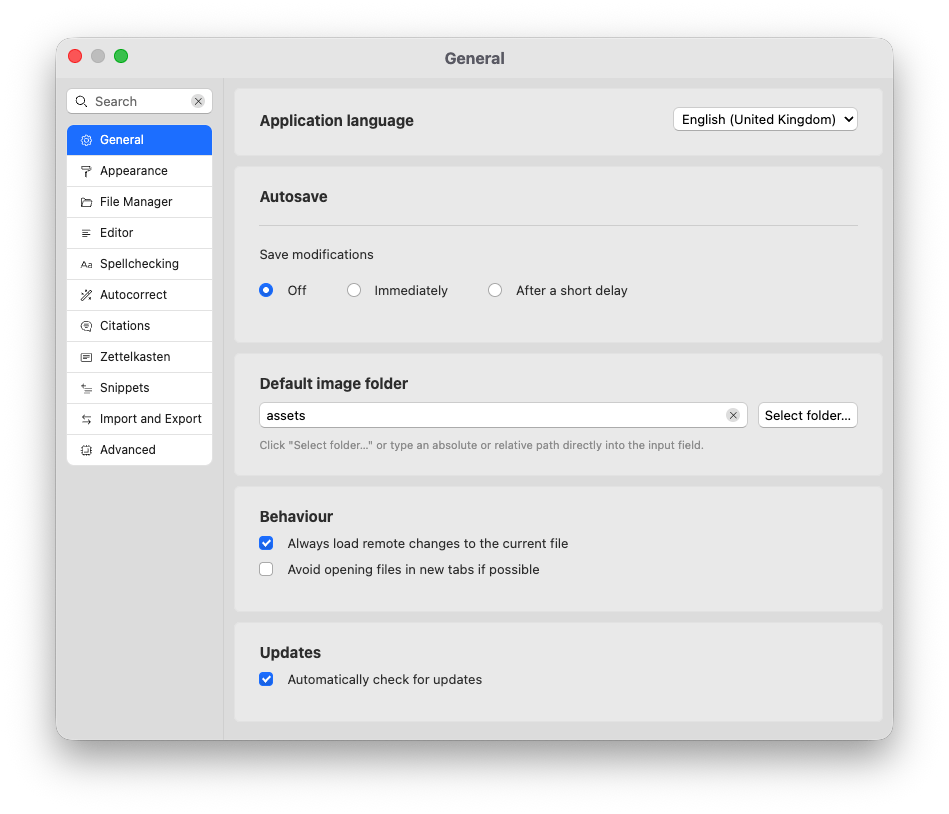
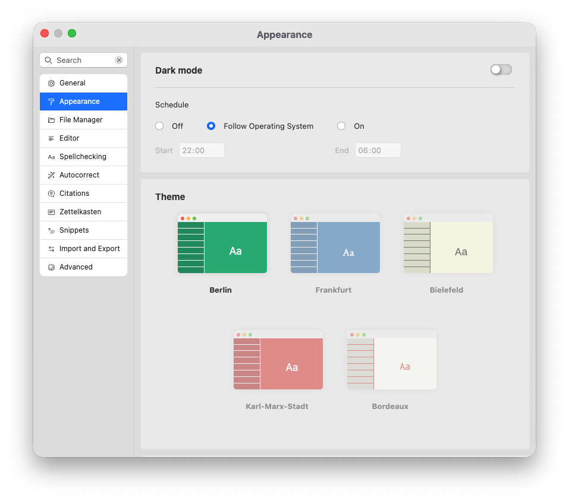
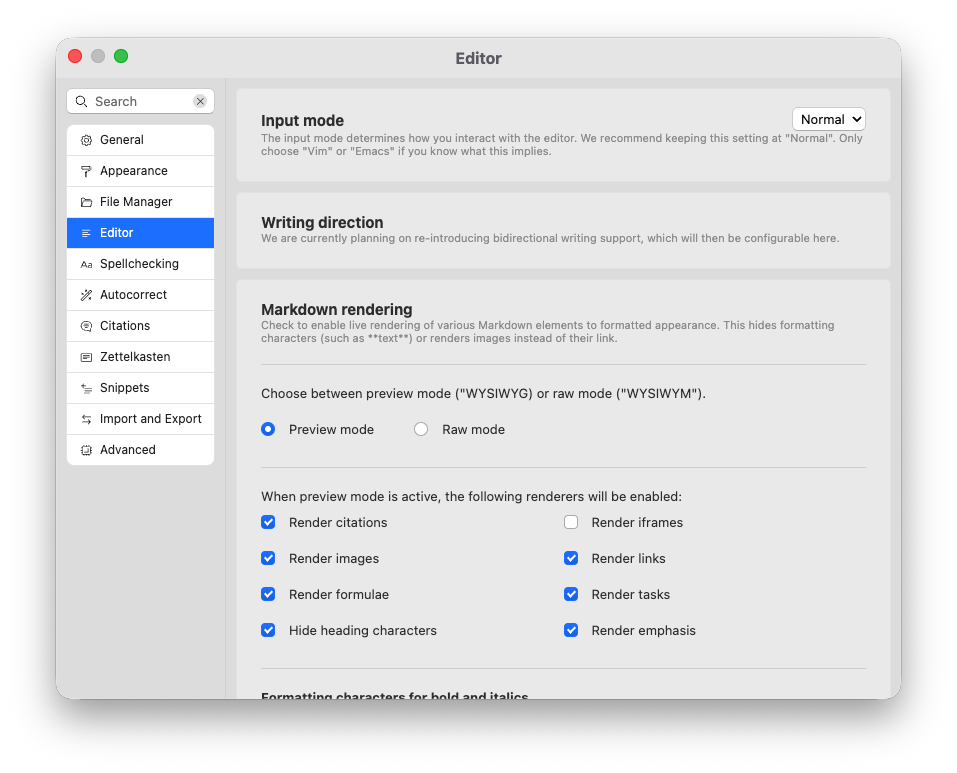
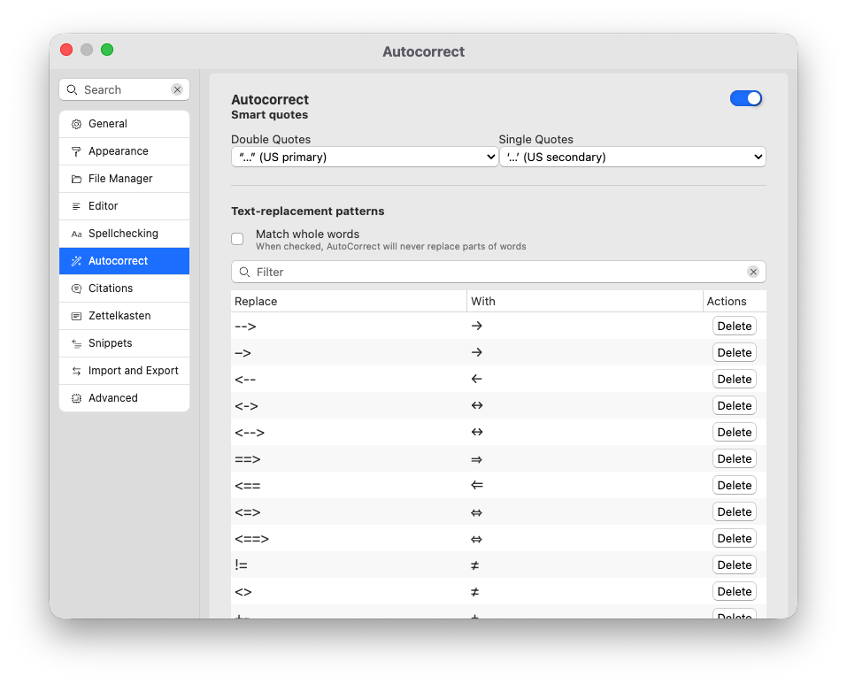
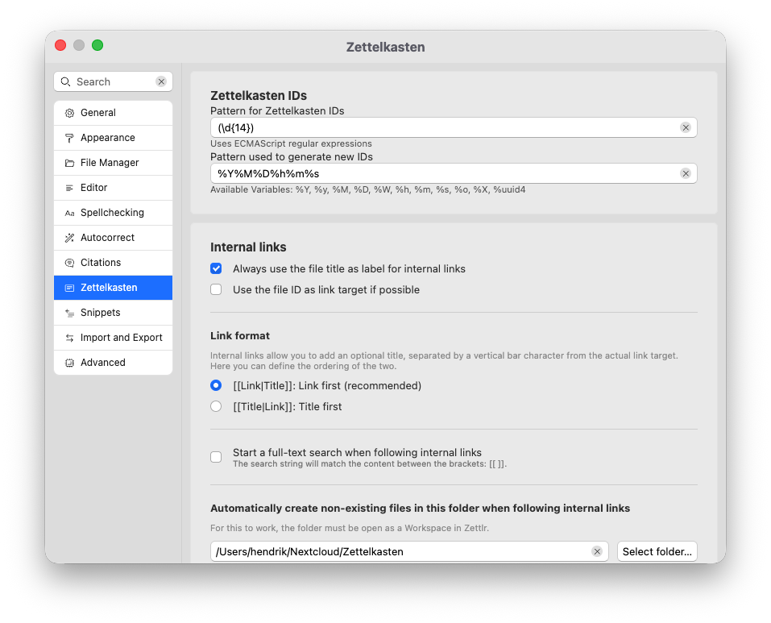
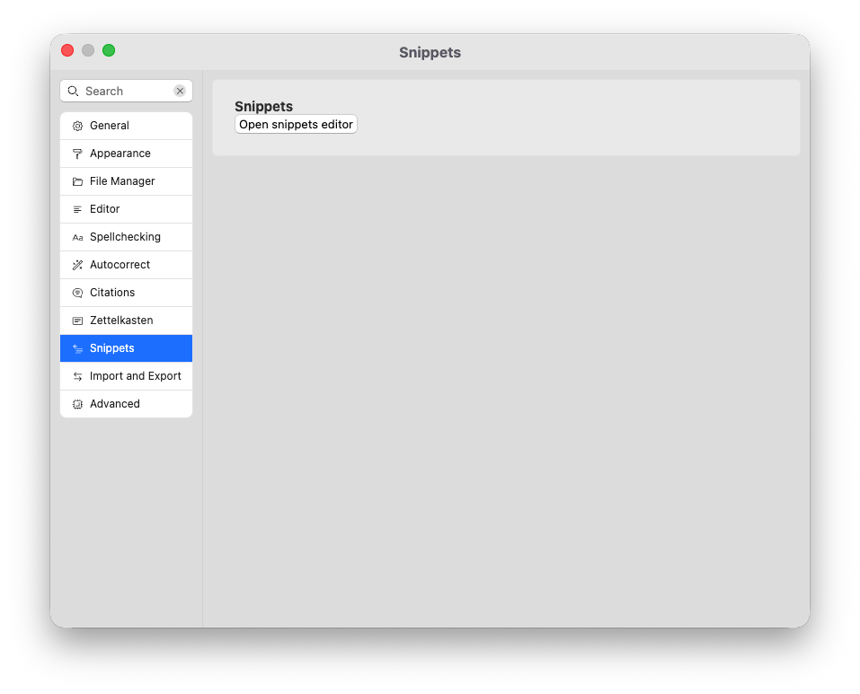
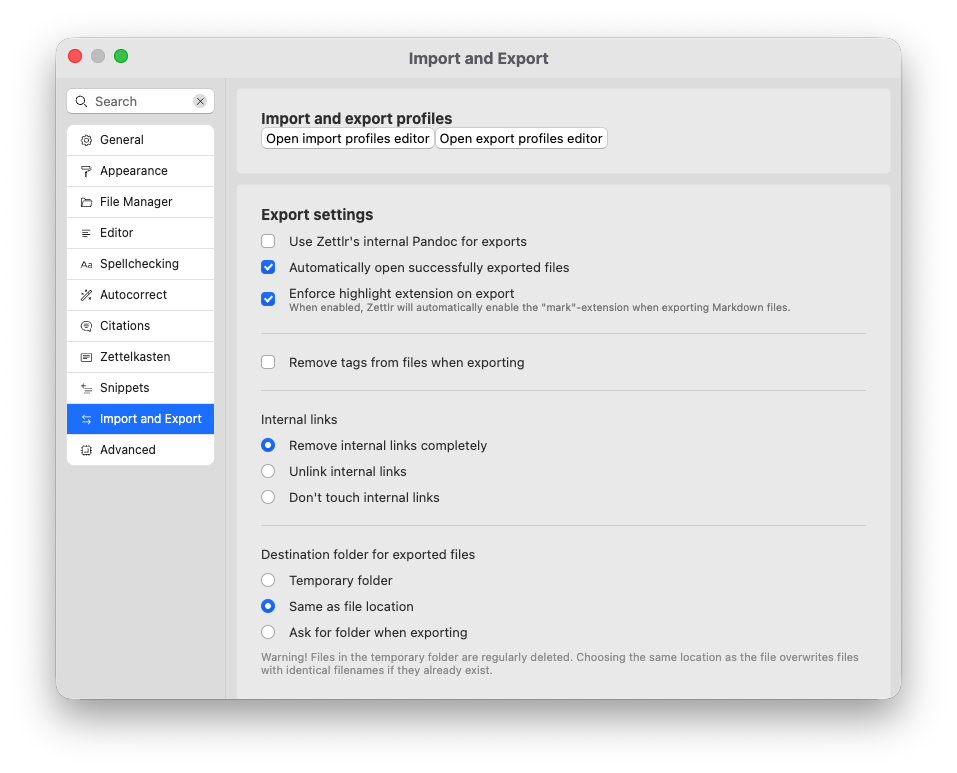
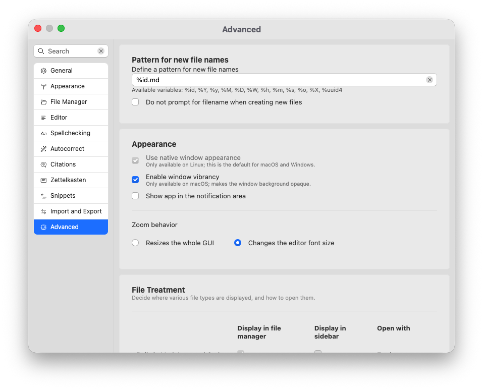

# Settings

In this reference document, we describe the various preferences Zettlr has.

## Navigating the Preference Window

The preference window groups all available settings by categories and settings “cards.”

You can navigate the window in one of two ways. You can click on the categories in the list to the left and then scroll through all settings that are part of this category. Or, you can enter a search term in the search bar to filter all settings based on their text content.

In the following, we describe each setting based on their categories.

!!! note

	The settings may be called differently in your language.

## General

General, app-related settings.

Application language

: Sets the language used for the entire app. Requires a restart.

Autosave

: Determines whether you need to manually save files using <kbd>Cmd/Ctrl</kbd>+<kbd>S</kbd>, or whether Zettlr will automatically save the files aggressively (“immediately”) or with a short delay. The latter will need less resources.

Default image folder

: Specify a relative or absolute path that will be assumed to be the default image folder. The default, “assets” means that Zettlr will save images into a folder “assets” relative to the Markdown file in question.

Behavior

: Sets some general behavioral settings for the app. “Always load remote changes” means that Zettlr will automatically reload any external changes to documents currently open in its editors. If turned off, you need to confirm whether changes will be reloaded. The setting “avoid opening files in new tabs” will replace the currently open document when you open another one.

Updates

: Controls whether Zettlr automatically checks for new updates. *Please disable this setting, if you have installed Zettlr via a package manager. The package manager will be able to update Zettlr for you.*

## Appearance

Controls the visual behavior of Zettlr.

Dark mode

: Controls whether the app will use a dark theme, or a light theme. Use the schedule setting to determine if Zettlr automatically switches between light and dark modes. “Follow Operating System” means that Zettlr will switch between dark and light mode as soon as your operating system does. You can also manually schedule with the “On” setting. Determine the time when the dark mode should be turned on (24-hour clock), and when it should return to the light mode (also 24-hour clock).

Theme

: Determines the editor’s theme. These are curated settings that determine font family, size, and some color options in the editor.

Toolbar options

: Lets you turn on or off toolbar buttons as you require them. Some toolbar buttons are required and cannot be turned off here.

Status bar

: Determines whether Zettlr will show a status bar for documents.

Custom CSS

: Provides a shortcut to open the Custom CSS tab of the assets manager.

## File Manager

Controls the behavior of the file manager.

Display mode

: Selects the file manager display mode. “Thin” only shows either your folder tree, or the file list. “Expanded” shows both the folder tree and the file list. “Combined” shows folders and files interleaved in a directory tree.

Show file information

: Shows metadata in the file list, if active.

Show folders above files

: Determines if folders are sorted on top of the files in the file manager. If turned off, folders will show interleaved with your files, sorted according to your settings.

Markdown Document Name display

: Determines how Zettlr displays your Markdown documents in the file manager. “Filename only” means that it will always simply use the filename. If this is selected, you can additionally determine whether Zettlr should show the file extensions, or hide them. “Title if applicable” uses the `title` property of the YAML front matter, if available; otherwise use the filename. “First heading level 1 if applicable” uses the first heading level 1 as the file name, if available; otherwise use the filename. “Title or first heading level 1 if applicable” uses the `title` property, if available, then the first heading level 1, and only if neither are available, it falls back to the file name.

Time display

: To indicate when a file was last modified, or created, select the option you want here. This affects both the display in the file manager, as well as the timestamp which is used to sort files based on time.

Sorting

: When sorting folder contents by name, select whether to use a simple ASCII order, or a more natural ordering which takes into account logical groups.

## Editor

Controls the editor behavior.

Input mode

: Choose between normal, Vim, and Emacs. Emacs defines different keyboard shortcuts to navigate your documents. Vim offers a completely different editing experience. We recommend “Normal” for most users.

Markdown rendering

: Determines how Markdown will be rendered. “Preview” means that Zettlr will show a rich text-experience, “raw” means that Zettlr will show you the Markdown syntax. When “Preview” is selected, you can fine-tune which elements should be rendered.

Formatting characters for bold and italics

: Markdown allows you to format bold and italic either with underscores or asterisks. This setting selects which characters Zettlr uses when you use keyboard shortcuts to make text bold or italic.

Check Markdown for style issues

: If turned on, Zettlr will run a linter that tells you whether your Markdown documents are properly formatted.

Table Editor

: Turn on to render Markdown tables using actual table elements. This setting is also controled by the rendering mode (tables will not be rendered if you switch to “raw”).

Distraction-free mode

: Controls how the distraction-free mode works. You can mute non-focused lines, and hide the toolbar in the distraction-free mode.

Word Counter

: Determines if the word counters show you words or characters. Internally, Zettlr will always count both. Also, the status bar will always show you both.

Readability mode

: Select the algorithm to use when using the readability mode.

Image Size

: Use this to restrict images to a maximum size within the editor, regardless of the actual image size.

Font size

: Sets the font size of the editor.

Indentation size

: Determines how many spaces Zettlr will insert when you indent using <kbd>Tab</kbd>. You can also insert tabs instead.

Show formatting toolbar when text is selected

: Displays a small toolbar with some common formatting tools next to selected text. Similar to Microsoft Word.

Show line numbers for Markdown files

: When turned on, Zettlr will also show line numbers in Markdown files. Zettlr always shows line numbers for code files.

Highlight Whitespace

: Check to have Zettlr highlight whitespace in your documents.

Suggest emojis during autocompletion

: Turn on to include emojis when autocompleting using the colon character.

Show link previews

: If this is turned on, Zettlr will contact the server behind a link to show you a rich preview of the link. Turn off to prevent Zettlr from contacting the websites before you visit the link.

Automatically close matching character pairs

: If turned on, characters such as brackets will be automatically inserted in pairs. Can make writing links or other syntactic elements quicker.

## Spellchecking

Adjust spellchecking and other language tools.

LanguageTool

: Controls the LanguageTool integration. If turned on, Zettlr will run your text through LanguageTool to provide rich grammatical and spelling feedback.

Strictness

: Chooses between a basic “Standard” mode and a more strict “Picky” mode. Controls how many suggestions LanguageTool provides.

Mother language

: Select your own native language. Helps LanguageTool check for potential fallacies such as “false friends.”

Preferred Variants

: Helps LanguageTool determine which language you likely meant when you type in one of them.

LanguageTool Provider

: Select a provider for LanguageTool. You can either choose their official servers, or select a custom one here.

LanguageTool Premium

: If you subscribe to LanguageTool, enter your username and API key here to get more feedback on your text. Note that Zettlr will ignore your custom server if you enter anything in here. Leave these fields blank to use a custom server.

LanguageTool: Ignored Rules

: Shows a list of all rules that you have disabled in the editor. Click the button to re-enable the rule.

Spellchecking

: Allows you to select Hunspell-compatible dictionaries for simple spellchecks.

User Dictionary

: Contains all terms you have added to your user dictionary. Click the button to remove them.

## Autocorrect

Controls your autocorrect and Magic Quotes settings.

Autocorrect

: If enabled, perform autocorrections, and enable magic quotes.

Smart quotes

: Controls which typographical quotation marks Zettlr inserts as you type.

Text-Replacement Patterns

: Controls which sequences of characters Zettlr will replace with what. You can add new patterns with the text fields at the bottom of the table.

Match whole words

: If active, Zettlr will never replace parts of words.

## Citations

Controls citation-related settings

Citation Autocomplete

: Controls how Zettlr autocompletes citation keys when you accept a suggestion. This will make Zettlr add the appropriate scaffolding around citations so that they turn out how you like.

Citation database

: Select a CSL JSON, BibTeX, or BibLaTeX file so that Zettlr can offer you citations and tell Pandoc how to format your citations during export.

CSL Style

: Provide a CSL Style from [zotero.org/styles](https://www.zotero.org/styles) to customize how your citations will be formatted. Only applies during exports.

## Zettelkasten

Controls PKMS-related functionality of Zettlr.

Zettelkasten IDs

: Tell Zettlr how it should generate IDs for your files. In addition, provide Zettlr with a regular expression it can use to identify your IDs.

Internal Links

: Controls how Zettlr autocompletes when you create an internal link. When “Always use the file title as label for internal links” is active, Zettlr will insert both the filename or ID as the link target, as well as the file title as the link label. If turned off, Zettlr will only provide the link target. “Use the file ID as link target” controls whether Zettlr will always only use file names to link between files, or if it uses the file ID if available.

Link Format

: Controls how links in your system work. Most systems recognize Links first, but some systems require the link title to be placed first. If you need to interact with such a system, change this setting accordingly.

Start a Full-Text Search when Following Internal Links

: If active, Zettlr will not just follow a link if you <kbd>Cmd/Ctrl</kbd>-click on it, but also search for the contents of this link in the global search.

Automatically create non-existing files in this folder when following internal links

: Specifies a folder in which Zettlr will create files that do not yet exist when you click on a link to a non-existing file. The folder must be loaded in Zettlr.

## Snippets

Only provides a shortcut to open the snippets tab of the assets manager.

## Import and Export

Controls behavior of the import/export engine.

Import and export profiles

: Contains shortcuts to the import and export tabs of the assets manager.

Use Zettlr’s Internal Pandoc for Exports

: If you disable this setting, Zettlr will use your computer’s separately installed Pandoc for exports.

Automatically open successfully exported files

: If enabled, Zettlr automatically opens files after export. Does not apply to project exports.

Enforce highlight extension on export

: Controls whether highlights will be recognized (`==mark==`) on export. Will forcefully enable the `mark` extension during exports, regardless of settings in the profile.

Remove tags from files when exporting

: Controls the tag removal Lua filter. When checked, the filter will remove any tags it finds. If disabled, leaves tags as-is.

Internal Links

: Controls the behavior of the link Lua filter. “Remove completely” means that it will act like the tag filter and remove links entirely. “Unlink” means that it will replace the links just with the link target. “Don’t touch” means that the filter will not modify your links at all.

Destination folder for exported files

: Controls where Zettlr will export your files to. “Temporary folder” means that they will be removed by your computer if you do not use the files. “Same as file location” means to place the exported file into the same folder as the source file. “Ask” will show a folder selection dialog upon export.

Custom export commands

: Allows you to specify custom commands to circumvent Zettlr’s own export engine.

## Advanced

Controls miscellaneous advanced settings.

Pattern for new file names

: Determines how Zettlr calculates new file names.

Do not prompt for filename when creating new files

: By default, you have the chance to choose a different file name. Select this to have Zettlr immediately create the file.

Use native window appearance

: Only available on Linux. If selected, Zettlr will use the default window decorations of your distribution. If disabled, Zettlr will render its own Window chrome.

Enable window vibrancy

: Makes the background of windows on macOS slightly transparent.

Show app in the notification area

: If enabled, displays a Zettlr icon in the menubar (on macOS) or the tray area (on Windows and Linux).

Zoom Behavior

: What happens when you press <kbd>Cmd/Ctrl</kbd>+<kbd>+</kbd> and <kbd>Cmd/Ctrol</kbd>+<kbd>-</kbd>.

File Treatment

: Controls where Zettlr displays which types of files, and how it will open them when you click them. “Display in file manager” makes these files show up in the file manager. “Display in sidebar” shows these files in the sidebar. “Open with” determines whether Zettlr will open the files internally, or let your computer open them with the system default app.

Custom Filename Extensions

: This control allows you to specify additional, arbitrary filename extensions for files to show. These files will only be shown in the sidebar.

Iframe rendering whitelist

: By default, Zettlr will ask you before loading any iframe for security reasons. This control lists all domains for which Zettlr will not ask before immediately loading the iframe. This should only include trusted domains. Remove all for maximum security.

Watchdog polling

: Deprecated.

Deleting items

: Mainly relevant for Linux distributions where “trash” functionality is optional. If no trash folder is specified, deleting files will fail. Enable this setting to just irreversibly delete the items in that case.

Debug mode

: Enables debug mode. Provides a new app menu (“Develop”) and shows “Inspect element” on context menus.

Beta releases

: Offers you to install beta releases if checked. Only works if you enable update checks.