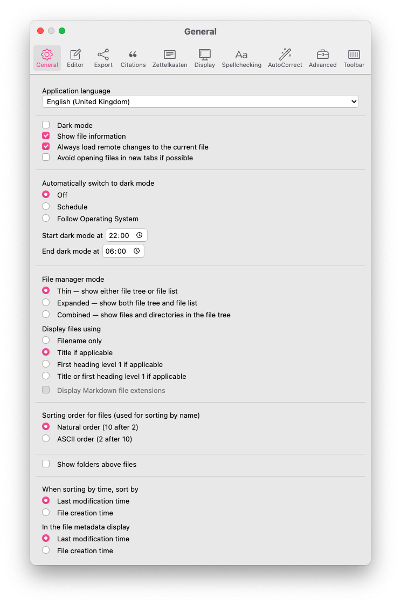
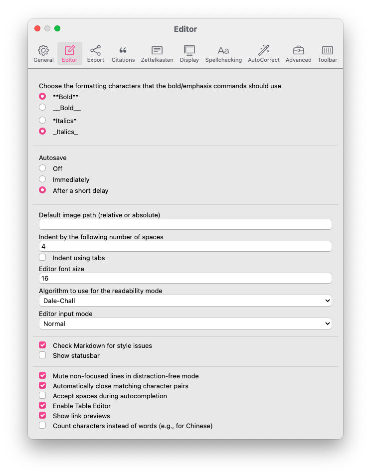
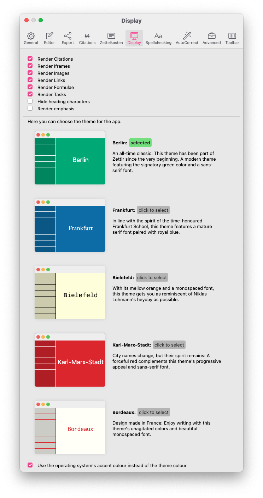

# Settings

Zettlr offers you a plethora of options to customise your experience with the app. It comes with three different settings-dialogs that will be explained in detail here, so you know which option does what.

## General Preferences

You can display the general preference dialog using either the shortcut `Cmd/Ctrl+,`, the toolbar button (the cog) or the respective menu item. The dialog will then show up and present to you all configuration options you may customise. They are ordered in nine tabs that you can see at the top of the dialog.

* [General](#general): These options affect Zettlr as a whole.
* [Editor](#editor): These settings concern only the editor itself.
* [Export](#export): Control how your files are exported in this tab.
* [Zettelkasten](#zettelkasten): Adapt Zettlr to match your Zettelkasten system.
* [Display](#display): Control how the editor displays certain elements, such as images or links.
* [Theme](#theme): Select the theme for the app here.
* [Spellchecking](#spellchecking): Find both the installed dictionaries and your user dictionary here.
* [AutoCorrect](#autocorrect): Choose text to be replaced and also determine the quotes you’d like to use.
* [Advanced](#advanced): Options for experienced users.

### General

In the general tab you find options that you might want to adjust if you begin using Zettlr to fit it to your needs. The application language is pretty self-explanatory.

The “Night Mode” and “File information”-checkboxes control the display. The “Night Mode” is simply the dark theme Zettlr is capable of (and which you might want to control using the shortcut `Cmd/Ctrl+Alt+L` instead). Check the “File information”-checkbox to display meta information in the file list (although you can control this behaviour as well using its respective shortcut `Cmd/Ctrl+Alt+S`).

If you check “Hide directories during global search,” Zettlr will not display directories while performing a search. by selecting “Always load remote changes to the current file”, Zettlr will not ask you whether you’d like to replace the file in the editor.

The sidebar mode controls how the sidebar is displayed to you. You have two options:

* Thin: In thin mode, the sidebar only displays _either_ the list of files _or_ the tree view. You can switch between both using the shortcut `Cmd/Ctrl+Shift+1`.
* Expanded: The expanded mode displays both the tree view and the file list side by side. In this mode, you have both lists always present.
* Combined: This makes the Sidebar look more like a traditional file browser, because it does not divide folders and files.

If you want to hide the sidebar completely, please use the distraction-free mode (`Cmd/Ctrl+J`).

The sorting order determines how Zettlr will sort your files internally. The natural order is recommended; ASCII ignores certain natural language implications.

Last but not least Zettlr can automatically switch to light or dark mode depending on your operating system:

* **Off**: switch between the modes manually
* **Schedule**: Zettlr will enter and leave dark mode between the given time span (24 hours format)
* **Follow Operating System**: On macOS and Windows, Zettlr can listen to operating system events notifying the applications currently running that the overall mode has changed.

### Editor

The editor tab controls most functionality of the editor. As Markdown allows both asterisks and underscores to make text bold and italic, you can choose your favourite flavour here. The **default image path** is a path you can use to tell Zettlr where it should put your images when you paste them from clipboard. It can be absolute or relative. If you provide the name `assets`, Zettlr would put images by default into the `assets` subdirectory of the directory where your file is. You can even tell it to use a directory relative to the parent directory, e.g. `../assets`. Remember that you can always select the directory for an image on a case-by-case basis.

The indentation refers to the amount of spaces inserted when you, e.g., increase the level of lists.

The algorithm for the readability mode that Zettlr should use when you toggle the readability mode. For a short explanation of the different algorithms available, please head over to [our documentation on the readability mode](https://www.zettlr.com/readability).

Further, you can **mute non-focused lines** while you are in the distraction free mode. This means that Zettlr dims all lines except the one where your cursor is. The next option allows you to **automatically close certain character pairs**.

The third option only applies to users using a keyboard that features the `Home` and `End` keys. If you press them, the default CodeMirror behaviour is to move the cursor to the beginning or end respectively of a whole paragraph (i.e.: the beginning and end of a _logical_ line). If you want CodeMirror to only move to the beginning and end of the _visible_ line, make sure to turn off this option. If you make use of the hard-wrap feature of Markdown, and always manually wrap a paragraph, this setting won't have any effect for you.

### Export

The export tab allows you to tweak all preferences concerning how your files are exported. To the left you have options concerning the Zettelkasten functionality.

Selecting "Remove ZKN IDs from files" makes Zettlr remove all IDs that it finds in your files prior to export. "Remove tags from files" does the same but with tags.

> We recommend leaving the option to remove Zettelkasten IDs from your files off unless you know what you are doing. Some websites produce links that contain 14 consecutive digits, and Zettlr will only stroll through the files removing everything your ID regular expression will detect, so it may break links!

Below these options you can choose what to do with internal links (by default they are encapsulated in `[[` and `]]`). The first option completely removes them, the second only removes the link formatting, while the last option leaves them alone.

On the right side you have more general options for exporting. You can choose to export your files to the temporary directory. This is recommended, as it allows you to leave the files alone, because they will be deleted automatically. The second option stores the rendered files in the current directory, overwriting existing files without asking. Use this option if you need the files be present in the attachment sidebar.

The CSL JSON database field can be used to open a literature database. Zettlr will read in the file and enable citation rendering in your files. The CSL Style lets you overwrite the default citation style (APA). You can use any file present in the [Zotero style repository](https://www.zotero.org/styles).

> The citation options can be overwritten on a per-project basis in the corresponding project's settings.

### Zettelkasten

In this tab you can customise the way Zettlr works with your existing Zettelkasten system. In most cases you won't need to touch these options, except you want to use a custom system.

You have four options that are important for Zettelkästen: The ID regular expression, the link start and ending, and the generator pattern.

#### The ID RegEx

Zettlr uses regular expressions internally to filter out the ID of a file. It looks for that pattern, and if it finds a string that matches this pattern, it assumes that as the ID of the file. **Please note that the first match in a file will be assumed the ID, never the last!** This means: If you choose to use only four digits as your ID, the regular expression would also match years inside your file. As Zettlr simply takes the first ID, make sure that the very first thing in your file is the ID of that file.

The default regular expression (which you can restore by pressing the reset button next to the text field) is `(\d{14})`. This means Zettlr will look for 14 consecutive digits — exactly the number of digits that you get when you concatenate a year, a month, a day, an hour, a minute and a second; like this: 20181012143724. It is extremely unlikely that a file contains a second string that includes fourteen (!) digits, therefore it's a great method to use as an ID. Another great thing is that the ID is unique to the second. So each second you can create a new, fully unique ID.

The braces around the `\d{14}` create a so-called "capturing group". A capturing group's purpose is that the regular expression not only matches a certain string, but also extracts a part of it — in this case the full match. This way you can use almost any structure of IDs you want.

> Note that you can omit the capturing group's braces. Zettlr will encapsulate your RegEx internally, if there is no capturing group.

#### The Internal Links

The internal links are explained pretty quick: Simply choose how you'd like to write internal links. The default are Wiki-Style-Links: [[your-link]]. You could also use curly brackets: {{your-link}}. Or you could use exclamation marks: !your-link!. Whatever suits you!

The internal links are used for two things: First, if they either contain an existing file name or an existing ID, clicking them will directly open the respective file (identified either by its name without the extension, or by its ID). Second, if they don't contain any of that, they won't open any file, but they will work as a search function, so `Cmd/Ctrl`-clicking them will start a search — this is great for saving searches you do often!

> Note that files will not assume any link as an ID. If a file finds an ID that is surrounded by the internal link formatting, it will not use this ID.

#### The ID Generator

The last field in the Zettelkasten tab in the preferences window concerns the way the IDs are generated. It is a simple string that may contain variables that are replaced when an ID is generated. Currently, you have the current year, month, day, hour, minute, and second available. The default ID generator pattern is: `%Y%M%D%h%m%s`, which means it will replace `%Y` with the current year (4 digits), `%M` with the current month (with leading zeroes), and so forth. You could also include some static part in your IDs, if you wish. So with the ID pattern set to `%Y-%M-%D_%h:%m:%s` Zettlr would generate an ID like this: `2018-10-12_12:03:56`. You can also reuse the variables in your pattern, e.g. to use only seconds as your ID. You could use something like this: `%s%s%s` and would get `565656`.

Always remember to adapt your regular expression so that it matches what the ID generator spits out. To successfully identify the ID with the pattern, `%Y-%M-%D_%h:%m:%s`, Zettlr would need the following regular expression: `(\d{4}-\d{2}-\d{2}_\d{2}:\d{2}:\d{2})`. If you use `%uuid4`, you can use the following RegEx: `[a-fA-F0-9]{8}-[a-fA-F0-9]{4}-4[a-fA-F0-9]{3}-[89aAbB][a-fA-F0-9]{3}-[a-fA-F0-9]{12}`.

You can test both the generation of IDs and the detection of them by clicking the Test-button below the text fields. Zettlr will then generate an ID and immediately tries to match it using your custom regular expression. Whether or not Zettlr was able to detect the ID will be indicated.

### Display

This tab controls how the editor displays certain elements. Zettlr uses a semi-preview approach to Markdown and only renders some elements. On this tab you can control which elements will be rendered.

> The iFrame-setting controls whether or not to render iFrames (for instance, YouTube-videos are embedded iFrames).

Additionally you can constrain the size of images, which is especially beneficial if you use a lot of portrait oriented images. The horizontal slider controls the maximum amount of width images are allowed to occupy. Setting this to 50 %, for instance, will keep images at half the width of the text body. 100 % disables this (images will never be wider than 100 % of the text body width).

The vertical slider controls the maximum height of the images relative to the window size. 50 percent would mean that images will never be higher than half of the window's total size. 100 percent disables this behaviour. Unlike the width, images may very well exceed 100 percent of the viewport if they are large and thin.

Last but not least you can determine which date you would like to see in the file metadata in the file list. This does not affect the sorting, if you’d like to sort by date. To change the time after which Zettlr should sort your files, please refer to the general tab.

### Theme

This tab should explain itself: Click on any of the previews to switch your application to that theme.

### Spellchecking

With the introduction of the user dictionary, the spellchecking functionality has moved to its dedicated tab. The list to the left contains all available dictionaries that can be used for spell checking. Simply select the ones you want to use. You can use multiple dictionaries to check bilingual texts. Filter the list using the search box on top of the list.

> **Tip**: To disable spell checking, uncheck all dictionaries. To install additional dictionaries, refer to the [localisation manual](../core/localisation.md).

Finally, the list on the right hand side of the tab displays all the words you've added to your custom dictionary. Click them to remove them from your user dictionary.

### AutoCorrect

This tab controls the AutoCorrect features you can use from version 1.5 onward that you might already know from LibreOffice or Word. You can choose to turn it off completely and choose the flavour you’d like. The main difference between the two styles is that Word is much quicker in replacing; it will replace when you type the last character, whereas LibreOffice only replaces when you hit Space or Return. LibreOffice is less harassing, but if you’re perfectly used to Word, you might find this mode easier.

The “Magic Quotes” refer to exactly that: the primary and secondary quotes that you would like to use instead of the generic ASCII-quotes (`"` and `'`). We’ve included a lot of pairs used all around the world. If you would like to deactivate this feature, choose the **first** option (the ASCII-quotes) in both dropdowns.

The last thing you can tweak is the replacement table to the right: These are simply characters you would like to replace with different ones. We’ve included a comprehensive list with most commonly needed tokens, so feel free to have a look around and also add or remove some!

### Advanced

The advanced tab contains options that are helpful for advanced users.

The “pattern for new filenames” is what the textfield will look like when you create a new file. It will be prepopulated by whatever you type here. You can make use of the variables below (the ID following the pattern you have selected in the Zettelkasten-tab, year, month, day, hour, minute and second). If you tick the checkbox, Zettlr will not even ask you for a filename when you create a new file, which might speed up your workflow.

The **pandoc- and xelatex-text fields** are used in case Zettlr is unable to locate any of these two programs. As you know, Zettlr uses both to export your files. In rare cases it may be that Zettlr is unable to find them, although you installed them properly. If that happens, simply enter the **full, absolute path** to both programs in the textfields to help Zettlr find them.

The **debug option** is used to control whether or not you are able to "reload" the graphical user interface (GUI) by pressing `F5` and display the Chrome developer tools to inspect what the app is doing. Naturally, you would want to do this as a developer.

You can also help Zettlr by **subscribing to beta releases**. When you tick this option, Zettlr will notify you about new beta releases as well. You can then decide whether to use the beta version, or not. Activate **RMarkdown file support** to enable the detection of `.rmd`-files used for R-Markdown. It is inactive by default, as some other programs (for instance, by Adobe) also use this extension to store binary data, which would cause problems.

The text area to the right controls what files will be displayed in the **attachment** sidebar. It is simply a comma-separated list of all file extensions you would like to have at your disposal. The initial list should contain most extensions you might be using.

The **Pandoc command** gives you full control over the export engine. The command in there will be run on export. You have a few variables at your disposal to customise your export:

- `$infile$`: The full, absolute path to the file that is going to be exported.
- `$outfile$`: The full, absolute path to the resulting file (including the correct extension).
- `$citeproc$`: Contains directives for the `pandoc-citeproc` engine.
- `$format$`: Contains the format (e.g. `html` or `docx`).
- `$outflag$`: The formatting flag for pandoc (e.g. `-t docx`).
- `$standalone$`: Will be `-s` in case the file needs to be exported standalone.
- `$toc$`: Whether or not a table of contents will be generated.
- `$tocdepth$`: A flag indicating the level up to which a table of contents should be generated.
- `$tpl$`: A template directive for pandoc.

> **Attention**: Many of these variables are tailored to the needs of pandoc. Of course, you can completely switch the program by replacing `pandoc` with the name of your desired exporting engine, but please beware that it will need to know how to parse pandoc flags.

## PDF Preferences

We've moved the PDF Preferences to another dialog because there are many you can use. These options control how the LaTeX-engine will render your files on PDF-exporting. They do not have any effect on all other export formats. You can bring up the dialog using either its shortcut `Cmd/Ctrl+Alt+,` or using the respective menu entry. The PDF options are also divided by tabs. Currently, there are three:

* Metadata: This controls the metadata field of PDF files.
* Page: Adjust the layout of pages using this tab.
* Font: All options regarding the font used in your exports are collected in this tab.

### Metadata

This data can be shown in your PDF readers using a dedicated menu item. Normally they are hidden from view, but in some circumstances they are used. The only thing that should be of concern really is the author field, which is prefilled by the information "Generated by Zettlr". You can change this to your own name (or the name of your company). Keywords and the "topic" field are rarely used.

### Page

In this tab you can control the layout of the page. These options work just as you would expect them from the similar dialogs that are used in LibreOffice or Microsoft Office. You can change the size of the paper, adjust the margins around the content and tell Zettlr whether or not you want to use page numbers (and which numbering system you want to use).

### Font

Here you can control how the font is displayed. The main font is the font used for all text. The LaTeX-engine will fetch this directly, so the name you type here must match exactly a font installed on your computer. **If the LaTeX-engine is unable to locate the font, it will spit out an error. To know whether you've encountered such an error or another error that does not relate to the font, simply search for the font name you typed here in the error message. If your font name appears, there is a high chance that the font is called differently. Then please open your operating system's font preferences and check the name.**

The font-size should be rather obvious. The line height specifies the spacing between lines (this only applies to paragraphs). For instance a line height of 150 percent would create a space of half a line between the lines (i.e. each line is followed by a space 50 percent of a normal line height before the next line begins).

## Manage Tags

The tags dialog does not have a shortcut associated, so you'll need to call it using the respective menu item. Here you can assign colours and descriptions to tags.

To add a new tag-colour-relationship, simply press the `+`-button at the bottom of the dialog. In the first field, enter your tag without the preceding hashtag symbol (e.g. if you wanted to assign a colour to the hashtag `#todo`, simply enter `todo`). Next, choose a colour to be assigned to that tag. If you click the second bar after the tag name field, a color picker should appear that lets you choose a colour. In the third field, you can enter a short description for that tag. This description will be shown if you hover over the tag symbols in the file list.

If you want to remove a tag-colour-association, simply click the `-`-button at the end of such a tagline (pun intended).
