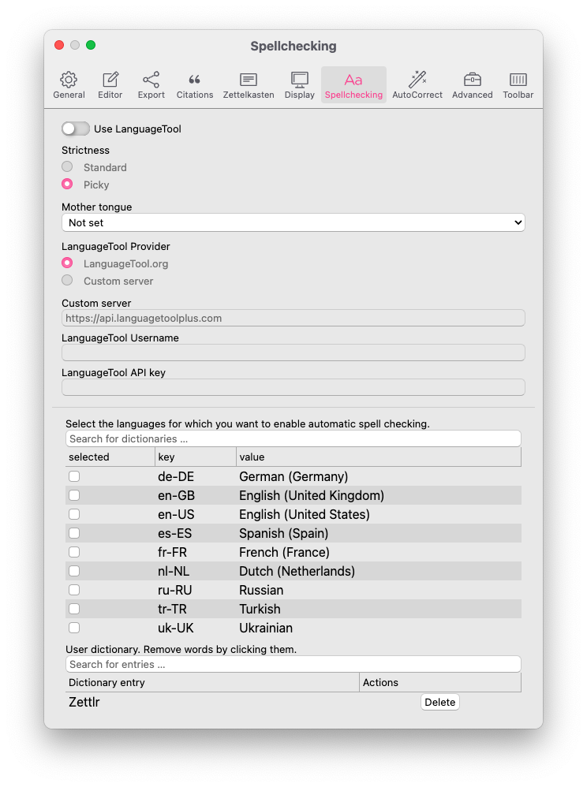

# Settings

Zettlr offers you a plethora of options to customise your experience with the app. It comes with three major settings dialogs, one of which is the [assets manager explained elsewhere](../core/assets-manager.md), a general preferences dialog, and a tag manager.

## General Preferences

You can display the general preference dialog using either the shortcut `Cmd/Ctrl+,`, the toolbar button (the cog) or the respective menu item. The dialog will then show up and present to you all configuration options you may customise. They are ordered in eight tabs that you can see at the top of the dialog.

* [General](#general): These options affect Zettlr as a whole.
* [Editor](#editor): These settings concern only the editor itself.
* [Export](#export): Control how your files are exported in this tab.
* [Citations](#citations): Control how to cite within Zettlr
* [Zettelkasten](#zettelkasten): Adapt Zettlr to match your Zettelkasten system.
* [Display](#display): Control how the editor displays certain elements, such as images or links and select the visual theme for the app here.
* [Spellchecking](#spellchecking): Find both the installed dictionaries and your user dictionary here.
* [AutoCorrect](#autocorrect): Choose text to be replaced and also determine the quotes you’d like to use.
* [Advanced](#advanced): Options for experienced users.

### General

In the general tab you find options that you might want to adjust if you begin using Zettlr to fit it to your general needs.

* **Application language**: Sets the language the application will be displayed in. Shown are languages which have a sufficient number of complete translations. Your changes are applied after a restart.
* **Dark mode**: Whether the application is set to dark mode. Can also be triggered using `Cmd/Ctrl+Alt+L` and via automatic scheduling.
* **Show file information**: Controls whether the file *list* (available in thin and expanded file manager modes) shows some meta information about your files, such as tags, or writing targets.
* **Always load remote changes to the current file**: If checked, Zettlr will silently reload any remote changes to your files. If unchecked, you will be asked for each file.
* **Avoid opening files in new tabs if possible**: By default, Zettlr will open each file in its own tab. Selecting this will prompt Zettlr to exchange the currently active file in some circumstances.
* **Automatically switch to dark mode**:
    * **Off**: Zettlr will never change the dark mode setting automatically.
    * **Schedule**: Zettlr will switch to and from dark mode at the times specified in Start/End dark mode at ….
    * **Follow Operating System**: Align the visual display at your operating system's dark mode setting (not available on Linux).
* **Start dark mode at**: Specifies a time (format: HH:MM) at which Zettlr will once automatically switch from light mode to dark mode if applicable.
* **End dark mode at**: Specifies a time (format: HH:MM) at which Zettlr will once automatically switch from dark mode to light mode if applicable.
* **File manager mode**:
    * **Thin**: Shows your directories and files separately. Select a directory to have its contents displayed in the file list. Switch between file list and directory tree by clicking on directories or the arrow button which appears at the top left corner of the file list.
    * **Expanded**: Shows your directories and files separately, but both at the same time. Select a directory to have its contents displayed in the file list.
    * **Combined**: Shows your directories and files in the same file tree. The file list is not available in this mode.
* **Display files using**:
    * **Filename only**: Always display just the filename of each file, never a title or heading level 1.
    * **Title if applicable**: Display the YAML frontmatter title of your files, if applicable. Otherwise, fall back to the filename.
    * **First heading level 1 if applicable**: Display the first heading level 1 of your files, if applicable. Otherwise, fall back to the filename.
    * **Title or first heading level 1 if applicable**: Display a YAML frontmatter title if applicable. Fall back to the first heading level 1 if applicable. If none are available, fall back to the filename.
* **Display Markdown file extensions**: By default, Zettlr hides the file extensions of known Markdown files (e.g., `*.txt`, `*.md`, `*.markdown`). With this setting you can command Zettlr to display them.
* **Sorting order for files (used for sorting by name)**:
    * **Natural order (10 after 2)**: This setting will sort your files logical, such that a number 10 would follow after a 2, even though the 2 has no preceeding 0.
    * **ASCII order (2 after 10)**: This setting sorts your file character by character, meaning that a 2 follows after a 1. To sort the 2 before the 10, prepend it with a leading zero.
* **Show folders above files**: By default Zettlr first displays your files, and only then the folders. Activating this setting will first display folders. Requires a restart to apply.
* **When sorting by time, sort by**:
    * **Last modification time**: The time at which you modified some file.
    * **File creation time**: Sort the files by the times at which you created them.
* **In the file metadata display**:
    * **Last modification time**: Display the last time you modified a file in appropriate places (e.g. the meta information in the file list).
    * **File creation time**: Display the file's creation time in appropriate places.

### Editor

The editor tab controls most functionality of the main editor.

* **Choose the formatting characters that the bold/emphasis commands should use**: When you press `Cmd/Ctrl+B` or `Cmd/Ctrl+I` to make text italic or bold, Zettlr will either use asterisks (`*`) or underscores (`_`) depending on your settings here.
* **Autosave**:
    * **Off**: No autosave. You need to manually save using `Cmd/Ctrl+S`.
    * **Immediately**: Save every modification immediately. This is done after a very short delay of 250ms so that the stress on your hard drive is reduced.
    * **After a short delay**: This will automatically save your files five seconds after you stopped typing.
* **Default image path (relative or absolute)**: Where to store images that you paste into a document. If set to `assets`, for example, Zettlr will put images into an `assets` folder relative to your Markdown file. If set to an absolute path, every image will be put into the same folder. A relative folder is recommended.
* **Indent by the following number of spaces**: Specifically has an effect on exporting your files. If set too low, some parsers might not be able to properly indent your lists. Four is a recommended setting and should work with most parsers, two spaces may be too few for some older parsers.
* **Editor font size**: Select the base font size of the editor (in pixels).
* **Algorithm used for the readability mode**: Select an algorithm to use whenever you activate the readability mode; you have four modes available. Please refer to [our documentation on the readability mode](https://www.zettlr.com/readability) to learn which mode does what.
* **Editor input mode**:
    * **Normal**: Zettlr will work like a regular text editor.
    * **Emacs**: Add Emacs shortcuts and keybindings to the editor.
    * **Vim**: Activate the Vim mode, which implements several functions of the Vim editor. _This setting is recommended for advanced users only, since it changes the very way you can enter text into the editor!_
* **Mute non-focused lines in distraction-free mode**: This dims all lines except the one you are currently editing distraction free mode.
* **Automatically close matching character pairs**: This allows you to type brackets and quotes, and the editor will automatically add the matching one afterwards.
* **Accept spaces during autocompletion**: To minimize the impact autocomplete has on your writing flow, spaces end autocomplete by default. If you need to have spaces to search for things inside autocompletes, activate this setting. _This setting does not affect tags and headings autocompletes, since no spaces are allowed in these either way._
* **Use the CodeMirror default actions for `Home` and `End`**: By default, CodeMirror will jump to the very beginning or end of a whole paragraph if you press `Home` or `End`. By disabling this option, `Home` and `End` jump to the beginning or end of the visible line.
* **Count characters instead of words**: If you write in a language where words are represented by single glyphs, such as Japanese or Chinese, activate this setting so that Zettlr counts these single glyphs rather than continuous strings of letters demarcated by whitespace.
* **Use left-to-right (LTR) writing direction**: This tells Zettlr that you mainly type in a (western) LTR script. If you type a paragraph in an RTL script, the editor will attempt to detect this automatically.
* **Use right-to-left (RTL) writing direction**: This tells Zettlr that you mainly type in a RTL script, such as Arabic, Hebrew, or traditional Japanese.
* **Use visual order for arrow key movement while in RTL-mode**: If active, the arrow keys on your keyboard move the cursor visually whenever you are typing a right-to-left script (Arabic or Hebrew).

### Export

The export tab allows you to tweak all preferences concerning how your files are exported.

* **Use the internal Pandoc for exports**: By default, Zettlr uses its own Pandoc. If you want or have to use a system-wide installed Pandoc (must be in PATH), disable this setting. After restarting the application, Zettlr will use the system-wide Pandoc.
* **Remove tags from files**: If checked, Zettlr will run a special Lua-filter that removes tags which are defined within your files (not the ones in the YAML frontmatter).
* **Remove internal links completely**: If checked, internal links in the format `<link start><ID><link end>` (default: `[[20220117101322]]`) will be completely removed upon export.
* **Unlink internal links**: If checked, internal links in the format `<link start><ID><link end>` will have their links stripped, so that only the contents of the link remain.
* **Don't touch internal links**: This leaves internal links as they are.
* **Target directory for exported files**:
    * **Temporary directory**: This directs Zettlr to put any file exports that you have into the temporary directory. This is intended so that you can export frequently, and once you are happy with how a file looks like, use the "Save as …" function of the default application (e.g. Adobe Reader for PDF) to save it in your preferred space. Files in the temporary directory are automatically removed when you restart your computer, or at other convenient times. _This is the recommended setting._
    * **Current working directory**: This directs Zettlr to always put exports into the directory of the source file. Subsequent exports will overwrite previous exports. While you do not have to "Save as …" in order to keep an exported file, this may lead to cluttered directories, which is why we do not recommend this setting.

### Citations

This tab controls how citations work in Zettlr.

* **How would you like autocomplete to insert your citations?** Choose the setting which will cite in a way which you use most often. If you need one of the other formats, you can always modify the autocompleted citation. _Note: This only applies if you autocomplete a cite key._
    * `[@Author2015, p. 123]`: When you start typing a citation, Zettlr will automatically surround it in square brackets so that you can create a "full" citation.
    * `@Author2015`: Activating this setting means that Zettlr will not add square brackets. Useful if you frequently cite with author names in-text.
    * `@Author2015 [p. 123]`: This will tell Zettlr to add square brackets _after_ the citation key.
* **Citation Database (CSL JSON or BibTex)**: Select a library which contains your citations. After having selected one, citing in Zettlr is active. _Note: BibLaTeX is not yet supported. Furthermore, you can always select libraries on a per-file basis using the YAML frontmatter._
* **CSL-Style (optional)**: Select a CSL stylesheet to overwrite the default citation style (APA). You can download any file from the [Zotero style repository](https://www.zotero.org/styles). _Note: This only affects exports. Zettlr will internally always use an in-text citation style for preview purposes._

### Zettelkasten

In this tab you can customise the way Zettlr works with your existing Zettelkasten system. In most cases you won't need to touch these options, except you want to use a custom system.

* **ID regular expression**: This is a JavaScript regular expression which should match the IDs you use inside your Zettelkasten system (default: `(\d{14})`). Zettlr will use this expression to find IDs for your files. The first found ID will be used. Zettlr first searches the file name (i.e. if you use `20220117102945.md` as the filenames), then the content.
* **Link start**: Determines how internal links within your Zettelkasten start. We recommend leaving this with the default (`[[`).
* **Link end**: Determines how internal links within your Zettelkasten end. We recommend leaving this with the default (`]]`).
* **Pattern used to generate new IDs**: Use variables to have variable IDs. This should be matched by your regular expression. Available variables: `%Y` (Year, four digits), `%y` (Year, two digits), `%M` (Month, two digits), `%D` (Day, two digits), `%W` (Week, two digits), `%h` (Hour, two digits), `%m` (Minute, two digits), `%s` (Seconds, two digits), `%X` (Unix timestamp), `%uuid4` (UUID v4).
* **Link with filename only**: If selected, Zettlr will always link using filenames, and never the IDs of the file. Useful for some Zettelkasten systems.
* **When linking files, add the filename …**: _Note: This setting is only available if you did not choose to link with filename only._
    * **always**: Always add the filename, even if the file has no ID, thus potentially duplicating the filename.
    * **only when linking using the ID**: Add the filename if the ID is being used for linking a file.
    * **never**: Never add the filename, even when linking using IDs.
* **Start a search when following Zettelkasten-links**: When checked, Zettlr will start a global search for the contents of the link you just followed.
* **Automatically create non-existing files when following internal links**: If checked, Zettlr will always create a file using the link contents as filename if no file that matches the link contents has been found.
* **Put auto-created files into this directory (must be loaded in Zettlr)**: This setting is useful if you have a Zettelkasten loaded into Zettlr alongside other directories. If you set this to a directory which is loaded in Zettlr, the app will never auto-create any files in any other directory except this one. _Note: This setting only applies to when you click a link to a non-existing file, not for regular new files._

### Display

This tab controls how the editor displays certain elements. Zettlr uses a semi-preview approach to Markdown and only renders some elements. On this tab you can control which elements will be rendered.

* **Render Citations**: Renders citations. Requires a citation database to be loaded in the [Citations](#citations) tab.
* **Render Iframes**: Renders embedded content (YouTube or Vimeo videos).
* **Render Images**: Renders images in your files.
* **Render Links**: Renders links in your files.
* **Render Formulae**: Renders any math content in your files (surrounded with Dollar signs).
* **Render Tasks**: Renders task lists (`- [ ]`) in your files
* **Hide heading characters**: Instead of seeing the heading characters (`#`) this will display an element indicating the heading level. Clicking on that element allows you to change the heading level.
* **Theme**: The theme selector allows you to select one of the available themes. You can further customize the appearance of Zettlr using [Custom CSS](../core/custom-css.md).
* **Use the operating system's accent colour instead of the theme colour**: If disabled, Zettlr uses the theme's accent color to highlight certain elements. If selected, Zettlr will use your operating system's accent color, which you can select in the corresponding system preferences. _Note: On Linux, this will be ineffective and set the highlighting color to Zettlr's Crayola Green._
* **Hide toolbar in distraction free mode**: If selected, Zettlr will remove the toolbar in distraction free mode.
* **Maximum width of images (percent)**: Select the maximum width of images in the editor (in percent of the total editor width). Smaller images will not be stretched.
* **Maximum height of images (percent)**: Select the maximum height of images in the editor (in percent of the total window height). Smaller images will not be stretched.

### Spellchecking

In this dialog, you can control spellchecking settings in the editor.

You can activate available dictionaries in the first list. Simply select the ones you want to use. You can use multiple dictionaries to check bilingual texts. Filter the list using the search box on top of the list. To disable spell checking, uncheck all dictionaries.

To install additional dictionaries, refer to the [localisation manual](../core/localisation.md).

The second list displays your user dictionary, that is: all the words you've added to your custom dictionary. Click "Delete" to remove a word from the list.

### AutoCorrect

This tab controls Zettlr's AutoCorrect features that you might already know from LibreOffice or Word.

* **Turn on AutoCorrect**: This controls both the MagicQuotes and the AutoCorrect settings. To _only_ enable AutoCorrect, set the MagicQuotes to the very first entry respectively, which will turn it off without turning off AutoCorrect.
* **Word style**: In the "Word Style", AutoCorrect will aggressively replace anything it can (such as `...` --> `…`). To undo a replacement, immediately press the `Backspace` key and continue writing.
* **LibreOffice style**: In this style, AutoCorrect requires you to first press `Space` or `Enter` before a replacement action is performed. Again, you can press `Backspace` to undo a replacement. Additionally, if you hold down `Shift` while pressing either `Space` or `Enter`, AutoComplete will not replace anything.
* **Primary Magic Quotes**: Set this to your local quote characters for primary quotations. Then, Zettlr will use these quotes instead of the regular ones. _Note that you can also rely on Pandoc for performing this conversion afterwards, using the `lang` YAML frontmatter property._
* **Secondary Magic Quotes**: The same as the previous setting, only for secondary quotations (quotes within quotes).

Below the settings, you can see a replacement table. Each key will be replaced with the value according to the style you've chosen. The default list includes some common replacements. You can delete replacements, or add new ones which you need.

### Advanced

The advanced tab contains options that are helpful for advanced tasks.

* **Pattern for new filenames**: This can be used to customize the default filename for new files. You can always adapt the filename, this is only used as a placeholder. Available variables: `%id` (an ID according to the pattern from the [Zettelkasten](#zettelkasten) tab), `%Y` (Year, four digits), `%y` (Year, two digits), `%M` (Month, two digits), `%D` (Day, two digits), `%W` (Week, two digits), `%h` (Hour, two digits), `%m` (Minute, two digits), `%s` (Seconds, two digits), `%X` (Unix timestamp), `%uuid4` (UUID v4).
* **Do not prompt for filename when creating new files**: When unchecked, Zettlr will always give you the option to adapt the filename before saving a file. When checked, Zettlr will immediately create a file using this pattern. You can change the filename by renaming the file.
* **Enable debug mode**: This enables a small set of functionality that is relevant for either developers, or if you have been asked to provide logs. When enabled, you have an additional menu available, and context menus will feature an "Inspect Element" item which works as you know it from browsers.
* **Notify me about beta releases**: If selected, Zettlr will also inform you about new beta releases, not just stable releases.
* **Use native window appearance**: Due to the plethora of available window managers on Linux, you can select this setting to have windows display with whatever window chrome your window manager uses. You have to close and reopen existing windows for this setting to take effect. _Note: This is only available on Linux._
* **Delete items irreversibly, if moving them to trash fails**: By default, Zettlr will put deleted files into the trash bin so you can restore them if necessary, and not do anything if it cannot put the files into the trash bin. If you have disabled the trash bin or something else prevents Zettlr from trashing your files, you can select this setting, which will instruct Zettlr to irreversibly remove the files instead.
* **Show app in the notification area**: If selected, display a small Zettlr icon in the notification area or tray bar. On Windows and Linux, this has the additional effect that the app will not quit if you close all windows. Click the icon to restore Zettlr's main window.
* **Enter all file extensions that you want to see in your attachment sidebar**: Zettlr works only with a small set of plain text files. As such, it cannot display, e.g., Excel spreadsheets. By adding extensions here, Zettlr will display those files in the sidebar so you can link them inside your files or open them with the external default program.
* **iFrame rendering whitelist**: iFrames can pose a security risk. As such, you have to confirm that you would like to display iFrames. This list contains all hostnames which you have whitelisted in your files so you can remove them if you accidentally whitelisted a hostname which you do not trust.
* **Activate Watchdog polling**: If you work with large files, or your computer is somewhat slower, you can activate this setting. By default, Zettlr listens to your computer to get notified if some file changes remotely. If you activate this setting, Zettlr will wait the defined timespan, before it considers a change to be ready.
* **Time to wait before writing a file is considered done (in ms)**: Increase this threshold, if Zettlr recognizes too many remote changes.

## Tag Manager

The tags dialog does not have a shortcut associated, so you'll need to call it using the respective menu item. Here you can assign colours and descriptions to tags.

To add a new tag-colour-relationship, simply press the `+` button at the bottom of the dialog. In the first field, enter your tag without the preceding hashtag symbol (e.g., if you wanted to assign a colour to the hashtag `#todo`, simply enter `todo`). Next, choose a colour to be assigned to that tag. If you click the second bar after the tag name field, a color picker should appear that lets you choose a colour. In the third field, you can enter a short description for that tag. This description will be shown if you hover over the tag symbols in the file list.

If you want to remove a tag-colour-association, simply click the `-` button at the end of such a tagline (pun intended).
