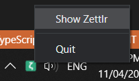
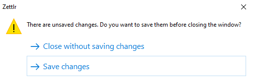
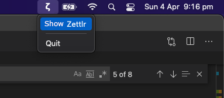
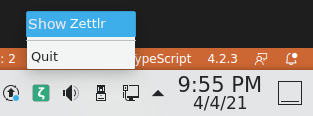
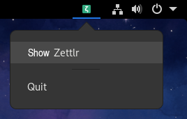

# Tray
Zettlr support tray function which allow you wake up and quit Zettlr easily by clicking the Zettlr icon in notifaction area. 

## Platform support
- Windows 10
- MacOS
- Linux

## Activate Tray
To activate tray function, open **Preferences** using either the menu item or the toolbar button. In the Advanced tab, select `Show app in the notification area` to active tray function.

## Guide
### Windows 10
1. Clicking `x` in the window's titlebar will close the window. Zettlr will not quit.

2.  Left or Right click  ➔ `Show Zettlr` will bring Zettlr window in front.

    
        
3. Left or Right click  ➔ `Quit` will quit Zettlr. 

    

    **If there are unsaved changes, Zettlr window will show and remind you to save changes.**

    

### MacOS
1. Clicking `x` in the window's titlebar will hide the Zettlr window. 

2. Left click  ➔ `Show Zettlr` will bring Zettlr window in front.

3. Left click  ➔ `Quit` will quit Zettlr. 
    
    

    **If there are unsaved changes, Zettlr window will show and remind you to save changes.**  

    

### Linux 

1. Clicking `x` in the window's titlebar will close the window. Zettlr will not quit.

2. Left click  ➔ `Show Zettlr` will bring Zettlr window in front.

3. Left click  ➔ `Quit` will quit Zettlr. 

    **If there are unsaved changes, Zettlr window will show and remind you to save changes.**  

    **KDE desktop**:
    
    
    **Gnome desktop**:
    
    
**Notice**: 
For Linux Gnome desktop, gnome-shell extension [AppIndicator Support](https://extensions.gnome.org/extension/615/appindicator-support/) is required in order to use tray function. If your computer does not install AppIndicator Support, you may see the following warning:
    