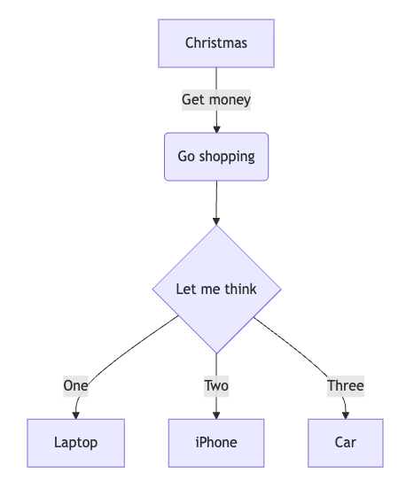

# Mermaid Diagrams

Oftentimes, having a way to quickly draft a diagram can be useful for both scientific and technical applications. To do so, Zettlr ships with built-in support for Mermaid diagrams. Mermaid.js is an alternative to other diagram solutions such as UML or draw.io.

Mermaid diagrams use a markup language that allows you to specify the diagram, which the Mermaid engine will then render.

This means that Zettlr utilizes code blocks for creating Mermaid diagrams.

## Rendering Mermaid

Zettlr can render a Mermaid-diagram in place. To do so, make sure that the corresponding renderer is active and that the rendering mode is set to “Preview,” not “raw.”

The following sample flowchart:

	```mermaid
    flowchart TD
        A[Christmas] -->|Get money| B(Go shopping)
        B --> C{Let me think}
        C -->|One| D[Laptop]
        C -->|Two| E[iPhone]
        C -->|Three| F[fa:fa-car Car]
    ```

Will render like so:



Syntax highlighting for Mermaid diagrams is not supported.

## Rendering Mermaid on Export

One difficulty with Mermaid is that, while Zettlr supports rendering Mermaid diagrams out of the box, many other systems do not. Please refer to the Mermaid documentation on how to enable diagram rendering in various contexts.

To allow Mermaid rendering when you export documents using Pandoc directly from Zettlr, you will need to use a Lua-filter to add Mermaid support.

Here follows an example filter that you could use. However, note that we do not provide support for this filter. It may stop working at any time.

To use this filter, you will need to install the Mermaid.js CLI utility (`mmdc`). If you need help, please ask the community, but do not open an issue on GitHub.

```lua
-- Lua filter to enable Pandoc Mermaid support during exports
local supported_formats = {
  svg = { "svg", "image/svg+xml" },
  png = { "png", "image/png" },
  pdf = { "pdf", "application/pdf" }
}

local default_formats = {
  html = supported_formats["svg"],
  latex = supported_formats["pdf"],
  beamer = supported_formats["pdf"]
}

local function get_format (format)
  if supported_formats[format] then
    return supported_formats[format]
  else
    return supported_formats["png"]
  end
end

local function render_mermaid (code, filetype, width, height, scale)
  local w = width or "800"
  local h = height or "600"
  local s = scale or "1P"
  local output = pandoc.pipe("mmdc", {
    "-e", filetype, "--width", w, "--height", h,
    "--scale", s,
    "-i", "-", "-o", "-"
  }, code)
  return output
end

function CodeBlock(block)
    if block.classes[1] == "mermaid" then
      local default_format = get_format(FORMAT)
      local filetype = default_format[1]
      local mimetype = default_format[2]
      if block.attr['format'] then
        local custom_format = get_format(block.attr['format'])
        filetype = custom_format[1]
        mimetype = custom_format[2]
      end

      local img = render_mermaid(block.text, filetype, block.attr['export_width'], block.attr['export_height'], block.attr['export_scale'])
      local fname = pandoc.sha1(img) .. "." .. filetype
      pandoc.mediabag.insert(fname, mimetype, img)
      local image = pandoc.Image({ pandoc.Str("Mermaid diagram") }, fname, "", block.attr)
      return pandoc.Figure({ image }, pandoc.Caption())
    end
end
```