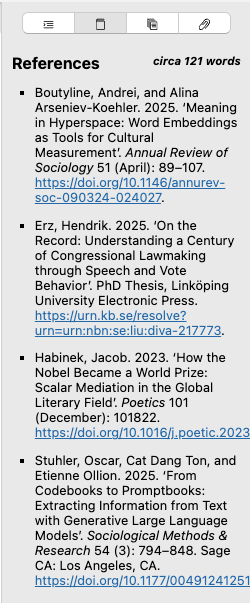

# References

The references tab contains a bibliography of all the references you cite within the document. It is generated while saving your document and gives you a preview of your bibliography section. You can also select text in this panel which allows you to copy the references.

This list consists of any element that is cited somewhere in your document, plus the `nocite` elements. Any valid citekey that you place in a YAML front matter under the `nocite` key will be added to the bibliography, regardless of whether you actually cite the item in your main text, in agreement with [how Pandoc will render your references](https://pandoc.org/MANUAL.html#including-uncited-items-in-the-bibliography).

To learn more about citing literature with Zettlr, take a look at the documentation page for [citations](../editor/citations.md).

!!! note

    Please note that the references will be displayed using the built-in CSL style. If you have specified a custom CSL style, Pandoc will use that one during export. The references in the sidebar are for preview purposes.