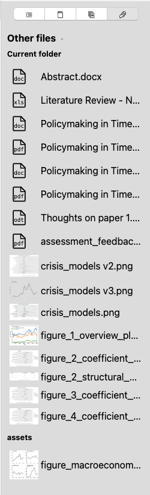

# The Sidebar

The sidebar is a context-sensitive element that displays relevant information and metadata for your current file. You can open it by using either the sidebar icon in the toolbar or by pressing <kbd>Cmd/Ctrl</kbd>+<kbd>0</kbd>.

!!! note

    Zettlr has – strictly speaking – two sidebars: The sidebar to the left is referred to as the [File Manager](../file-manager/index.md), whereas the right one – this sidebar – is referred to as "the" sidebar.

The sidebar contains four tabs with metadata. These are (from left to right):

* [Table of Contents](./table-of-contents.md): Displays all sections of the document as a navigable list
* [References](./bibliography.md): Displays all cited reference items in a bibliography
* [Related Files](./related-files.md): Displays potentially related files from across your workspaces
* [Other Files](./other-files.md): Displays other (non-Markdown) files from the current and assets-directories.

## Other Files

The last section contains files that reside within the currently selected directory but are considered neither Markdown nor one of the supported code files. This could be images, PDF files, Excel spreadsheets, or any other file type which you would like to see there.

You can determine which files are being listed here by adding the file extensions in the advanced preferences tab. Those file extensions are case-insensitive, so adding `.jpeg` will show `.jpeg` files as well as `.JPEG` and `.JpEg`.

!!! tip

    This tab is especially useful if you want to add some images to your Markdown files. Simply drag and drop them onto the editor, and Zettlr will make sure to wrap them in an image tag.
