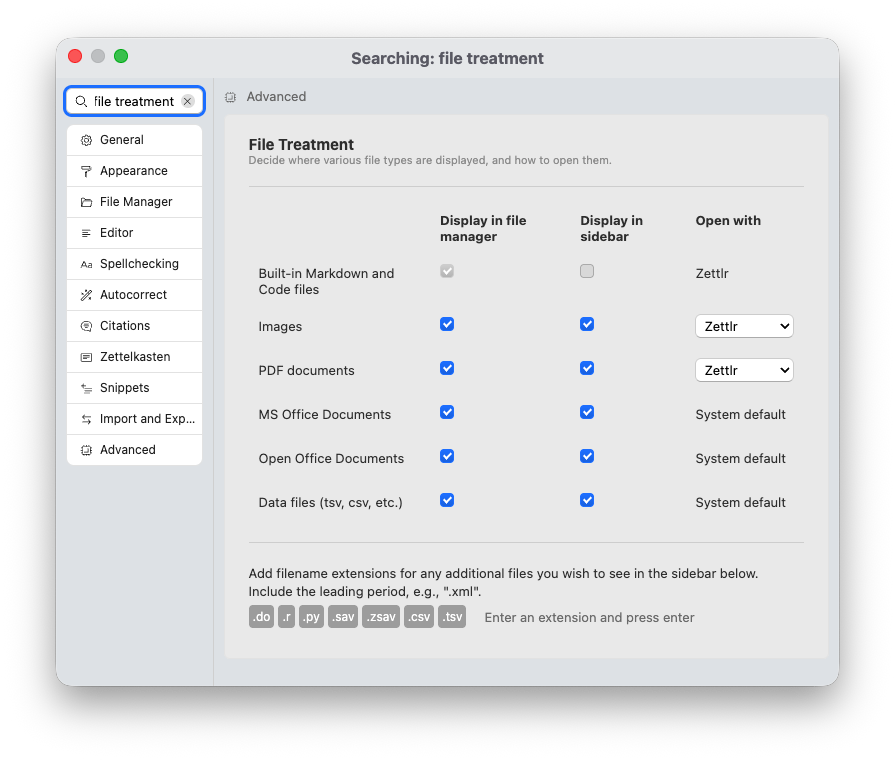
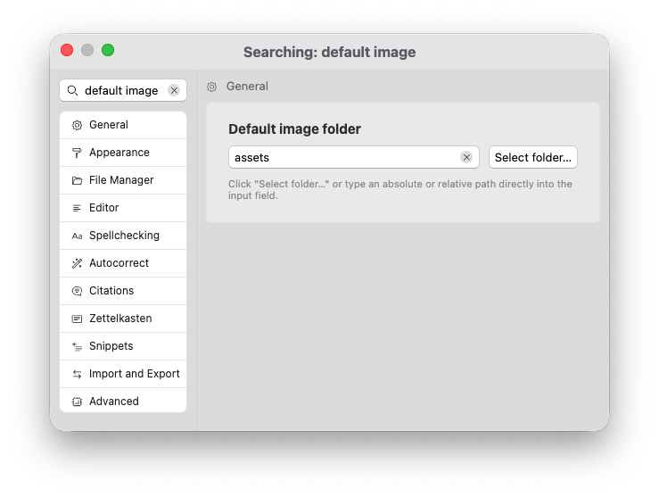

# Other Files

The last tab in the sidebar shows other files that reside in the vicinity of the current document. You can define which files show up in this list, and click on them to view them, or drag them into the current editor to link them.

## Determining Which Files to Display

The other files-tab’s main purpose is to declutter your file manager. While the file manager provides a view over the files in your file system, it purposefully hides many files to help you focus on writing.

The tab holds any file that you do not immediately need in the file manager, but that you may want to access more easily than through your computer’s file browser. This affects primarily two categories of files:

1. Files that Zettlr can either open only read-only or that need to be opened with an external program, but that are central to your broader workflow.
2. Images.

First, some words on non-image files. Depending on your workflow, you may rely on files such as Excel spreadsheets, PDF files, or data files to progress in your writing. The sidebar offers you a way to have these files tucked away, but still accessible from within Zettlr.

Next, images. Many writing workflows require quick access to images. These could be pictures you want to include in your documents, or plots. The sidebar gives you quick access to these files. In addition, Zettlr can show you a preview so that you can see the contents of the image before you link them in your documents.

You can configure which files will be shown here in the preferences → “Advanced” → “File treatment.”

This section gives you two controls:

1. Predefined data types (images, PDF documents, Office documents, and data files). You can also choose to show these files directly in the file manager.
2. Arbitrary filename extensions for custom files you deem relevant. These additional filename extensions will only be shown in the sidebar.

## Locations of Other Files

Since the sidebar is **context-sensitive** and only shows files related to the current document, the content of this tab will change as soon as you change the current document.

It will search **two locations** for other files:

1. The current folder
2. The assets folder

First, it will display matching files that are in the same folder as your current document. Second, it will display files from the “assets folder.” You can define this assets folder yourself. To do so, go into preferences → “General” → “Default image folder.”

This setting allows you to determine an absolute or relative path that should host your assets (primarily intended for images).

It is common to define a relative path – the default is just “assets.” This means that the other files-tab will search for the presence of an “assets” folder in the current folder. If there is one, it will display any matching files from this folder.

In case you provide an absolute path as the default image folder, this will remain the same for all documents.