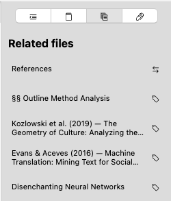
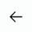
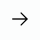
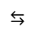

# Related Files

The related files tab lists files which Zettlr deems related to the current document. This sidebar tab is primarily relevant for Zettelkasten/PKMS workflows. It helps you navigate your files not based on the hierarchical folder structure, but on semantic similarity based on textual indicators. This feature can help you identify connections between documents.

The tab lists the filenames (or YAML front matter titles, or headings level 1, depending on your preferences) of the related file next to an icon that symbolizes the nature of this relationship.

There are four different types of relationships, identified with the following icons:

| Relationship           | Symbol                              | Description |
|------------------------|-------------------------------------|-------------|
| **Shared keywords**    |             | Two files can be related if they have keywords (or tags) in common. |
| **Inbound link**       |     | A file is considered relevant if it contains a link to the current document. |
| **Outbound link**      |      | A file is considered relevant if the current documents links to it. |
| **Bidirectional link** |  | A file is considered relevant if both the current document links to it, and the related file links back to the current document. |

## Understanding how Zettlr Calculates Relatedness

Zettlr uses a variety of signals in determining whether two files are related. The primary modes of relatedness Zettlr utilizes are wiki links and keywords, or tags.

### Shared Keywords

The most common form of relatedness is if two documents share the same keywords, or tags. Once you add at least one keyword that already exists somewhere in your loaded workspaces to the current document, the related files-tab will display all other documents or notes that have been tagged with this keyword.

Each keyword that is shared between two files increases the ranking of the relationship. The more keywords are shared, the higher up in this list the related file will be positioned.

However, keywords are considered **weak signals** to indicate relatedness. These are implicit relationships that have their merit, but these emerge from the contents you inserted into your notes.

### Explicit Links

The only judge of whether two files can be related is you, so to make a relationship explicit, you’ll utilize wiki links, or Zettelkasten links, or “internal” links.

Zettlr deems explicit links between files to be **strong signals** that two documents are related, so any form of link-relationship will be placed on top of any tag relatedness.

As soon as you link from your current document to another one, that is, you create a link, you form an explicit relationship between the two documents. This is called an **outbound link** (since it points to another file), and is considered stronger than any relationship based on shared keywords.

The reverse of this link also holds true. Once you open the file you linked to, the related files-tab will display an **inbound link** in the related files.

The strongest form of an explicit link between two files is a **bidirectional link**, that is, both files reference each other. Thus, this type of relationship will always be sorted to the top of the list of related files.