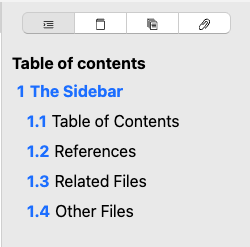

# Table of Contents

The table of contents-tab contains a structured view over your document. It lists the headings it can find therein, and shows them in a numbered list.

These entries are interactive; clicking them jumps directly to the corresponding section in the document.

The section in which your cursor currently sits is highlighted according to the app’s accent color. This highlight will update as you move with your cursor through the document.

Lastly, you can also change the section ordering by dragging and dropping a heading from one position to another.