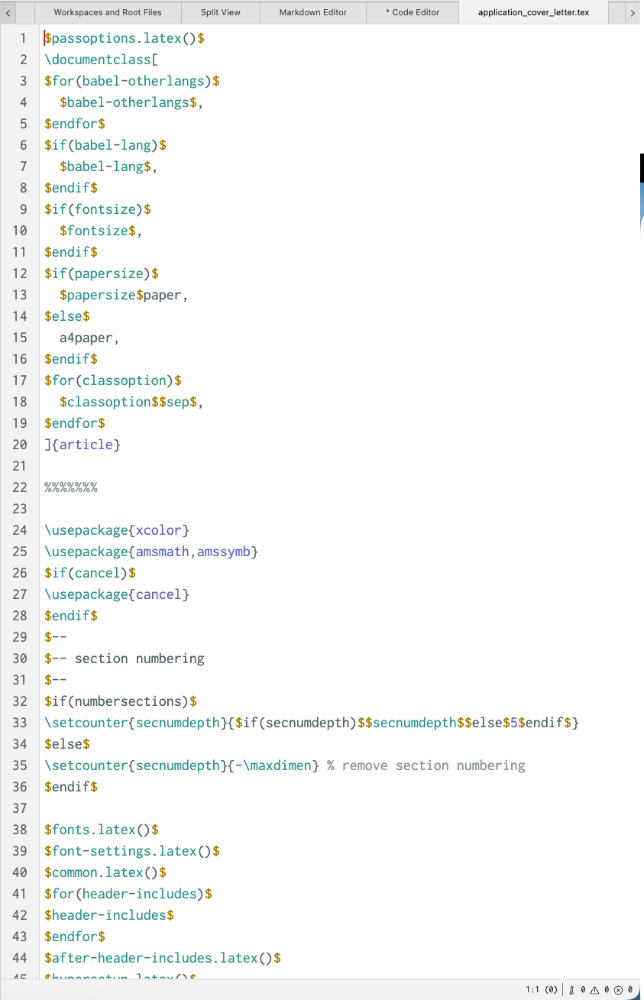

# Code Editor

The code editor works similarly to the Markdown editor, but for code files. As of now, Zettlr only supports three types of code files: JSON data files, YAML data files, and LaTeX source files.

The code editor allows you to comfortably edit the supported code files. It supports auto-indentation, syntax highlighting, and it always shows line numbers.

In addition, the code editor sports the same status bar as the main Markdown editor, if you activate it. The status bar shows you some information such as cursor position or linter results.

Besides common features, the code editor also features a linter. A linter is a tool that checks some code for syntax errors, and highlights them for you.

This way you can quickly find and fix any errors in your files.