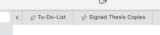

# Document Tab Bar

Each individual split element has a tab bar on top of its file editor or viewer area. The document tab bar shows you directly which documents are currently open within this split element.

The tab bar behaves like any other tab bar you may have already interacted with. Each element shows you the file name, file title, or first heading level 1 (depending on your settings) of the file. You can also close a document using the close button on the element.

Furthermore, you can change the order of your documents by dragging the elements around, and dropping them at the wanted target position. The positions will update as you go for a preview of where the element will end up at.

## Pinned Tabs

You can also pin tabs. To do so, right-click the tab you want to pin, and select the corresponding option from the context menu.

Pinned tabs will show their status with a pin-icon. In addition, pinned tabs will *always* be moved to the start of your document tabs. You can sort them as well by dragging, just like all other tabs, but you cannot move pinned tabs behind non-pinned tabs, and vice versa.

Pinning a tab essentially means that you cannot accidentally close it – neither by pressing <kbd>Cmd/Ctrl</kbd>+<kbd>W</kbd>, nor by accidentally selecting the “Close” option from the context menu.

To close a pinned tab, you first need to unpin it, and then close it.