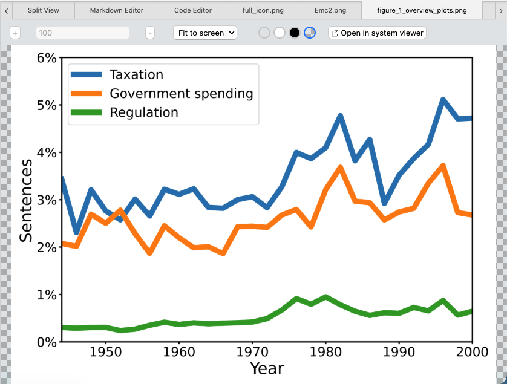

# Image Viewer

The image viewer is a component that can load and show images inside Zettlr. This feature allows you to, e.g., reference plots or other pictures as you write.

Zettlr supports most image types by default, including JPEG- and PNG-images.

!!! note

	To enable the image viewer, you need to choose "Zettlr" as the application to open images with in the preferences.

## Enabling the Image Viewer

Zettlr uses the image viewer to display images, but only if you have set Zettlr as your application to open images with.

To enable Zettlr to open images for you, go inside the Preferences window → “Advanced” → “File Treatment.” In this section you can adjust various options pertaining to where and how to open various file types. Make sure that **Open with** for **Images** is set to **Zettlr** and not to System default.

## Using the Image Viewer

The image viewer comes with a set of configuration options that you can set to adjust how images are shown. It comes with its own small toolbar to allow that.

First, you can decide whether the images should be shown in their entirety and fitted to the available size (the default). You can also choose to fit either the width or the height, which will necessitate scrolling. Lastly, you can also freely zoom in and out of the picture.

When you select the Zoom-option, you can manually adjust the zoom level with the controls on the left side of the image viewer toolbar.

Next, you can choose a background for the image viewer. You can choose between **transparent**, **white**, **black**, and **checkerboard**. The latter is often used to show you transparency in PNG-images.

Finally, the image viewer is just that: a viewer. If you need to open the image in your system viewer, click the corresponding button.

!!! tip

	You can also right-click the image's document tab, and choose to show the file in your file browser. This way you can manually select which software you want to open the image in.