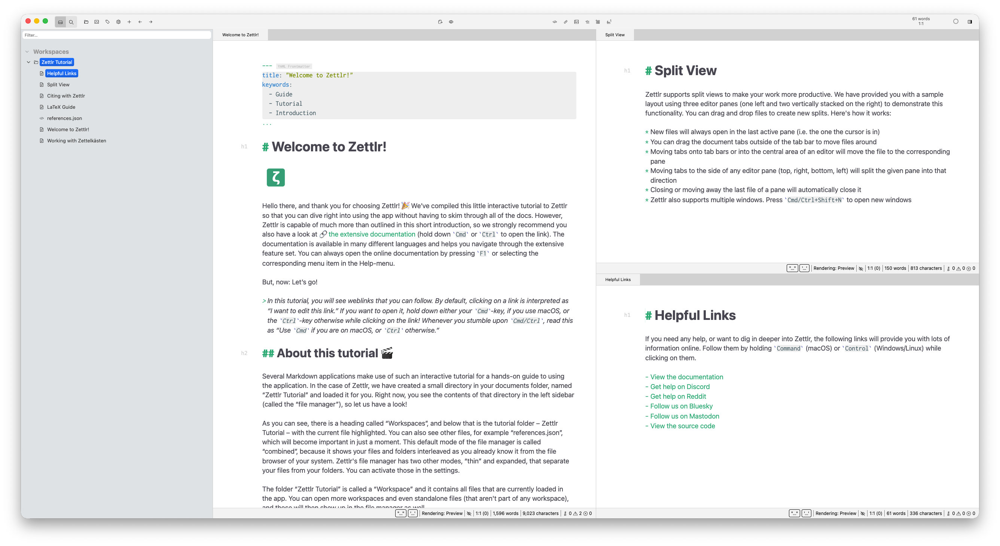
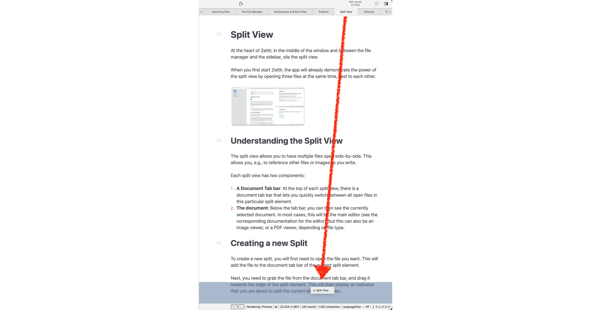
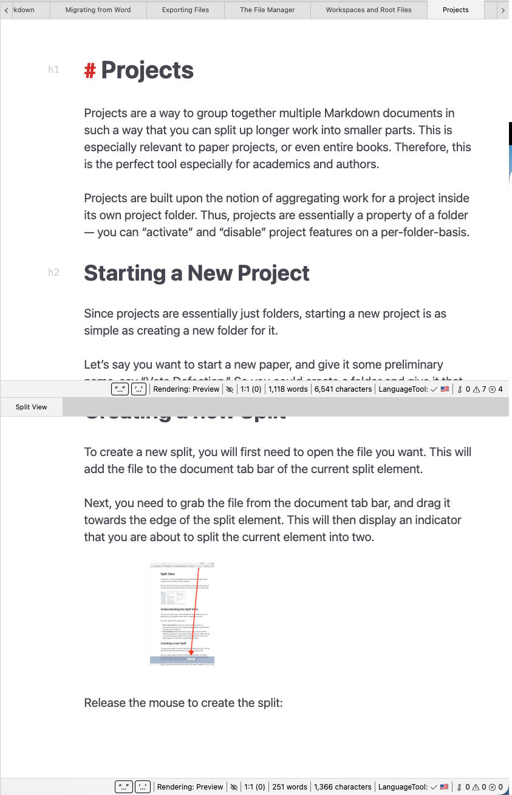

# Split View

At the heart of Zettlr, in the middle of the window and between the file manager and the sidebar, sits the split view.

When you first start Zettlr, the app will already demonstrate the power of the split view by opening three files at the same time, next to each other.

## Understanding the Split View

The split view allows you to have multiple files open side-by-side. This allows you, e.g., to reference other files or images as you write.

Each split view has two components:

1. **A Document Tab bar**: At the top of each split view, there is a document tab bar that lets you quickly switch between all open files in this particular split element.
2. **The document**: Below the tab bar, you can then see the currently selected document. In most cases, this will be the [main Markdown editor](./markdown-editor.md) (see the corresponding documentation for the editor), but this can also be an [image viewer](./image-viewer.md), or a [PDF viewer](./pdf-viewer.md), depending on file type.

## Creating a new Split

To create a new split, you will first need to open the file you want. This will add the file to the document tab bar of the current split element.

Next, you need to grab the file from the document tab bar, and drag it towards the edge of the split element. This will then display an indicator that you are about to split the current element into two.

Release the mouse to create the split:

Now you have split the existing element into two. Note that both splits have their own document tab bar, with the bottom split only showing a single document — the one you used to create the split.

## Moving Documents Around

To move documents between existing splits, you can simply drag and drop them from the document tab bars onto the center of the target split. If you do not see a blue indicator, this means that you won’t create a new split, but instead move the document there.

You can also drag the documents exactly onto the document tab bar of the target split, which will give you an indicator, but this is not necessary.

## Removing Split Views

Zettlr does not allow empty split views, to remove a split view, you can simply move all documents out of the split view you wish to remove. After the last file has been removed from the element, Zettlr will close it.

To close a split element with various open documents, you can also right-click on an empty spot on its document tab bar, and select “Close leaf.”

!!! note

	Since the split view is more a concept to organize documents, and less a specific "thing," terms can get confusing. What we call "Split View" usually means the entirety of all split elements. You can also call individual split elements "panes," since that is how we call them internally.

## Resizing Split Views

All split views can be individually resized. To do so, move the mouse over the border between two split elements. The mouse cursor will change shape to indicate the direction of the split (horizontally or vertically). Drag the edge to resize the split view.