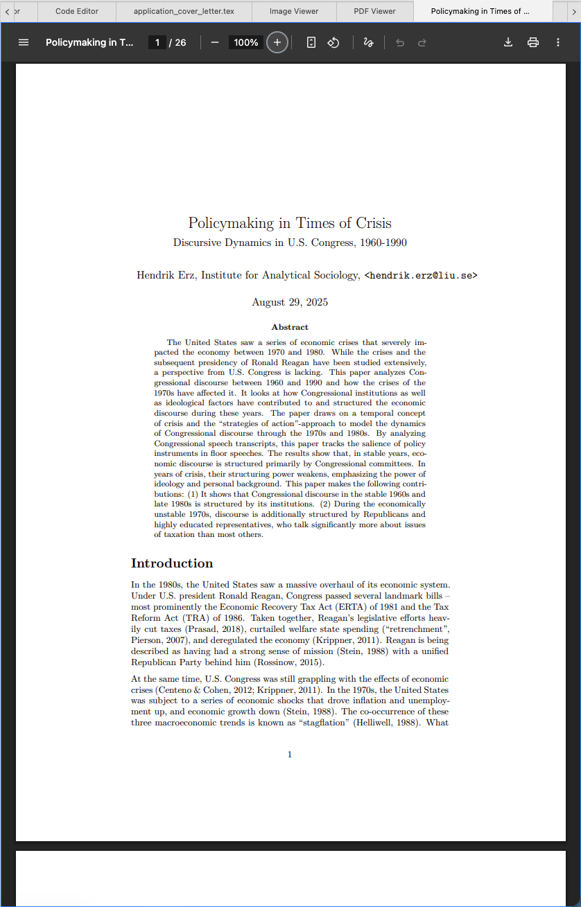

# PDF Viewer

The PDF viewer is a component that can load and show PDF files inside Zettlr. This feature allows you to, e.g., reference papers or exported paper projects as you write.

!!! note

	To enable the PDF viewer, you need to choose "Zettlr" as the application to open PDF files with in the preferences.

## Enabling the PDF Viewer

Zettlr uses the PDF viewer to display PDF files, but only if you have set Zettlr as your application to open PDF files with.

To enable Zettlr to open PDF files for you, go inside the Preferences window → “Advanced” → “File Treatment.” In this section you can adjust various options pertaining to where and how to open various file types. Make sure that **Open with** for **PDF documents** is set to **Zettlr** and not to System default.

## Using the PDF Viewer

If you have ever used Google Chrome (or a derivative browser), you will immediately recognize the PDF viewer. Since Zettlr is built upon the Chromium-browser, it contains the same PDF viewer. Everything you know from Chrome’s PDF viewer applies in Zettlr.

**However**, there is one important point: Because the PDF viewer needs a lot of mouse interaction, by default the PDF viewer is **disabled**. In order to navigate a PDF file, you first need to focus the PDF viewer. You do so simply by clicking inside the document. Then you can use the viewer as you normally do.

!!! hint

	When a PDF viewer is active, you can see a colored border around it. Click outside the PDF viewer to un-focus it.