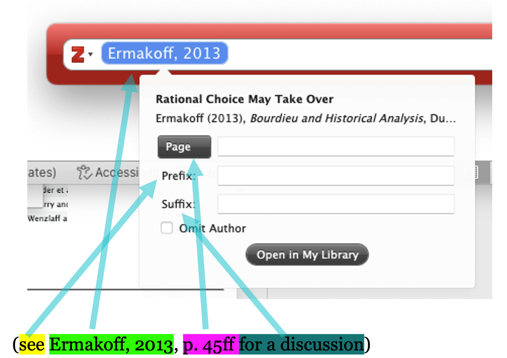
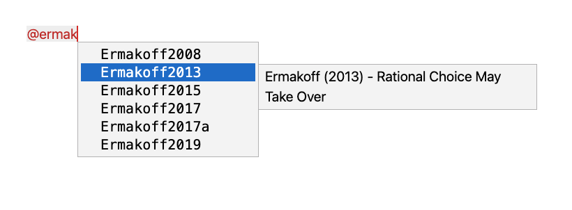
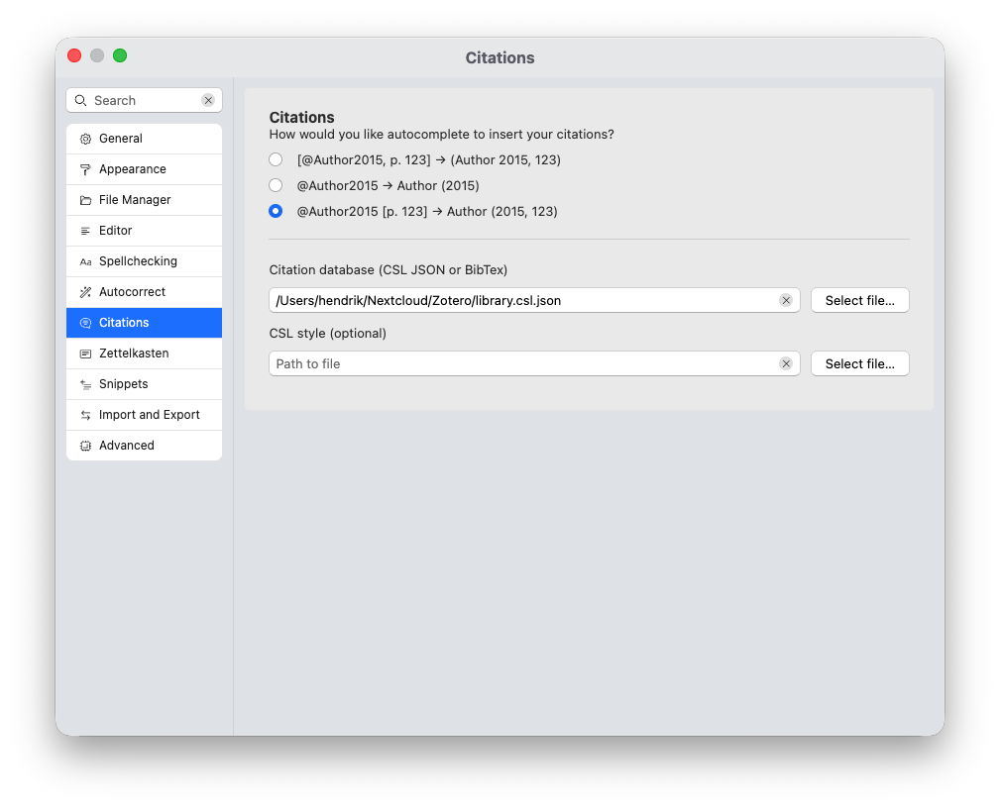

# Citations and CrossRef

Two features that are unique to Zettlr is its native support for both academic references and cross-referencing of tables, figures, and equations across your documents.

In this section, we describe both types of syntax and explain how Zettlr aids you in adding citations and references. We start with citations, and then explain CrossRef.

> [!important]
> Both citations and cross-references are barely supported by any editor or tool except Pandoc and Zettlr. Therefore, expect that no other tool will properly understand either syntax without plugins or additional configuration.

## Citations

Citations are at the heart of every academic document. Zettlr offers first-class features for supporting your claims with references.

### Anatomy of a Citation

Every citation consists of up to four parts, only one of which is mandatory:

* An **optional prefix** that precedes the citation.
* A **required citekey** that specifies the piece of work that shall be cited.
* An **optional locator** that specifies the exact location within the work cited (e.g., a page number or a chapter).
* An **optional suffix** that includes further information after the reference.

These are the same four parts you can configure in the Zotero picker that you may already be familiar with. Thus, let us start by demonstrating how the settings in the Zotero picker are turned into valid citations when you export a work:



In this example, we have highlighted the **prefix** in yellow, the actual **citation key** in green, the **locator** in purple, and the **suffix** in teal. You can easily identify that the citation key, which hides behind the “Ermakoff, 2013” label, is mandatory.

> [!note]
> **Zettlr does not use Zotero’s citation picker**. Instead, it utilizes Pandoc’s citation syntax. Pandoc’s citation syntax is equivalent to the picker, but instead of using a graphical interface to modify your citation, you write out all the parts of your citation directly.
>
> This can be much faster once you are attuned to the syntax, because you don’t have to wait for the picker to open, click around the elements, and wait for the picker to apply your changes afterwards.

The syntax for composing a citation using Pandoc syntax is almost the same as what it will look like when rendered. The example text from above would be written like this:

```markdown
This is some text [see @Ermakoff2013, p. 45ff for a discussion].
```

As you can see, the citation syntax exactly mirrors how regular in-text citations are written. The benefit? Zettlr and Pandoc are smart enough to take these pieces of information and format them **regardless of which citation style you use**!

::: tip
While the Zotero picker offers a checkbox to “omit the author” of a work (that is, only display the year), you can achieve the same functionality by prepending the citation key with a hyphen (`-`).

Example: The citation `[-@Ermakoff2013]` would render as `(2013)` without the author.
:::

### Types of Citations

Depending on where you want to reference a work, you can choose between three variants of citations:

1. `[@Author2015, p. 123]` will render as `(Author 2015, 123)`
2. `@Author2015` will render as `Author (2015)`
3. `@Author2015 [p. 123]` will render as `Author (2015, 123)`

The **first option** will produce a self-contained reference, where prefix, suffix, and all parts of the referenced work are contained within the citation. By using this option, you retain the most flexibility, and upon exporting, it will be converted into the correct syntax (including footnotes, if you use a citation style that mandates footnotes).

However, sometimes you may wish to include a citation seamlessly into your sentence. For example, you may want to write something like this:

```markdown
… and as Ermakoff (2013, p. 45ff) has pointed out …
```

This won’t work with option one, as it will place the author’s surname into the brackets instead of in front of them. To ensure that the author name is placed in front of the brackets, and is thus part of the sentence, place the citekey **without brackets** inside your sentence:

```markdown
… and as @Ermakoff2013 has pointed out …
```

This will immediately render as `Ermakoff (2013)`. If you use a citation style that mandates footnotes, the author’s surname will remain a part of the sentence, but the contents of the brackets will be moved into a footnote upon export.

To add additional information to the citation, such as a locator, or a suffix, use square brackets *directly after the citekey*:

```markdown

… and as @Ermakoff2013 [p. 45ff] has pointed out …
```

This will add the locator and/or suffix information into the brackets behind the author’s surname (or in the footnote, depending on the style).

> [!important]
> Because Zettlr focuses on the writing environment, it will always pre-render your citations using an in-text style. When you export a finished paper, you can specify any supported citation style, including footnote citation styles, or even numerical styles that are common in the computer sciences.

### Inserting Citations

Provided you have pointed Zettlr to a file that contains your citations, you can insert citations easily with the help of autocompletion. Start by typing an `@`-symbol in a valid position. A “valid position” means: the `@` is at the beginning of a line, preceded by whitespace, or directly after an opening square bracket.

In this case, Zettlr will automatically suggest citekeys from your library to autocomplete to. Simply start typing letters from the citation key (i.e., of the author name or the year) to have Zettlr remove non-matching citation keys until the key you need is visible. Then, navigate with the arrow keys through the list until the correct entry is highlighted, and press <kbd>Enter</kbd>.



Zettlr shows you the bibliographic information of the currently selected citekey in an additional tooltip next to the entry. This helps you verify that you have the correct entry, especially in instances (as you can see in the screenshot) where you have multiple publications per year.

One the autocomplete completes the citekey, it will use your preferred syntax to insert the citation. This includes inserting a closing square bracket, if necessary, or adding square brackets behind the citekey, depending on your setting.



You can change how Zettlr autocompletes citekeys by navigating into the preferences → “Citations” section. Here you can choose one of the three types of citations that have been introduced above. This is helpful especially if you usually use in-text references.

> [!tip]
> There may be times when you want to cut and paste a citekey directly from your reference manager. If you're using Zotero with the BetterBibTeX plugin, the plugin comes with features for streamlining this process, which require a one-time setup.
>
> In Zotero, go to the `Settings` menu and select `Better BibTeX` from the sidebar to bring up the plugin settings. Scroll to the section labeled `Quick-Copy` and choose `Pandoc citation` from the `Quick-Copy format` menu. Next, select `Export` from the `Settings` sidebar. From the dropdown menu labeled `Item Format`, select the option labeled `Better BibTeX Citation Key Quick Copy`. This completes the necessary setup.
>
> Going forward, you can select one, or multiple, items in Zotero and drag them onto the Zettlr editor pane to insert citations. If you prefer to cut and paste citekeys, you can do so by selecting an entry in Zotero and using the shortcut <kbd>Cmd/Ctrl</kbd>+<kbd>Shift</kbd>+<kbd>C</kbd> to copy the citekey to the clipboard.

For more information on how to use citations in line with Pandoc's citeproc engine, [please refer to the official guide](https://pandoc.org/MANUAL.html#citations).

## CrossRef

With an understanding of citation syntax in mind, it is now time to learn how to write cross-references. As mentioned above, cross-reference syntax is a simple extension of the citation syntax you just learned.

> [!caution]
> While Zettlr supports CrossRef syntax out of the box, you will have to perform some initial setup steps to make this syntax work when you export your files. Refer to the [CrossRef guide](../editor/crossref.md) to learn how to set up Pandoc CrossRef, which powers these.

### Introduction to CrossRef Syntax

The CrossRef syntax is easy to learn once you understand the citation syntax, since CrossRef is essentially an extension to it. Each cross-reference consists of two elements:

1. A figure/table/equation ID that you specify using [Pandoc attributes](./attribute-syntax.md).
2. A reference that looks almost like a regular citation.

The main difference between a citation and a cross-reference is that the “citekey” of a cross-reference is the ID you specified earlier, and not a work from your reference library. Also, cross-references do not support locators or suffixes.

### CrossRef Identifiers

Because cross-references use the same syntax as regular citations, they must follow a specific format so that the CrossRef filter can identify them, and leave actual citations as they are, so that citeproc can handle them.

Each identifier **must** follow this format:

```
{fig,tbl,eq,sec,lst}:<a-z0-9->
```

As you can see, cross-reference identifiers consist of two parts, separated by a colon (`:`). The first part must be one of `fig` (for figures), `tbl` (for tables), `eq` (for equations), `sec` (for sections), or `lst` (for listings such as code blocks). The second part should be a simple label that can include ASCII letters, numbers, dots, and hyphens.

Pandoc CrossRef uses this convention to identify cross-references that it should handle, and distinguish these from citekeys (which, for example, cannot contain colon characters).

### Declaring Elements to Cross-Reference

To be able to cross-reference a table, figure, equation, listing, or section, you first must assign it an ID that follows the abovementioned format. You do so by utilizing the [Pandoc attribute syntax](./attribute-syntax.md):

```markdown
First, an image:

{#fig:plotA}

Next, a table (where the ID is defined in the caption):

| Column | Column |
|--------|--------|
|   One  |   Two  |

: Table A {#tbl:tableA}

Lastly, an equation:

[$$\hat{y} = \beta_0 + \beta_1 x + \epsilon$$]{#eq:equation1}
```

The equation in this example is wrapped inside a [Pandoc span](./bracketed-spans-fenced-divs.md), which specifies the range of text that this ID should apply to. The image and table are referenced implicitly.

To reference these elements in your text, you use these IDs as if they were citekeys:

```markdown
As shown in [table @tbl:tableA], we can see […]

See [figure @fig:plotA] for a plot of the regression analysis.
```

> [!CAUTION]
> Crossref-syntax requires square brackets around the citation, but these will *not* be turned into round brackets upon export, which is different from how citations are parsed. If you wish to reference something in brackets, write those out manually:
> 
> ```markdown
> As the plot below shows ([@fig:plotA]), […]
> ```

### CrossRef Prefixes

Cross-references support prefixes. If you only provide the cross-reference ID, CrossRef will use default labels such as `Fig.` or `Tbl.`. By adding a prefix in front of the ID, you can customize this:

```markdown
As shown above ([see table @tbl.table2.2]), […].
```

This would render as follows:

```markdown
As shown above (see table 3), […].
```

where the contents in the bracket are linked to the actual table (or other referenced element).

You can also reference multiple figures, tables, or other elements at the same time by separating them just like regular citations with semicolons. CrossRef will, upon exporting your file, try to compress all referenced items to compact number ranges (where, say, `[@fig:fig1; @fig:fig2; @fig:fig3]` would become `Figs. 1-3`).

> [!TIP]
> While Zettlr pre-renders a subset of the CrossRef syntax, you can always find an up-to-date and complete documentation of the available syntax [in the official CrossRef documentation](https://lierdakil.github.io/pandoc-crossref/).