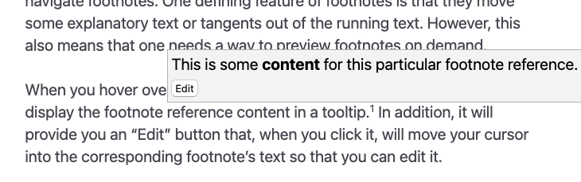

# Footnotes

Footnotes are a crucial part of any serious writing workflow. Zettlr utilizes Pandoc’s syntax to enable footnote support. In addition, Zettlr provides some convenience features to make working with footnotes easier.

> [!important]
> Footnotes are another element that has proliferated across the ecosystem. There are even discussions to include this into the base Markdown dialect, CommonMark. This has not yet happened, but almost all parsers should understand footnotes. What fewer understand are *inline* footnotes, so take care about this.

## Anatomy of a Footnote

Footnotes consist of two elements, an inline **footnote label** that you place at the position where you wish to reference something, and a block-type **footnote reference** that is usually placed at the end of a document, and which can contain inline elements, citations, or other block elements.

There is a less-common variant syntax which allows you to define **inline footnotes** that combine the label and reference in one single inline element.

### Numbered Footnotes

The most common case are regular numbered footnotes. To add such a footnote, you need to create two elements, first a footnote label, and then the content of the footnote, called its *reference*:

```markdown
This is a sentence to which I am adding a footnote.[^1]
This is another sentence.

[^1]: This is the footnote reference.
```

It is common to place the footnote’s content at the end of your document. However, you can place it anywhere in the document, although this is not recommended and can become confusing.

> [!tip]
> The number is called the *identifier* of the footnote.

The footnote reference is a **block** element, which means that it can contain other block elements. To do so, you need to indent all following paragraphs with **four** spaces:

```markdown
This is a sentence to which I am adding a footnote.[^1]
This is another sentence.

[^1]: This is the footnote's content.

    * This is a list item inside the footnote.
```

The first non-indented line after the footnote reference ends the footnote and continues regular text (or starts the next footnote reference).

### Custom Identifiers

You are not required to use numbers to create footnotes. You can use arbitrary text as an identifier. The important aspect of a footnote is that both label and reference must share **the same identifier**. The identifier is anything that follows the `^`-character in label or reference, so `1` would be a common numerical identifier, but any arbitrary text can be used as an identifier, too.

The following is a perfectly valid footnote:

```markdown
This is a sentence to which I am adding
a footnote.[^example-note] This is another
sentence.

[^example-note]: This is the footnote's content.
```

> [!tip]
> The footnote syntax is heavily inspired by reference-style link syntax. The only distinguishing factor between a footnote and a reference-style link is that the identifier of a footnote **must** start with a circumflex (`^`), whereas a link **cannot**.

For some people, using custom identifiers might be easier, since it allows you to provide a short summary of what the footnote actually says. Whenever you export a document with footnotes using such custom identifiers, these identifiers **will be replaced with regular, ascending numbers**, so you will not have to worry about the correct numbering of the footnotes.

### Inline Footnotes

Lastly, sometimes it may be helpful to move just a small amount of information into a footnote, but keep everything in one place. You can use an **inline footnote** for this purpose. The syntax for such footnotes is slightly different, in that it moves the circumflex in front of the beginning square bracket, and replaces the identifier with the actual footnote text:

```markdown
This is a text supported by an inline footnote.^[This text will appear in the footnote.]
```

### Multiple Labels

Lastly, you can refer to the same footnote reference multiple times. The footnote *reference* will be duplicated for every footnote *label* found in the text:

```markdown
This is a sentence which is followed by a footnote.[^x]
This, next sentence, is followed by the same footnote.[^x]

[^x]: This footnote text will appear two times, once
      for a footnote "1", and for a footnote "2".
```

## Footnotes and Projects

There is an important caveat with regard to footnotes in projects. When you use the [project feature](../file-manager/projects.md), you can export multiple files into a single exported file. Within each file, you can then have footnotes starting with the label `1` and counting upwards.

However, when you export multiple files that contain the same footnote identifier, **the latter footnote references will override earlier ones**. This means that the footnote content of your first file will be overridden by the content of the reference with the same identifier of the second file.

To avoid this, you need to tell Pandoc that it should treat each file individually, using the setting `file-scope: true`. We recommend you add this flag to every [export profile](../export/defaults-files.md) that you use to export projects with.

When `file-scope` is set, Pandoc will first turn all footnote identifiers into unique strings so that there are no collisions across the files. Only once that is done, Pandoc will combine the files to create the single export file.

> [!important]
> The reason Zettlr does not apply this setting automatically is that `file-scope` changes all identifiers in a file. This can break custom reference section placements, or filters that expect specific IDs. So while you would gain unique footnote identifiers, you may lose other features.

## Inserting Footnotes

Since you are working with Markdown, you can simply write out the syntax to first define the footnote, and later provide the footnote reference text.

However, this can quickly become cumbersome, especially if you’re in a field that lives off of footnotes. Therefore, the first quality-of-life feature Zettlr provides is an automated way to insert footnotes.

To insert a footnote, simply press <kbd>Cmd</kbd>+<kbd>Alt</kbd>+<kbd>R</kbd> (macOS) or <kbd>Ctrl</kbd>+<kbd>Alt</kbd>+<kbd>F</kbd> (Windows/Linux).

This will direct Zettlr to create a footnote at the current cursor position, and at the same time insert a corresponding reference at the bottom of your current document. At the same time, it will place your cursor at the start of the footnote reference so that you can immediately start writing your footnote body. Lastly, it will automatically renumber all footnote identifiers so that they are numbered ascending.

## Viewing and Navigating Footnotes

The main purpose of footnotes is to move some explanatory text or tangents out of the running text. However, this necessitates some facilities to quickly and efficient view footnote text, and navigate between the footnote label and its reference.

Hovering over a footnote label with your cursor will show a tooltip that contains the footnote reference text, already pre-rendered in HTML. This allows you to read the footnote text without scrolling.



To edit a footnote text, you can click the edit button inside this tooltip, or you can hold <kbd>Cmd</kbd> or <kbd>Ctrl</kbd> while clicking the footnote. Both actions will scroll to the footnote reference and focus it so that you can edit the footnote content.

To jump back to the footnote label in the text, click the arrow button next to the footnote reference.


## Removing Footnotes

To remove a footnote, you will have to delete the footnote label and reference. When you press <kbd>Backspace</kbd> with your cursor next to a footnote label, Zettlr will first select the footnote label, and, on the second press, it will delete the entire label. Next, you can delete the reference manually.

If this creates a hole in the numbering of your footnotes, remember that footnotes will be correctly numbered upon export. When you add a new footnote, Zettlr will re-number the footnotes correctly.