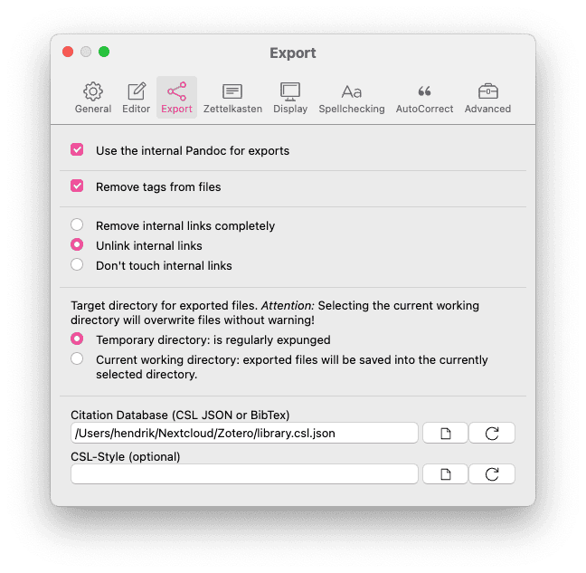

# Citando con Zettlr

Las citas en Zettlr se hacen usando `citeproc-js`, una librería que funciona como el motor citeproc-engine de Pandoc o Zotero. Entonces, lo que ve en Zettlr coincidirá con la salida de los complementos de Word o LibreOffice de Zotero. El motor de citas de Zettlr tiene tres partes: una biblioteca CSL JSON o BibTex que contiene todos los elementos que se pueden citar, un motor de vista previa y una hoja de estilo CSL opcional que puede utilizar para modificar el estilo con el que se exportarán sus archivos. Esta guía le ayudará a habilitar las citas y producir archivos de apariencia hermosa (¡no solo PDF!) Que contienen citas correctas y consistentes.

## Habilitando las citas en Zettlr

Hay dos motores diferentes que pertenecen al ámbito de las citas: las vistas previas (las citas se pueden previsualizar como imágenes o enlaces) y el proceso real de generación de citas (que ocurre solo en la exportación). Ambas funciones se activan al seleccionar una biblioteca de citas que contiene referencias. Sin dicha biblioteca, Zettlr todavía podrá "previsualizar" las citas (para que pueda ver qué activará el citeproc de Pandoc), pero Zettlr no reemplazará el contenido de la cita con una cita generada.

Entonces, el primer paso es crear dicho archivo. Zotero y JabRef son aplicaciones recomendadas para administrar su biblioteca.

> Para simplificar las cosas, **este tutorial asume que usas Zotero**. Si utiliza otro administrador de referencias, consulte su manual sobre cómo exportar desde un formato CSL JSON o BibTex.

Si usa Mendeley, Citavi, EndNote o cualquier otro software de administración de referencias que no admita CSL JSON, puede usar archivos BibTex. Funcionarán de la misma forma que los archivos CSL JSON. Internamente, Zettlr convertirá BibTex a CSL JSON.

### Paso 1: Instale BetterBibTex

El primer paso es instalar [el complemento BetterBibTex para Zotero](https://github.com/retorquere/zotero-better-bibtex/releases/latest). Usar BetterBibTex tiene dos beneficios importantes frente a no usarlo: Primero, mantiene todas sus identificadores de citas únicas en toda su biblioteca. En segundo lugar, le permite mantener actualizado su archivo de biblioteca exportado para que no tenga que volver a exportarlo cada vez que algo cambie.

Cada elemento de la cita tiene su propio identificador único. Esto es necesario para que cuando sumercé, por ejemplo, se dé cuenta de que la fecha de publicación se ha guardado incorrectamente, pueda cambiarla fácilmente en Zotero y luego citeproc utilice la información corregida. Si no usa BetterBibTex, puede suceder que se emita un identificador varias veces, lo que generaría errores (en el buen sentido, porque sabe que hay algo mal) o simplemente haga que citeproc use el primer elemento que coincida con este identificador (la de mala manera, porque entonces tendrías que tener suerte de detectar la cita incorrecta después de la exportación).

> **¿Por qué es esto importante?** Por ejemplo, si te das cuenta de que la fecha de publicación de una referencia se ha guardado incorrectamente, puedes cambiarla en Zotero y citeproc usará la cita con la información corregida. Sin embargo, sin BetterBibTex, la misma identificación puede emitirse varias veces. Esto podría conducir a un error evidente, lo cual es bueno porque en realidad hay algo mal. Sin embargo, también podría conducir a un error silencioso, donde citeproc usa el primer elemento que coincide con el ID; esto es malo porque es difícil detectar citas erróneas después de la exportación.

> **Tip**: BetterBibTex genera automáticamente identificadores únicos mediante un algoritmo que puede personalizar. BetterBibTex es compatible con [patrones de identificadores de citas de JabRef](https://docs.jabref.org/setup/citationkeypatterns). Se asegurará de que cada entrada sea única agregando opcionalmente un sufijo a las publicaciones que produzcan los mismos identificadores  (por ejemplo, tendrá algo como `Harvey2005a`,` Harvey2005b`, `Harvey2005c`, etc.). Puede encontrar [todas las capacidades de BetterBibTex en la extensa documentación del complemento](https://retorque.re/zotero-better-bibtex/citation-keys/) .

### Paso 2: exporta tu biblioteca

El siguiente paso es exportar tu biblioteca. La tarea de Zotero es administrar sus referencias, pero para que Zettlr pueda usarlas en la vista previa y en los archivos exportados, debe exportarlos a un archivo independiente.

> Hemos realizado pruebas con una biblioteca que contiene alrededor de 700 elementos y no hemos experimentado ningún problema de rendimiento al exportarlos todos en total.


A continuación, haga clic en `Archivo` y seleccione `Exportar biblioteca ...`. Seleccione `Better CSL JSON` como formato; Si optó por no instalar BetterBibTex, elija `CSL JSON`. Al marcar `Mantener actualizado`, BetterBibTex se asegurará de que cada cambio en Zotero actualice automáticamente su archivo `CSL JSON`. De esta manera, Zettlr siempre usará la cita correcta más actualizada.

> Si marcó `Mantener actualizado`, puede verificar el estado del `CSL JSON` abriendo las Preferencias de Zotero, seleccionando la pestaña` BetterBibTex` y seleccionando `Exportación automática`. Aquí puede ajustar qué se exporta y cuándo.

### Paso 3: abre tu biblioteca en Zettlr

Es hora de importar su biblioteca a Zettlr. Para hacerlo, abra las preferencias de Zettlr, vaya a la pestaña `Exportar` y haga click en el icono de la hoja pequeña que se encuentra a la derecha del campo de entrada `Base de datos de citas`. Aparecerá un cuadro de diálogo que le permitirá navegar a su archivo de base de datos (es decir, `CSL JSON` o` BibTex`). Seleccione su archivo de base de datos, guarde las preferencias y Zettlr cargará automáticamente la base de datos. ¡Ahora está todo listo para citar!



> Tenga en cuenta que también puede agregar archivos de bibliografía a los archivos predeterminados. Estos, sin embargo, no serán cargados por Zettlr, por lo que no obtendrá una vista previa de los identificadores de cita definidos allí.

### Paso 4: Habilite *Renderizar citas*

En la sección *Visualización* de las preferencias, encontrará la opción *Renderizar citas*. Esta opción debe estar habilitada para ver citas formateadas en el editor. Está habilitado de forma predeterminada, pero en caso de que lo haya cambiado, ahora sería un buen momento para volver a habilitarlo.

## Citando en Zettlr

Zettlr admite la sintaxis citeproc de Pandoc para escribir citas. Esto significa que tendrá dos opciones para escribir citas. Primero, puede agregar una única identificación en su texto para representar una cita para esta identificación. Debería verse así: `@ Harvey2005a`. Todas las claves de citas comienzan con una "@" seguida de la ID (es decir, BetterBibTex CiteKey).

> Zettlr tiene una función de autocompletar que le indicará todas las claves de citas disponibles tan pronto como escriba un carácter "@". Si no se le presenta una lista de posibles referencias, puede haber un problema con el archivo de base de datos (es decir, `CSL JSON` o` BibTex`) que configuró anteriormente. Después de escribir "@", puede comenzar a escribir los primeros caracteres de la identificación para limitar su búsqueda. Si la referencia que desea citar está en la parte superior de la lista, presione la tecla `Enter` para seleccionarla. Si la referencia que desea está visible, pero más abajo en la lista, use las teclas de flecha para resaltar la referencia y presione la tecla `Enter`, o use su mouse para hacer click en su referencia.

A veces querrás llegar a algo más específico con tu cita. Por ejemplo, agregando un cierto rango de páginas. Para eso es la cita de corchetes más extendida. Una cita con un prefijo y un rango de páginas se vería así:

`[Véase @Harvey2005a, 45-51]`

Para citar varios autores, simplemente divida los bloques con punto y coma:

`[Véase @Harvey2005a, 45-51; también @Ciepley2007, 8-9]`

Para obtener más información sobre cómo utilizar las citas de acuerdo con el motor citeproc de Pandoc, [consulte la guía](http://pandoc.org/demo/example19/Extension-citations.html).

> **Por favor tenga en cuenta** El motor citeproc de Zettlr es **solo para fines de vista previa**. Por razones de simplicidad, Zettlr no analiza perfectamente todas las citas. Está ahí para **verificar que sus citas se detecten correctamente para que no tenga citas faltantes en la exportación**. Pero tenga la certeza de que citeproc de Pandoc representará la cita correctamente en la exportación.

## Comprobando las referencias

Una vez que hayas terminado de citar y quieras comprobar que has citado todo lo que planeaste, puedes abrir la [Barra lateral](../core/sidebar.md) e ir a la sección de referencias. Si falta algo allí, probablemente no se haya citado en su archivo.

## Usar una biblioteca de archivos específicos

También puede usar un archivo de bibliografía específico que solo se usa para uno de sus archivos. Para hacerlo, debe agregar el archivo de bibliografía al YAML frontmatter  de su archivo. Si Zettlr detecta la propiedad `bibliography` en el frontmatter de un archivo, automáticamente cargará ese archivo y le ofrecerá elementos de ese archivo en lugar de su biblioteca principal.

Ejemplo:

```yaml
---
title: "Mi documento"
tags: etiqueta1, etiqueta2, etiqueta3
bibliography: ./assets/references.json
---
```

## Cambiando el estilo de la cita

Internamente, Zettlr siempre usará el estilo Chicago para generar citas. Por lo tanto, sus citas de vista previa siempre estarán "en el texto" y nunca en estilo de nota al pie. Esto tiene la intención de confirmar que todo está funcionando.

Pero, por supuesto, puede usar diferentes estilos de citas, dependiendo de los requisitos de la revista para la que esté escribiendo o de sus preferencias personales. Para cambiar el estilo de cita que utilizará citeproc de Pandoc para representar sus citas, debe descargar el archivo CSL correspondiente. Un muy buen punto de partida es el [repositorio de estilo Zotero](https://www.zotero.org/styles). Allí puede buscar estilos de citas específicos, obtener una vista previa y descargarlos. Otra buena opción es el [repositorio de estilos de lenguaje de estilo de citas](https://github.com/citation-style-language/styles)

Puede dirigir Zettlr a un archivo CSL de dos formas. Primero en las preferencias generales. En la pestaña "Exportar", debajo del campo de su archivo de base de datos de citas, puede seleccionar su estilo CSL preferido. Esto se utilizará para todas las exportaciones de una sola página mediante el botón de la barra de herramientas. 

En segundo lugar, puede establecer especificar un estilo CSL para un proyecto específico. Con la carpeta del proyecto visible en el administrador de archivos, haga click con el botón derecho en la carpeta del proyecto y seleccione `Configuración del proyecto ...`. Aquí puede especificar el archivo CSL que se utilizará al exportar su proyecto.

## Personalización de la lista de referencias

Citar cosas no solo implica representar correctamente las citas dentro de su texto, sino también recopilar una lista de referencias al final del documento. De forma predeterminada, Pandoc simplemente agregará una lista de referencias al final de sus documentos sin ningún tipo de decoración. Pero tiene muchas opciones disponibles para personalizar ese comportamiento, y conocer algunos trucos puede hacer que todas sus listas de referencias se vean bien desde la primera exportación.

### 1. Agregar un encabezado de sección

Cuando exporta un documento por primera vez, notará que, de forma predeterminada, Pandoc simplemente adjuntará la lista de referencias al final de su documento sin ningún tipo de decoración, incluso sin ningún título. Para agregar un título, puede elegir entre dos opciones.

La primera opción es definir la propiedad `reference-section-title` en el YAML frontmatter de su archivo. Acepta una cadena que se establecerá como título para toda la sección. Entonces, si especifica `reference-section-title: Bibliografía`, Pandoc usará` Bibliografía` como título.

La segunda opción es simplemente terminar su documento con el encabezado deseado, es decir, `## Bibliografía`. Dado que Pandoc literalmente colocará la lista de referencias en el archivo al final, si su archivo termina con un encabezado, ese se convertirá en el encabezado de la sección.

> Obviamente, no tiene sentido utilizar ambos enfoques, ya que eso daría como resultado dos títulos seguidos.

### 2. Cambiando el lugar donde aparece la lista de referencias

Otra opción de personalización que tiene al usar Pandoc es que puede especificar dónde aparece su lista de referencias. Por ejemplo, si desea agregar otra sección _después_ de la lista de referencias, como un apéndice, tendrá que decirle a Pandoc exactamente dónde deben terminar sus referencias. Para esto, necesita definir un elemento `div` (que es una forma de contenedor para texto) con el ID` # refs`. Puede hacerlo agregando un div HTML literal o agregando un div interno de Pandoc.

Primero, así es como puede definir un div de HTML:

```markdown
Esta podría ser la última oración de su conclusión.

## Referencias

<div id="refs">
</div>

## Apéndice

Aquí podría agregar un apéndice.
```

Tenga en cuenta que en este ejemplo no debe hacer uso del YAML frontmatter  `reference-section-title` ya que hemos agregado un encabezado manualmente.

Aquí está el segundo ejemplo usando un div de Pandoc:

```markdown
Esta podría ser la última oración de su conclusión.

## Referencias

::: {#refs}
:::

## Apéndice

Aquí podría agregar un apéndice.
```

> Puede leer más sobre cómo hacer esto en el [manual de Pandoc](https://pandoc.org/MANUAL.html#placement-of-the-bibliography).

### 3. Dándole formato a la lista de referencias

Cuando agrega citas a sus archivos, seguro desea asegurarse de que las referencias tengan un formato ordenado. Si exporta a Word o LibreOffice, puede ajustar sus referencias mientras edita su archivo antes de enviarlo. Pero esto no es posible si exporta a PDF. Por lo tanto, es posible que deba agregar algunas directivas de estilo a su archivo. Aquí describimos cómo cambiar la apariencia de los archivos PDF. Para cambiar la apariencia de las exportaciones HTML, puede utilizar CSS.

LaTeX usa longitudes para determinar las medidas generales del PDF exportado. Estas longitudes se establecen normalmente de forma global, pero se pueden cambiar para diferentes partes del documento. Una de estas longitudes es `parindent`, que controla la sangría francesa de todos los párrafos.

Siempre que use el comando `\ setlength`, LaTeX sobrescribirá la longitud especificada desde donde encuentre este comando hasta que use` \ setlength` nuevamente. Dado que la sección de referencias está formateada con párrafos como el resto del documento, se formatearán de forma predeterminada en este estilo predeterminado. Para volver a formatear la lista de referencias para que se vea diferente, debe sobrescribirlas justo antes de la lista de referencias.

El siguiente fragmento de código le ofrece un ejemplo:

```latex
\setlength{\parindent}{-1cm} % Sangría francesa negativa
\setlength{\leftskip}{0.5cm} % Sangría general
\setlength{\parskip}{0.1cm} % Espaciado entre párrafos
```

El ejemplo anterior representaría la lista de referencias con una sangría negativa de menos un centímetro. Además, aplicará una sangría general de medio centímetro en relación con los márgenes de la página. Por ejemplo, si el margen de la página izquierda se establece en 3 centímetros, los párrafos de la lista de referencias se desplazarán 3,5 centímetros. El último valor (`parskip`) controla el espacio _entre_ párrafos, por lo que habrá un espacio de 10 milímetros entre párrafos.

El ejemplo anterior es un buen punto de partida. Puede buscar más longitudes para modificarlas y ajustarlas a su gusto.

> Tenga en cuenta que esto se aplica principalmente si exporta sus documentos utilizando la plantilla predeterminada o cualquier otra plantilla que no controle específicamente cómo se formatean las citas. Si está enviando, por ejemplo, a una revista STEM que proporciona su propia plantilla LaTeX y la usa, es probable que esto ya formatee correctamente la lista de referencias.

## Controlando Pandoc Citeproc con el YAML frontmatter 

Puede controlar ciertos aspectos de citeproc de Pandoc usando variables que se pueden configurar en su YAML frontmatter. Asegúrese de leer la [página correspondiente](../ core/yaml-frontmatter.md) para ver, por ejemplo, cómo cambiar el idioma de su lista de referencias.

## Accediendo al PDF de una referencia desde Zettlr

Puede pasar que vuelva a leer algo que ha escrito y desee volver a verificar un trabajo referenciado. Puede hacer esto simplemente haciendo click derecho en una cita y abriendo el archivo PDF correspondiente.

Para que esto funcione, **Zotero debe estar ejecutándose** (ya que Zettlr consultará la aplicación usando el identificador de cita y solicitará la ruta real al archivo PDF) y usted necesita **tener BetterBibTex instalado** (ya que solo BetterBibTex ofrece el destino API correspondiente necesario para solicitar la ruta PDF).

Tenga en cuenta que esto no se aplica a las bases de datos BibTex, ya que estas ya contienen las rutas completas a los archivos PDF vinculados (pero tenga en cuenta que son opcionales, por lo que es posible que deba decirle explícitamente a su gestor de referencias que agregue esas rutas) y, como tal, Zettlr no lo hace. necesita consultar un programa externo.
