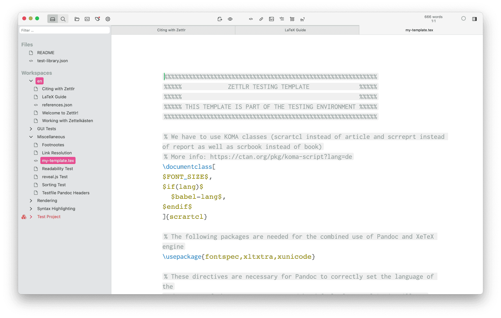

# Plantillas personalizadas

Cuando haya terminado con el contenido de su artículo, es hora de centrar su atención en su estética. Tus ideas son valiosas. Sin embargo, para que brillen realmente, debes seleccionar el diseño y la tipografía correctos. Por ejemplo, es posible que desees utilizar una fuente específica, un espaciado de línea diferente y tal vez incluso un color diferente. Si lo deseas, puede crear documentos de apariencia realmente asombrosa, [como estos ejemplos](https://tex.stackexchange.com/questions/1319/showcase-of-beautiful-typography-done-in-tex-friends).

Además de darle la libertad de usar herramientas como Pandoc y LaTeX, un principio fundamental de la filosofía de Zettlr es hacer que estas herramientas funcionen _bien_ para sumercé. ¡Esta página le presentará el uso de plantillas personalizadas de LaTeX, para que pueda mostrar su escritura y el producto final!

## Introducción a la creación de plantillas

¡Escribamos su primera plantilla LaTeX, que se puede hacer directamente en Zettlr! Cuando esté completo, su archivo de plantilla se pasará a Zettlr, Citeproc (si corresponde), Pandoc y finalmente a LaTeX.

Primero, cree un nuevo archivo (Archivo -> Nuevo archivo…). Esto creará automáticamente un archivo Markdown (`.md`) con un identificador único como nombre temporal. Comience a escribir su plantilla LaTeX y luego guarde su archivo (Archivo -> Guardar). En este punto, podrá proporcionar a su archivo un nombre y una extensión de archivo adecuados. Por ejemplo, `mi-plantilla.tex`. 


Zettlr cambiará automáticamente el resaltado de código de Markdown a LaTeX, y aparecerá un pequeño indicador `TeX` debajo del nombre del archivo en la lista de archivos.



## Contenidos necesarios

Puede utilizar muchas variables diferentes, según sus necesidades. Las plantillas predeterminadas de Pandoc ya contienen muchas variables útiles que se documentan aquí. Sin embargo, eres libre de no usar variables que consideres poco importantes, e incluso puedes introducir tus propias variables usando el motor de plantillas de Pandoc. Por ejemplo, supongamos que desea agregar información adicional a algunas, pero no a todas, sus exportaciones. Luego, podría definir una variable `mi-variable` y definir si en todos los YAML frontmatters donde los archivos exportados deben contener esa información:

```markdown
---
title: "El título de mi archivo"
date: 2021-10-18
mi-variable: "Alguna información adicional"
---
```

Dentro de su plantilla, necesitaría hacer algo con esta variable:

```
$if(mi-variable)$
Este es un texto que solo estará contenido si se ha definido "mi-variable".

Incluso puede insertar el contenido de la variable escribiendo $mi-variable$
$endif$
```

> Tenga en cuenta que esto es solo un ejemplo. Un ejemplo más completo que podría decirse que promueve el principio de variables al máximo, consulte [esta plantilla para un curriculum vitae](https://github.com/nathanlesage/cv).

Si bien muchas variables son opcionales, hay una variable de Pandoc que debe estar presente en todo momento:

```
$body$
```

Pandoc reemplazará esta variable con el contenido analizado de su(s) archivo(s) Markdown. Si lo omite, su contenido no aparecerá en el archivo de salida.

## Activa tu plantilla

Para que su plantilla funcione, debe dirigir a Zettlr a ella, a través del archivo de valores predeterminados de PDF en el Gestor de recursos. Navegue hasta el Gestor de recursos desde el menú de Zettlr y seleccione 'PDF' de la lista de configuraciones ('Archivos predeterminados') a la izquierda. A continuación, agregue `template: ` al final del archivo de configuración. Tenga en cuenta el espacio después de los dos puntos. Ahora Zettlr necesita saber la ruta a su nuevo archivo de plantilla. Busque su archivo de plantilla, que si lo ha creado en Zettlr, puede encontrar haciendo click derecho en el archivo en el administrador de archivos de Zettlr y seleccione 'Mostrar archivo'. Tenga en cuenta que el nombre del archivo LaTeX debe terminar en `.tex`. Una vez que haya encontrado el archivo, debe encontrar su ubicación en la estructura de directorios de su computadora, que es la 'ruta' o el 'nombre de ruta' del archivo.

1. En macOS, puede encontrar la ruta del archivo haciendo click con el botón derecho en el archivo en el Finder y presionando la tecla 'Opción', que cambiará el elemento del menú 'Copiar archivo' a 'Copiar como nombre de ruta'.
2. En Ubuntu Linux, usando el Explorador de archivos, puede encontrar la ruta del archivo seleccionado actualmente usando la combinación de teclas __CTRL__ + __L__, que muestra la ruta del archivo en la barra de ubicación.
3. En Windows 10 y 11, seleccione el archivo en el Explorador de archivos y presione y mantenga presionada la tecla __Shift__ en su teclado mientras __hace click con el botón derecho__ en él. En el menú contextual que aparece, seleccione "Copiar como ruta".

Copie el nombre de la ruta y péguelo en el archivo PDF predeterminado así: `template: /path/to/your/template.tex`.


Recuerde dejar un espacio entre los dos puntos y su ruta. Guarde los cambios y disfrute de su plantilla LaTeX.

## Ideas finales

Zettlr se esfuerza por darle un control total sobre lo que puede hacer con sus archivos. Lo que hemos descrito en esta página es solo el comienzo. ¿Cómo usas las posibilidades de Zettlr para hacer cosas raras? Cuéntanos en [Twitter](https://www.twitter.com/Zettlr), [Discord](https://discord.com/invite/PcfS3DM9Xj) o en [Reddit](https://www.reddit.com/r/Zettlr)!
