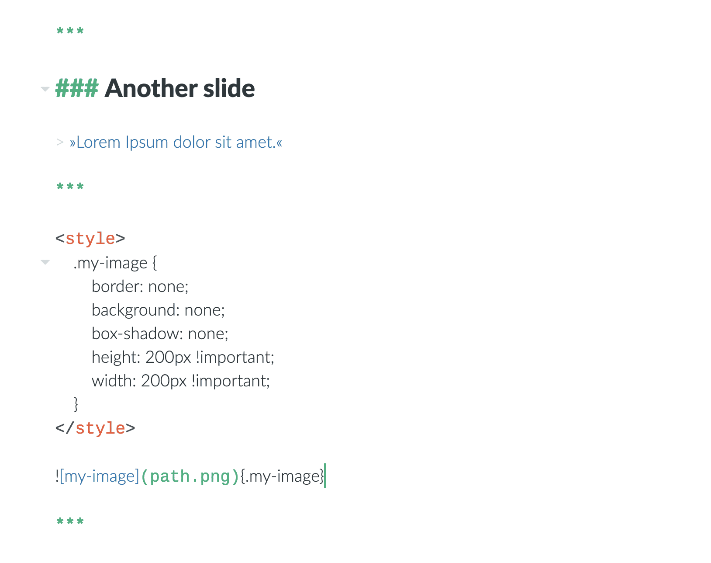

# Presentaciones

Zettlr puede exportar sus archivos de Markdown directamente como archivos de presentación utilizando el framework [revel.js](https://revealjs.com/#/). `revel.js` es una solución liviana para crear presentaciones usando HTML simple y JavaScript. Por lo tanto, estas presentaciones se pueden mostrar en _todos_ los equipos que ejecutan un navegador; hoy en día esto significa: se ejecutan en _todos_ equipos.

Para exportar archivos Markdown a `revel.js`, debes asegurarte de que Pandoc esté instalado en tu computadora. Dirígete a la [guía de instalación de Pandoc](../installing-pandoc.md) para ver cómo instalar Pandoc.

## Consideraciones previas

Por supuesto, un documento de Markdown que debe compilarse en una presentación tiene una estructura ligeramente diferente a la de otros documentos de Markdown.

### Creando diapositivas

Puede crear nuevas diapositivas de dos formas. Primero, cada nivel de encabezado 1 comenzará una nueva diapositiva y también actuará como el título de la diapositiva. Pero en caso de que el nivel de encabezado 1 sea demasiado grande para su gusto, o simplemente no desee un título en esa diapositiva, también puede delimitar las diapositivas utilizando divisores de Markdown (ya sea `***` o `---`) .

Todo lo que siga al encabezado o al divisor terminará siendo el contenido de las diapositivas. No es necesario que "finalice" explícitamente la última diapositiva con un divisor.

### Usando elementos de Markdown

Dentro de las diapositivas, puede utilizar todos los elementos de Markdown. Se renderizarán como cabría esperar. ¡Incluso puede usar notas al pie que luego se colocarán en la respectiva diapositiva al final!

## Herramientas avanzadas

Por supuesto, las presentaciones de `revel.js` también tienen la misma versatilidad que PowerPoint o Impress cuando se trata de controlar su presentación. Por ejemplo, puede usar clases CSS para decirle a la presentación que ciertos elementos deben activarse antes de cambiar la diapositiva. Estos se denominan "fragmentos". Debido a las limitaciones en el motor de Pandoc, tendrá que usar HTML simple para lograr esto. Considere, por ejemplo, el código HTML de la presentación de demostración:

```html
<ul>
    <li class="fragment fade-in">Este elemento se desvanecerá.</li>
    <li class="fragment highlight-blue">Esto se resaltará en azul.</li>
    <li class="fragment highlight-red">Todas las transiciones disponibles están documentadas [aquí](https://github.com/hakimel/reveal.js/#fragments).</li>
</ul>
```

Esto creará una lista con tres elementos. Todos los elementos son "fragmentos", lo que significa que al presionar la tecla para la siguiente diapositiva, la primera se `desvanecerá`, como dice la clase (_class_ en el HTML). En la próxima pulsación de la tecla de flecha derecha, el segundo elemento se resaltará en color azul. La tercera pulsación de la tecla de flecha derecha resaltará el último elemento en rojo. Y en la cuarta pulsación de la tecla de flecha se mostrará la siguiente diapositiva.

## Configuración de presentación

Por supuesto, la presentación en sí también tiene configuraciones que puede utilizar. Estas son directivas JavaScript simples que puede manipular insertando una etiqueta `<script>` como se muestra en la captura de pantalla. Puede anularlos estableciendo los atributos en el objeto `zettlrRevealOptions`.


Estas son las opciones que puede configurar:

```javascript
const zettlrRevealOptions = {
    // Mostrar controles en la esquina inferior derecha
    controls: true,
    // Mostrar una barra de progreso de la presentación
    progress: true,
    // Mostrar el número de página de la diapositiva actual
    slideNumber: true,
    // Suba cada cambio de diapositiva al historial del navegador
    history: true,
    // Habilitar atajos de teclado para la navegación
    keyboard: true,
    // Habilitar el modo de vista general de diapositivas
    overview: true,
    // Centrado vertical de diapositivas
    center: true,
    // Permite la navegación táctil en dispositivos con entrada táctil
    touch: true,
    // Haga cíclica (en bucle) la presentación
    loop: false,
    // Cambiar la dirección de presentación para que sea RTL
    rtl: false,
    // Hace aleatorio el orden de las diapositivas cada vez que se carga la presentación
    shuffle: false,
    // Activa y desactiva los fragmentos a nivel global
    fragments: true,
    // Marca si la presentación se está ejecutando en modo incrustado,
     // es decir, contenido en una parte limitada de la pantalla
    embedded: false,
    // Señala si deberíamos mostrar una superposición de ayuda cuando se presiona la tecla de signo de interrogación 
    help: true,
    // Marca si las notas del orador deben ser visibles para todos los espectadores
    showNotes: false,
    // Anulación global para la reproducción automática de medios integrados (video/audio/iframe)
    // - null: Los medios solo se reproducirán automáticamente si la reproducción automática de datos está presente
    // - true: Todos los medios se reproducirán automáticamente, independientemente de la configuración individual
    // - false: Ningún medio se reproducirá automáticamente, independientemente de la configuración individual
    autoPlayMedia: null,
    // Número de milisegundos entre que se procede automáticamente la
    // siguiente diapositiva, desactivada cuando se establece en 0, este valor se puede sobrescribir
    // mediante el uso de un atributo de deslizamiento automático de datos en sus diapositivas
    autoSlide: 0,
    // Detener el desplazamiento automático después de la entrada del usuario
    autoSlideStoppable: true,
    // Habilitar la navegación por diapositivas a través de la rueda del mouse
    mouseWheel: false,
    // Oculta la barra de direcciones en dispositivos móviles
    hideAddressBar: true,
    // Abre enlaces en una superposición de vista previa de iframe
    previewLinks: false,
    // Estilo de transición
    transition: 'convex', // none/fade/slide/convex/concave/zoom
    // Velocidad de transición
    transitionSpeed: 'default', // default/fast/slow
    // Estilo de transición para fondos de diapositivas de página completa
    backgroundTransition: 'fade', // none/fade/slide/convex/concave/zoom
    // Número de diapositivas que son visibles a la distancia
    viewDistance: 3,
    // El modo de visualización que se utilizará para mostrar diapositivas.
    display: 'block'
};
```

## Estilo de presentación

Si ninguno de los temas disponibles le atrae, o si necesita proporcionar algo de CSS adicional, puede hacerlo simplemente colocando una etiqueta `<style>` en algún lugar de su presentación.

Necesitará algunos conocimientos de CSS para perfeccionar el estilo, pero la apariencia de la presentación en sí debería ser satisfactoria por sí sola.



## Imágenes

Uno de los inconvenientes de estas presentaciones HTML es que el archivo resultante no puede contener imágenes. (Más exactamente, _pueden_ incluirse, pero eso aumentaría el tamaño del archivo por el tamaño de todas las imágenes multiplicado por el factor 1.3).

Por lo tanto, debe decidir dónde colocar las imágenes. Básicamente, existen tres métodos posibles.

1. Cree un directorio dedicado para las imágenes, por ejemplo, `img`, dentro del directorio con su archivo de markdown. Luego, enlace a todas las imágenes usando rutas relativas (`img/my-image.jpg`). Cuando exporte su archivo, asegúrese de que la presentación esté en el mismo lugar en relación con el directorio de imágenes que su archivo de origen.
2. Simplemente coloque todas las imágenes dentro del mismo directorio que su archivo de presentación. Luego, vincularlos con su nombre de archivo debería ser suficiente.
3. Súbelos a la web, por ejemplo, a un servicio de alojamiento de imágenes, y vincule sus URL's. Único inconveniente: Debería depender de una conexión a Internet que funcione en el lugar donde realiza su presentación.

Una regla general es: si Zettlr muestra correctamente sus imágenes, también lo hará su presentación, siempre que se asegure de que la presentación esté en _exactamente_ el lugar correcto en relación con sus archivos de imagen.

> Si realmente debe hacerlo, puede decirle a Pandoc que incluya todas las imágenes directamente en el archivo HTML configurando la variable `self-content` en` true` en su archivo predeterminado (no funciona dentro del frontmatter). Pero recuerde que muchas imágenes en su presentación fácilmente podrían resultar en un archivo HTML de decenas de Megabytes. Sin embargo, entonces tendría un archivo de presentación verdaderamente autónomo.
