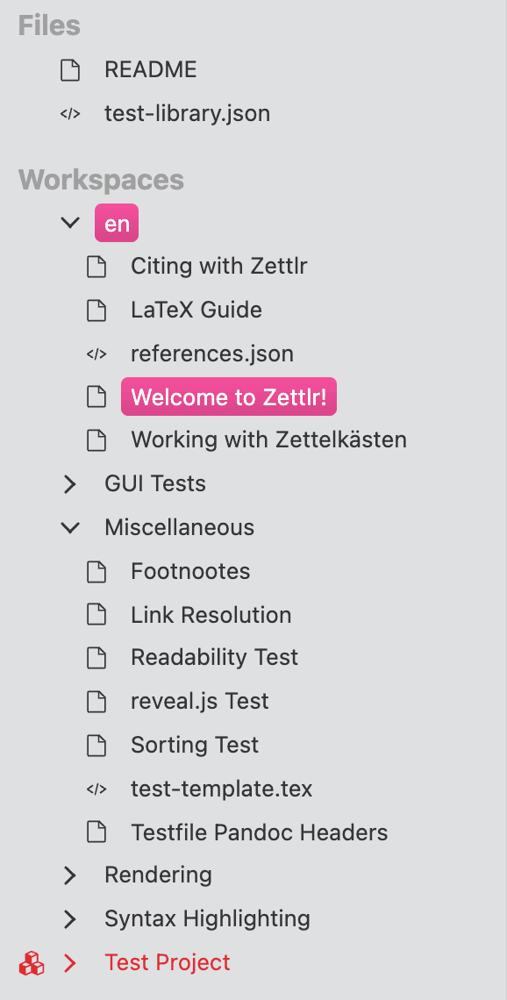

# Áreas de trabajo y archivos

Zettlr contiene un gestor de archivos completo basado en nuestra propia capa de abstracción de sistema de archivos personalizada (_FSAL_ por sus siglas en inglés). Esto no es una coincidencia, ya que  Zettlr fue construido con la inmersión como un principio guía. Lo que se traduce en la práctica es que Zettlr espera que elijas un folder en algún lugar de tu computador, en donde realizarás la mayoría del trabajo con  Zettlr.

<iframe width="560" height="315" src="https://www.youtube-nocookie.com/embed/2YX5n8-XVbU" frameborder="0" allow="accelerometer; autoplay; encrypted-media; gyroscope; picture-in-picture" allowfullscreen></iframe>

> A lo largo de esta documentación, estaremos usando los términos "carpeta", "folder" y "directorio" indistintamente como si se refirieran a la misma cosa. La única diferencia es que "folder" o "carpeta" es el término más conocido por las personas, mientras que "directorio" es el término técnico para las carpetas y folders en tu computadora.

## Áreas de trabajo

Un área de trabajo conforma el inicio para un único árbol de archivos. Como sabrás, los archivos se guardan de manera jerárquica en carpetas de tu computador. Cada directorio que abres en Zettlr se llama área de trabajo.

Puedes cargar varias áreas de trabajo al mismo tiempo, por ejemplo si quieres separar diferentes partes de trabajo (por ejemplo un área de trabajo llamada  "Zettelkasten" y otra llamada  "Proyectos"). Si quieres implementar el llamado principio "PARA" para archivar documentos, tiene sentido crear cuatro carpetas en tu computador, "Proyectos," "Archivos," "Recursos," y "Áreas" y cargar cada uno en su propia área de trabajo dentro de la aplicación.

Zettlr revisará los archivos al interior de tu área de trabajo en caso de que haya cambios que haga de forma remota. Por ejemplo, si usa un servidor en la nube para hacer copias de seguridad de sus archivos, como Google Drive, Dropbox, o Nextcloud, puede ocurrir que tu aplicación en la nube se sincronice y realice cambios a un archivo solo después de que has arrancado Zettlr. Entonces,  Zettlr reconocerá esto y reflejará esos cambios  apropiadamente al interior de la aplicación.

> Es altamente recomendable que tenga al menos un área de trabajo abierta en la aplicación. Es posible que solo abra archivos de tu computador y trabaje en ellos, pero recomendamos evitarlo, porque podrías perder un montón de funcionalidades que están relacionadas con las áreas de trabajo, y como Zettlr se ha construido sobre este concepto, es probable que seas menos productivo sin este enfoque.

## Archivos independientes

Los archivos independientes son aquellos que abres, por ejemplo haciéndoles doble click en tu computador, pero que no están contenidos en el interior de ninguna área de trabajo que ha abierto. Ellos por sí mismo forman un ítem al interior del árbol de archivos de  Zettlr, pero a diferencia de las áreas de trabajo, estos "árboles" solo contienen un único archivo.

No puedes abrir archivos directamente al interior de la app. En cambio, se abrirán cuando le des doble click a un archivo en algún lugar de tu computador. Si el archivo está ubicado al interior de un área de trabajo, Zettlr simplemente lo llevará al área de trabajo y abrirá el archivo allí. Pero si el archivo no se puede encontrar en ningún área de trabajo de Zettlr, Zettlr lo abrirá como archivo independiente.

Los archivos independientes siempre se ordenan sobre las áreas de trabajo, donde pueda acceder a ellas fácilmente. También puede "cerrarlos", lo que quiere decir que ellos serán desmontados de la aplicación, pero los deja sin tocar, o removerlos, lo que quiere decir que Zettlr los desmontará de la aplicación y además los moverá a la papelera de reciclaje.

> Este comportamiento hace que sea simple cargar uno o dos archTvos adicionales en Markdown en la aplicación que no estén cargados en un área de trabajo. Esto tiene sentido, por ejemplo, para desarrolladores de software que solo quieren editar el archivo Readme de sus proyectos sin cargar todo un directorio en Zettlr.
