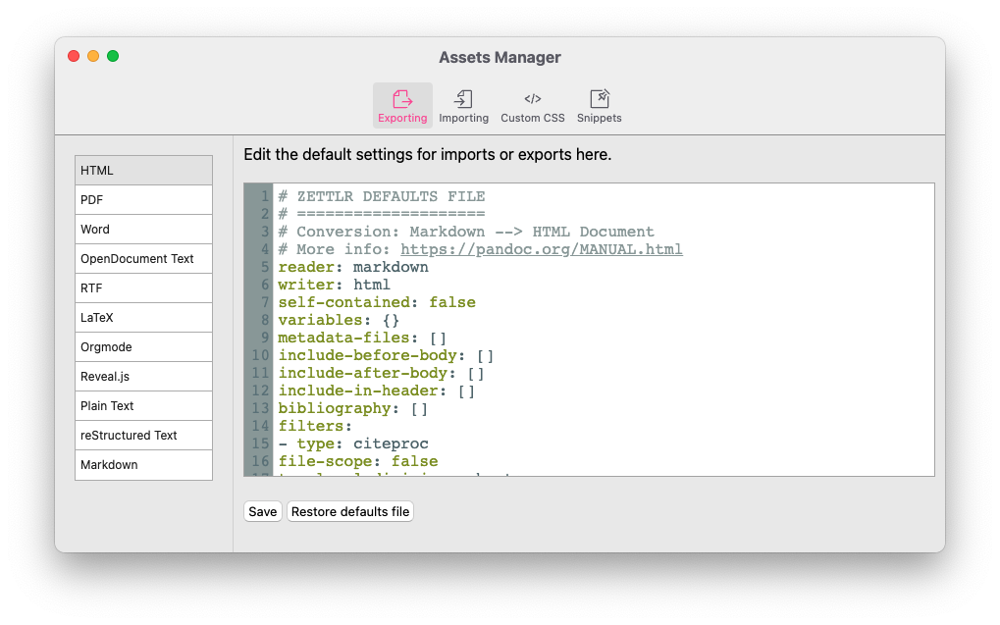

# Gestor de recursos

Zettlr 2.0 introdujo el nuevo administrador de recursos que te permite administrar todos los recursos estáticos que se almacenan como archivos en tu directorio de datos de usuario. Entre estos se encuentran los nuevos archivos predeterminados, tu CSS personalizado y fragmentos. Si bien es posible editar estos archivos de manera externa, el administrador de activos te brinda un medio completo para hacerlo desde la propia aplicación.



Puedes acceder al administrador de activos a través de "Zettlr -> Gestor de recursos" (macOS) o "Archivo -> Preferencias -> Gestor de recursos" (Windows / Linux).

El gestor de recursos te permite editar tus archivos utilizando el resaltado de corrector de sintaxis y lo hace más fácil que los editores externos. Para ver qué puedes editar y cómo hacerlo de manera productiva, consulta las partes correspondientes de la documentación:

* [Archivos predeterminados](defaults-files.md)
* [CSS's personalizados](custom-css.md)
* [Fragmentos](snippets.md)

> El gestor de recursos reemplaza el cuadro anterior de diálogo de preferencias de PDF. El nuevo gestor de recursos te brinda no solo todas las configuraciones del cuadro de diálogo de preferencias de PDF, sino muchas más.

## Cómo adaptar las preferencias de PDF

Desde la versión 2.0, ya no hay un diálogo de Preferencias de PDF dedicado. Más bien, ahora puedes ajustar las configuraciones que estaban presentes en ese cuadro de diálogo junto con una magnitud de configuraciones adicionales. Para simplemente restaurar las antiguas preferencias de PDF y luego adaptarlas, puedes copiar fácilmente el siguiente fragmento en la sección `variables` del archivo de exportación de valores predeterminados para documentos PDF:

```yaml
# Omitted content of the defaults file ...
variables:
  # mainfont and sansfont work for the default pdf-engine "xelatex"
  # Should you choose to use pdflatex, you can set the font using the property
  # "fontfamily". For more information, see https://pandoc.org/MANUAL.html#fonts
  mainfont: "Times New Roman"
  sansfont: "Arial"
  linestretch: 1.3 # 1.3 means 130% linespacing
  papersize: a4 # Can also be a5, letter, legal, etc.
  margin-left: 2cm
  margin-right: 2cm
  margin-top: 2cm
  margin-bottom: 2cm
# Further omitted content ...
```

Todas las variables que puedes establecer aquí están [documentadas en el manual de Pandoc](https://pandoc.org/MANUAL.html#variables).

> Tip: Puedes definir cada variable también dentro del frontmatter YAML de cualquier archivo. La única diferencia es que simplemente usas las propiedades *sin* anidarlas en `variables`.
