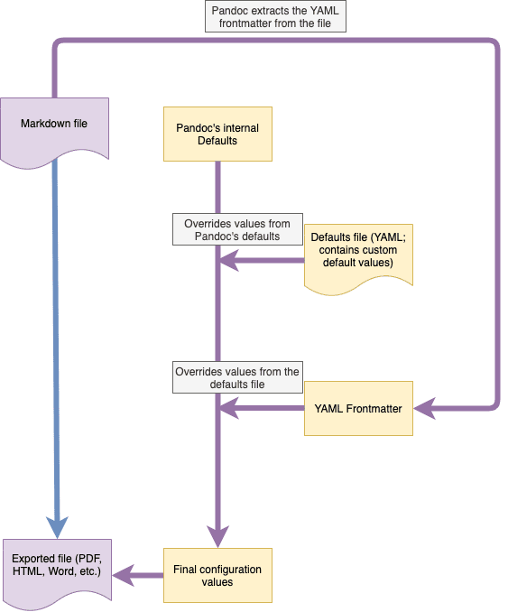

# Archivos predeterminados

Los archivos predeterminados son una forma de definir valores predeterminados para muchas de las variables que Pandoc utiliza internamente para facilitar tanto las importaciones como sus exportaciones. Los archivos predeterminados se parecen a [YAML frontmatters](yaml-frontmatter.md), pero son más potentes y se aplican a todos sus archivos en lugar de a uno solo.

Anteriormente, Zettlr usaba archivos predeterminados internamente, pero Zettlr 2.0 finalmente te brinda la posibilidad de editar estos archivos por tí mismo.

> Editar estos archivos puede ser un poco complicado, así que probablemente deberá exportar un archivo de prueba varias veces antes de hacerlo bien. Es un proceso de prueba y error. Sin embargo, Zettlr se envía con una configuración predeterminada razonable, por lo que si no tienes requisitos especiales, puedes dejar estos archivos como están.

## ¿Qué son los archivos predeterminados?

Los archivos predeterminados son archivos YAML que contienen propiedades que se pueden usar para controlar el comportamiento de Pandoc para un formato de exportación o importación determinado. Residen en tu carpeta de datos de usuario y tienen el formato `<importar / exportar>. <Escritor / lector> .yaml`, donde _importar / exportar_ se refiere al lugar donde se usará el archivo y _escritor / lector_ al formato usado.

Zettlr requiere un cierto conjunto de archivos predeterminados, ya que para cada exportación o importación pasará uno de estos archivos a Pandoc. Como tal, cuando se inicia Zettlr, verificará la existencia de estos archivos requeridos y los creará si es necesario.

> La documentación completa de lo que puedes hacer con los archivos predeterminados se puede encontrar en el [manual de Pandoc](https://pandoc.org/MANUAL.html#default-files). Asegúrate de consultar ese manual cuando edites archivos predeterminados.

## Requisitos para archivos predeterminados

Los archivos predeterminados que utiliza Zettlr tienen un cierto conjunto de requisitos que debes tener en cuenta al editarlos. Primero, nunca debe cambiar las propiedades del `escritor` y del` lector`, excepto para agregar extensiones de markdown (consulte el cuadro de información a continuación). Estas propiedades se pueden establecer porque, en teoría, podría utilizar un archivo predeterminado para varias estrategias de conversión. Sin embargo, dado que Zettlr te permite exportar e importar un determinado conjunto de archivos, es más inteligente ofrecerle una variedad de archivos predeterminados donde estas propiedades son fijas. Si, por ejemplo, intercambia una propiedad de escritor y de lector, Pandoc podría quejarse.

Luego, siempre que Zettlr importe o exporte un archivo, lo leerá en el archivo predeterminado correspondiente y lo modificará de formas específicas. En general, Zettlr solo intentará modificar las propiedades que definas en un archivo de valores predeterminados en lugar de reemplazarlas. Por ejemplo, Zettlr verificará si ya has definido una bibliografía allí y agregará tu biblioteca principal a esa matriz para que las bibliotecas de citas que ya hayas definido no se pierdan. Sin embargo, los archivos de entrada y salida se reemplazarán internamente, por lo que definir algunos archivos allí no tendrá ningún efecto.

Aparte de eso, sin embargo, puedes hacer lo que necesites con los archivos predeterminados para adaptar las importaciones y exportaciones a tu gusto.

> Mencionamos que no debes cambiar las propiedades de "escritor" o "lector". Sin embargo, existe un cierto apalancamiento. Pandoc admite extensiones de Markdown (es decir, para comillas tipográficas, emojis, etc.). Estos se especifican agregándolos después de las propiedades `lector` o` escritor` usando los signos `+`. Por lo tanto, si necesita extensiones para el lector de Markdown estándar, por supuesto, puedes agregarlas a las propiedades `lector` o` escritor`. Ejemplo: `reader: markdown + definition_lists + mmd_title_block + bracketed_spans + fenced_divs`. Esto seguirá usando el mismo lector, pero configurándolo (en este ejemplo) para usar adicionalmente listas de definición, bloques de título de múltiples de markdown, intervalos entre corchetes y divs delimitados.

## ¿Qué variable sobrescribe a cuál?

La última pregunta que podría interesarte es conocer la forma en que todas las diferentes variables que puedes definir para controlar Pandoc interfieren entre sí. Es fundamental comprender cómo Pandoc determina el conjunto de parámetros final y efectivo que luego utilizará para facilitar su importación o exportación. En el gráfico a continuación, puedes ver cómo se realiza cada importación o exportación.



Primero, Pandoc cargará sus propios valores predeterminados internos que están codificados en el binario (y que son la razón por la que no tienes que definir _todas_ las variables cada vez).

En segundo lugar, Pandoc se cargará con el archivo predeterminado que le proporciona Zettlr. Cada variable definida allí reemplazará la predeterminada dentro de la configuración de Pandoc.

En tercer lugar, Pandoc analizará el (los) YAML frontmatter (s) de los archivos que está intentando importar o exportar actualmente. Estas variables pueden reemplazar las establecidas por los archivos predeterminados, pero generalmente no todas. Puedes notar que los archivos predeterminados pueden contener un campo de metadatos, y cualquier valor allí generalmente puede ser reemplazado por una propiedad de YAML frontmatter. Consulta la documentación sobre [YAML frontmatters](yaml-frontmatter.md) para obtener más información.

**Ejemplo**: Supongamos que has definido un `título` para todas sus exportaciones de Word en el archivo predeterminado de Docx. Si no utilizas ningún frontmatter, esta variable se utilizará para todas y cada una de las exportaciones a Docx. Pero si especificas la propiedad `title` dentro de un YAML frontmatter, este archivo, cuando se exporta a Docx, tendrá su propio conjunto de títulos.

> Un caso de uso común para definir variables dentro de un archivo predeterminado que también podrías definir en el nivel de los frontmatters de YAML sería la propiedad `lang`. De forma predeterminada, Pandoc establece el idioma de cada importación y cada exportación en "en-US", lo que genera delimitadores de números y comillas estadounidenses. Si exportas regularmente a, digamos, francés, podría tener sentido establecer la propiedad `lang` directamente en sus archivos predeterminados en` fr` para que los archivos se exporten utilizando esa configuración regional de forma predeterminada. Luego, aún puedes sobrescribir la propiedad a algo diferente dentro de archivos individuales configurando la variable de YAML frontmatter  correspondiente.

## Cómo personalizar las exportaciones

Los archivos predeterminados son una forma muy poderosa, pero al mismo tiempo muy compleja, de personalizar sus exportaciones. En esta sección queremos darte una idea de cómo usar los archivos predeterminados al máximo.

> Esta sección aún está en proceso.

### Preliminares

Pandoc contiene un potente **sistema de plantillas** para personalizar sus exportaciones. Dentro de las plantillas predeterminadas que proporciona Pandoc (y utiliza, si no proporciona explícitamente una plantilla personalizada), encontrarás declaraciones como `$for(hyperrefoptions)$, $hyperrefoptions$$endfor$`. En este caso, "hyperrefoptions" es una variable que puedes establecer. Dependiendo de la plantilla, están disponibles diferentes variables. Puedes encontrar una lista completa de todas las variables utilizadas en las plantillas predeterminadas [aquí](https://pandoc.org/MANUAL.html#variables).

### Configuración de variables

Las variables predeterminadas a veces pueden ser indeseables (Pandoc establece el tamaño carta como el tamaño de papel predeterminado, lo cual no es deseable en otras partes del mundo; Zettlr cambia este valor predeterminado a DIN A4, que también puede no ser adecuado para todos), por lo que puedes configurarlas con diferentes valores. Hay dos formas generales de hacer esto:

1. El YAML frontmatter  de un archivo
2. El archivo de valores predeterminados correspondiente

Si tuvieras que cambiar, digamos, la variable del tamaño de papel solo para un archivo específico, simplemente puedes agregar esa variable con el valor correspondiente como una propiedad de nivel superior. Ejemplo:

```yaml
---
title: Título de documento
author: Pepito Pérez
papersize: legal
---
```

Esto establecería el tamaño del papel en "tamaño oficio" (_legal_ en inglés). Ten en cuenta que en la plantilla predeterminada, la palabra `paper` ya está configurada, por lo que si estás algo familiarizado con LaTeX,` a4paper` no funcionaría ya que en la plantilla se convertiría a `a4paperpaper`, que no es un valor correcto.

La segunda forma de cambiar una variable es cambiarla para cada exportación (es decir, a menos que se sobrescriba con un frontmatter). Esto lo puedes hacer en el archivo de valores predeterminados, pero ten en cuenta que en los archivos de valores predeterminados debes colocar esas variables en una sección especial llamada "variables". Ejemplo:

```yaml
# ... snip ...
variables:
  papersize: legal
# ... snip ...
```

También puedes utilizar este sistema de plantillas tú mismo. Si deseas escribir una plantilla personalizada, puedes agregar declaraciones como `$ if (myvariable) $$ myvariable $$ endif $` e insertar la variable `myvariable` en cualquier archivo inicial o predeterminado, y se reemplazará con el valor que establezcas.
