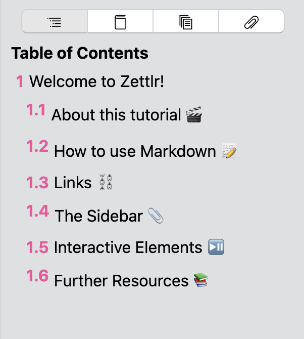
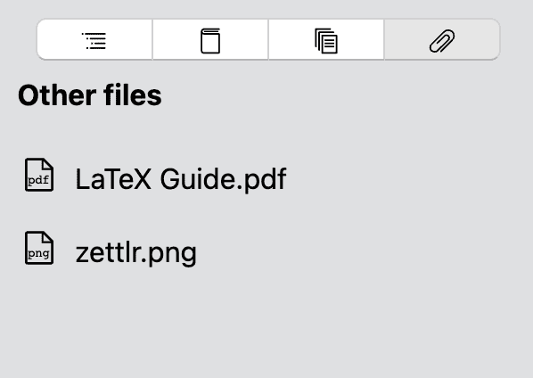

# La barra lateral

La barra lateral es un elemento sensible al contexto que muestra información adicional relevante sobre su directorio actual y su archivo actual. Puede abrirlo usando el icono de la barra lateral en la barra de herramientas o presionando `Cmd / Ctrl +?`.

> Tenga en cuenta que, estrictamente hablando, Zettlr presenta dos barras laterales: la barra lateral de la izquierda se denomina [Administrador de archivos](file-manager.md), mientras que la de la derecha, esta barra lateral, se denomina "la" barra lateral.

Después de abrir la barra lateral, puede ver que tiene cuatro pestañas. Estos son (de izquierda a derecha): tabla de contenido, referencias, archivos relacionados y otros archivos.

## Tabla de contenidos

La primera pestaña le muestra una tabla de contenido para su archivo actual. Se actualiza en tiempo real y le permite ver la estructura de su documento de un vistazo. Las entradas dentro de la tabla de contenido también admiten elementos de Markdown, por lo que sus títulos se procesarán en HTML.

Si hace click en uno de estos títulos, el editor saltará directamente a ese título específico. De esta manera, la tabla de contenido funciona casi exactamente como la vista de esquema de Microsoft Word u otros editores de texto que quizás conozca.

## Referencias

La pestaña de referencias contiene una bibliografía de todas las referencias que cita dentro del documento. Se genera cada vez que guarda su documento y le da una vista previa de su sección de bibliografía. Se podrá hacer clic en los enlaces para que pueda abrir un sitio web relacionado directamente desde la barra lateral. También puede seleccionar texto en este panel que le permite copiar las referencias.

Para obtener más información sobre cómo citar referencias con Zettlr, eche un vistazo a la página de documentación de [citas](../ academic / citations.md).

> Tenga en cuenta que las referencias se mostrarán utilizando el estilo CSL integrado. Sin embargo, durante la exportación, Pandoc utilizará el estilo que defina en sus preferencias para satisfacer sus expectativas. Las referencias en la barra lateral son para propósitos de vista previa.

## Archivos relacionados

La sección de archivos relacionados se ha agregado en la versión 2.0 y contiene archivos que Zettlr cree que están relacionados con el archivo actual. Se enumeran por relevancia descendente, por lo que los archivos más relevantes estarán en la parte superior de la lista.

Los archivos que se consideran relevantes están determinados por las etiquetas que utilizan. Cuantas más etiquetas correspondientes tenga el otro archivo, más relevante será para Zettlr. También planeamos agregar backlinks al cálculo de relevancia. <!-- TODO: ¡Arreglar esta pieza tan pronto como se implemente! -->

## Otros archivos

La última sección contiene archivos que residen dentro del directorio seleccionado actualmente pero que no se consideran Markdown ni uno de los archivos de código admitidos. Pueden ser imágenes, archivos PDF, hojas de cálculo de Excel o cualquier otro tipo de archivo que le gustaría ver allí.

Puede determinar qué archivos se enumeran aquí agregando las extensiones de archivo en la pestaña de preferencias avanzadas. Esas extensiones de archivo no distinguen entre mayúsculas y minúsculas, por lo que agregar `.jpeg` mostrará archivos` .jpeg` así como `.JPEG` y` .JpEg`.

> Esta pestaña es especialmente útil si desea agregar algunas imágenes a sus archivos Markdown. Simplemente arrástrelos y suéltelos en el editor, y Zettlr se asegurará de ponerlos entre una etiqueta de imagen.
