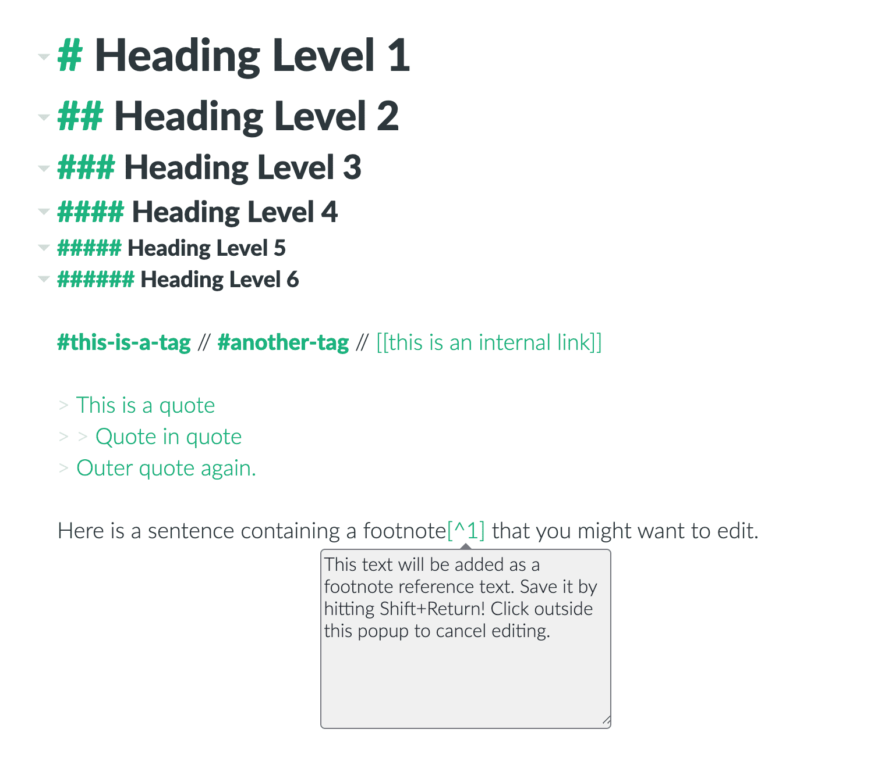
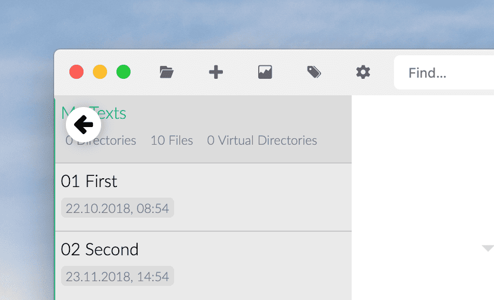
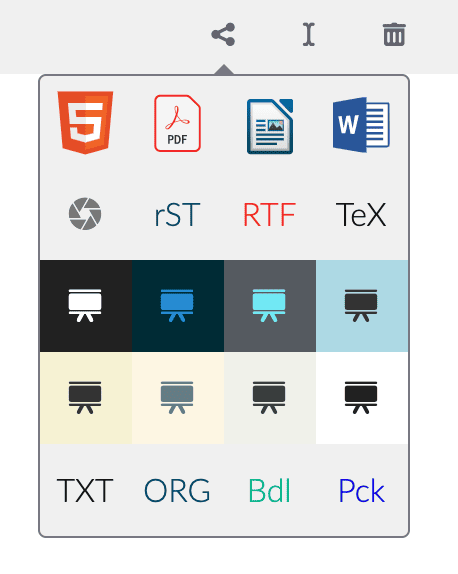

# Zettlr in 5 Minutes

Bon, vous avez téléchargé et installé l'application, vous avez réglé l'horloge et vous êtes prêt à commencer ? Alors, appuyez sur le bouton du compte à rebours et c'est parti !

## 1. Ouvrir des répertoires et des fichiers

Pour ouvrir des répertoires ou des fichiers, il suffit de les faire glisser n'importe où sur la fenêtre de l'application. Ils s'ouvriront automatiquement. Vous pouvez également cliquer sur `Cmd/Ctrl+O` pour ouvrir le dialogue de sélection du répertoire, si cela est plus rapide pour vous.

## 2. Créer des fichiers et des répertoires

Après avoir ouvert un répertoire, vous avez besoin d'un fichier. Exécutez `Cmd/Ctrl+N` pour créer un nouveau fichier. Tapez un nom de fichier, appuyez sur `Return` et sélectionnez l'éditeur. Vous avez besoin d'un autre répertoire ? `Cmd/Ctrl+Shift+N` fera le travail.

> You can not only add Markdown files! If you do not provide an extension, Zettlr will add the extension `.md` for you. But you can also create `.txt`-files and `.tex`-files, you just need to provide that file extension!

## 3. Ecrire !

L'écriture dépend de vous, mais voici les touches les plus importantes à retenir :

- `Cmd/Ctrl+I`: Passez en \__italique_\_. Comme dans Word.
- `Cmd/Ctrl+B`: Passez en \*\***gras**\*\*. Comme dans Word.
- `Cmd+Alt+R` (macOS) `Ctrl+Alt+F` (Windows/Linux) : crée une note de bas de page.
- `Alt/Ctrl+Click` (sur une référence de note de bas de page) : modifier une note de bas de page. Taper `Shift+Enter` pour finir l'édition.
- `Cmd/Ctrl+K`: Insérer un lien. (`Alt/Ctrl+Click` pour ouvrir le lien.)
- `Cmd/Ctrl+J`: Entrez dans le mode "sans distraction".
- `Cmd/Ctrl+Alt+L`: Basculer le thème entre le mode clair et le mode foncé.

Des choses sans frappe, mais aussi importantes :

- Utiliser le signe `#`pour créer des titres. Le nombre de symboles `#`correspond au niveau de titre. Le maximum est 6.
- Utiliser le signe `>`pour créer des blocs de citations. Vous pouvez également les emboîter en utilisant plusieurs signes supérieurs (par exemple `> >`).
- Utiliser  le signe`#` _non_ suivi d'un espace pour créer des étiquettes. Vous pouvez utiliser ces étiquettes pour la recherche et la navigation.

## 4. Quoi d'autre ?

Si vous utilisez le mode "thin sidebar" (par défaut), vous verrez soit la liste des fichiers, soit l'arborescence des répertoires. Déplacez la souris dans le coin supérieur gauche de la liste de fichiers et cliquez sur la flèche pour afficher l'arborescence des répertoires. Pour basculer entre la liste de fichiers et l'arborescence des répertoires, vous pouvez également cliquer sur `Cmd/Ctrl+!`. Choisissez le mode de la barre latérale étendue dans les préférences pour que la liste des fichiers et l'arborescence des répertoires soient visibles en même temps.

Zettlr est strictement basé sur le contexte. Sauf indication contraire, les nouveaux fichiers et répertoires seront créés à l'intérieur du répertoire actuellement sélectionné. Les opérations basées sur les fichiers (renommage ou suppression) viseront par défaut le fichier actuel. Utilisez le menu contextuel en cliquant sur n'importe quel fichier ou répertoire avec le bouton droit de la souris pour sélectionner des fichiers/répertoires spécifiques.

Trois règles simples :

1. La touche `Alt`(ernative) déclenche des actions alternatives sur le même élément.
2. Le modificateur de touche `Shift` _shifts_ (déplace ?) la cible d'une action vers un autre élément (le plus souvent le répertoire au lieu du fichier).
3. Toutes les actions cruciales se trouvent dans la barre d'outils. À gauche se trouvent les actions générales, au milieu les actions basées sur des fichiers et à droite les autres actions.

## 5. Bien, j'ai fini d'écrire. Comment puis-je le partager ?

Trois étapes faciles :

1. Assurez-vous que Pandoc et LaTeX (uniquement nécessaire pour les PDF) sont installés.
2. Cliquez sur le bouton de partage dans la barre d'outils (ou appuyez sur `Cmd/Ctrl+E`) et sélectionnez le format cible. L'ouverture révèle les présentations (elles sont faites à l'aide de reveal.js - vous comprenez le jeu de mots -_pun_- ?)
3. Lors de l'exportation, Zettlr ouvre automatiquement le fichier exporté dans votre application préférée. Dans cette application, appuyez sur `Cmd/Ctrl+Shift+S` (devrait fonctionner dans la plupart des applications) pour le sauvegarder où vous voulez.

## 6. Ok, les 5 minutes sont terminées, autre chose ?

Non, vous pouvez y aller. Si vous voulez plonger plus profondément, n'oubliez pas de consulter nos guides :

- [Zettlr as a note-taking app](guides/guide-notes.md)
- [Zettlr as a Zettelkasten](guides/guide-zettelkasten.md)
- [Zettlr as an IDE](guides/guide-ide.md)
