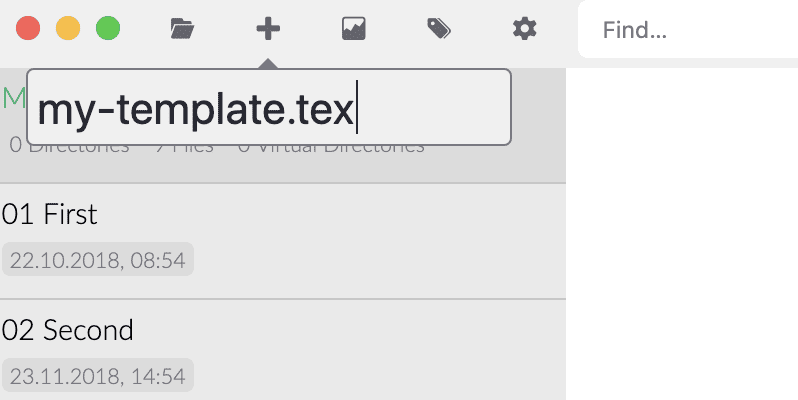

# Modèles personnalisés

Comme [Custom CSS](../core/custom-css.md) est un excellent moyen de s'approprier l'apparence de Zettlr, mais cela ne fait pas vraiment de vos papiers les vôtres. Une fois que vous avez fini d'écrire, l'esthétique compte tout autant que le contenu. Vos idées ont beaucoup de valeur en soi, mais sans un grand design et une typographie qui vous invite à lire, vos idées en souffriront.

Vous voulez votre propre police, un bon interligne et peut-être même quelques couleurs. Alors que les [préférences PDF](../reference/settings.md) vous permettent de personnaliser certains paramètres généraux, aussi bien pour les exportations par projet que pour les exportations de fichiers individuels, vous ne pouvez pas vraiment utiliser toutes les fonctionnalités que la composition LaTeX vous offre. Et, oh là là, [il y a tellement de bons exemples](https://tex.stackexchange.com/questions/1319/showcase-of-beautiful-typography-done-in-tex-friends).

Heureusement, l'un des principes fondamentaux de la philosophie de Zettlr est non seulement de vous donner le maximum de liberté pour utiliser des outils comme Pandoc et LaTeX à votre avantage, mais aussi de le faire fonctionner _bien_ pour vous. Cette page est destinée à vous donner une longueur d'avance dans l'utilisation de modèles LaTeX personnalisés pour votre travail, afin que votre écriture et le produit final soient prêts à être mis en valeur !

## Considérations préalables

Avant de commencer à rédiger vos propres modèles LaTeX personnalisés, nous devrions nous pencher sur ce qui se passera à l'exportation. Le moteur d'exportation Zettlr est un puissant logiciel qui effectue diverses tâches avant de transmettre vos documents à Pandoc pour les étapes finales. Il est important de savoir ce que Zettlr va faire à vos documents pour assurer une sortie cohérente et éviter les problèmes et les contretemps, surtout lorsque vous effectuez des modèles plus avancés. Ce chapitre est consacré à l'explication de toutes les étapes que Zettlr effectuera sur vos projets et vos exportations de fichiers avant de les transmettre à Pandoc (qui, à son tour, transmet le fichier à LaTeX).

### 1. Concaténer tous les fichiers d'entrée (ne s'applique qu'aux projets)

Si vous exportez un projet, Zettlr effectuera d'abord une tâche simple : il concaténera tous vos fichiers de la manière dont ils vous sont présentés dans la liste de fichiers et les écrira dans un seul fichier temporaire. Pour ce faire, il lira dans le répertoire du projet de la même manière que la liste des fichiers (préservant ainsi l'ordre), et lira dans les fichiers. Au cours de cette étape, **deux opérations seront effectuées sur la source Markdown**:

1. Tous les chemins d'images seront convertis en images absolues. Ceci pour des raisons de sécurité, car LaTeX ne pourra pas exporter si les chemins d'images ne sont pas absolus (car le CWD de LaTeX ne sera pas celui où réside votre fichier Markdown). De cette façon, vous pouvez utiliser des chemins relatifs partout sans avoir à vous soucier de ce que LaTeX leur fera.
2. Rendez toutes les notes de bas de page uniques. Chacun de vos chapitres commencera par la note de bas de page numéro 1. Par conséquent, dans la plupart des cas, vous aurez des notes de bas de page en double qui risquent de ne pas être exportées ou, pire encore, l'un des doubles sera utilisé, tandis que les autres seront omis. Zettlr rend les notes de bas de page uniques en préfixant le hachage interne du fichier. Ainsi, à partir d'un `[^1]`, Zettlr créera par exemple `[^1934976181]`. De cette façon, chaque note de bas de page sera unique.

Ensuite, il enregistre le fichier résultant dans le répertoire temporaire et lance l'exportateur, ce qui nous amène à l'étape 2.

### 2. Lire dans le fichier source

La chose la plus évidente à faire pour Zettlr est de lire dans votre fichier source. Il s'agit soit du fichier que vous souhaitez exporter rapidement en utilisant la fonctionnalité `Share`, ou le fichier généré et concaténé de votre projet (voir étape 1). Lors de la lecture du fichier, tous les chemins d'accès aux images seront absolus (cela ne se produira pas si vous exportez un projet, car les chemins d'accès aux images sont déjà absolus à partir de l'étape 1).

Ensuite, il remplacera toutes les balises, si vous avez coché l'option correspondante dans les préférences. Dans cette étape, il traitera également vos liens Zettelkasten, le cas échéant. Il supprimera les caractères de formatage des liens (`[[` et `]]` par défaut) ou de tout supprimer complètement. Si vous avez désactivé cette fonction, les liens ne seront pas touchés. De plus, si vous avez spécifié l'option correspondante, elle supprimera tous les identifiants.

> C'est la raison pour laquelle la fonction "Strip IDs" est désactivée par défaut : en raison de la nature des ID par défaut, qui ne sont constitués que de chiffres, cela rendrait également certains types de liens web inutilisables.

Une fois le fichier préparé, il sera enregistré dans un emplacement temporaire.

### 3. Préparer le modèle

Lorsque le fichier est prêt, Zettlr lit le modèle et l'écrit dans un fichier temporaire. Au cours de cette étape, un certain nombre de variables du modèle seront remplacées. Ces variables sont les suivantes :

- `$PAGE_NUMBERING$`: La numérotation des pages que vous avez choisie dans les préférences du PDF, par exemple les numéros arabes.
- `$PAPER_TYPE$`: Le papier que vous avez choisi, par exemple `a4paper`.
- `$TOP_MARGIN$`: The top pagemargin that you've provided (e.g. 3cm).
- `$RIGHT_MARGIN$`: The right page margin that you've provided (e.g. 3cm).
- `$BOTTOM_MARGIN$`: The bottom page margin that you've provided (e.g. 3cm).
- `$LEFT_MARGIN$`: The left page margin that you've provided (e.g. 3cm).
- `$MAIN_FONT$`: La police principale (pour la plupart des textes) que vous avez fournie (par exemple, Times New Roman)
- `$SANS_FONT$`: La police secondaire (principalement pour les titres) que vous avez fournie (par exemple Arial)
- `$LINE_SPACING$`: L'interligne, fourni par vous (par exemple 150 %).
- `$FONT_SIZE$`: La taille de la police que vous avez fournie (par exemple 12pt).
- `$PDF_TITLE$`: Le titre du PDF (soit le nom du fichier ou personnalisé) si vous exportez un projet.
- `$PDF_SUBJECT$`: The PDF subject.
- `$PDF_AUTHOR$`: The PDF author meta information.
- `$PDF_KEYWORDS$`: Keywords for the PDF file.
- `$TITLEPAGE$`: Soit une chaîne vide, soit `\\maketitle\n\\pagebreak\n`, si vous exportez un projet avec l'option page de titre activée.
- `\$GENERATE_TOC$`: Soit une chaîne vide, soit `\\setcounter{tocdepth}{<number>}\n\\tableofcontents\n\\pagebreak\n`, si vous exportez un projet avec l'option cochée pour générer une table des matières. `<number>` sera remplacé par le niveau (1 à 6).

Ces variables seront remplacées globalement, ce qui signifie que si la variable `\$PDF_AUTHOR$` se trouve plusieurs fois dans le modèle, il sera remplacé à chaque fois.

### 4. Préparer l'exportation PDF

Maintenant, avec les fichiers préparés, Zettlr va préfabriquer les variables de commande qui seront envoyées au moteur Pandoc. Dans cette étape, le modèle LaTeX préparé sera ajouté aux variables de commande. S'il n'y a pas de modèle personnalisé, Zettlr utilisera son modèle par défaut, [que vous pouvez trouver ici](https://github.com/Zettlr/Zettlr/blob/master/source/main/assets/export.tex). Le modèle Zettlr par défaut est une adaptation du modèle Pandoc par défaut ([trouver ici](https://github.com/jgm/pandoc/blob/master/data/templates/default.latex)), avec de nombreux édulcorants supplémentaires dépouillés pour une compatibilité maximale.

> De nombreuses commandes du modèle Pandoc par défaut nécessitent des paquets LaTeX supplémentaires. Le modèle Zettlr PDF vise une compatibilité maximale, et non des PDF parfaits, afin de ne pas semer la confusion chez les utilisateurs qui n'ont besoin que des bases.

### 5. Exécutez la commande !

Maintenant que toutes les conditions préalables sont réunies, Zettlr va enfin exécuter la commande Pandoc. Il lui transmettra le fichier d'entrée temporaire ainsi que le fichier modèle temporaire et le laissera faire son travail. Si vous avez décidé de créer une table des matières, Pandoc sera invité à en générer une. Cela signifie qu'en interne, Pandoc exécutera le binaire XeLaTeX **deux fois**. En effet, la commande XeLaTeX doit construire un PDF afin de savoir où les titres se retrouvent réellement avec tous les espaces appliqués, puis doit le reconstruire, mais cette fois avec la table des matières incluse.

> Il est de la plus haute importance de conserver le ToC-flag dans la commande Pandoc (que vous pouvez modifier dans l'onglet avancé des préférences), car si vous le supprimez, la table des matières ne sera pas incluse, quel que soit le commutateur défini dans les paramètres du projet !

Une fois la commande exécutée avec succès, Zettlr demandera à votre système d'exploitation d'ouvrir le fichier, ce qui donnera l'impression que vous avez double-cliqué sur le fichier final. Cela signifie qu'il sera ouvert avec votre lecteur PDF par défaut (ou avec l'éditeur de documents Word, si vous avez choisi d'exporter vers Word, par exemple). Si Pandoc se termine avec une erreur, cette erreur vous sera indiquée à l'aide d'une boîte de dialogue d'erreur étendue à partir de laquelle vous pourrez également copier l'erreur afin de pouvoir la rechercher sur Internet.

> **Attention :** Si LaTeX renvoie un message d'erreur, la sortie complète de la console vous sera montrée, ce qui est - la plupart du temps - à la fois très verbeux et aussi frustrant et vide. Par exemple, si un simple paquet LaTeX est manquant, il produira une longue liste de messages d'erreur où vous devrez repérer le `File <package-name>.sty is missing`. En règle générale, si vous n'utilisez pas de modèle personnalisé ni de truc LaTeX dans votre fichier Markdown, et que vous rencontrez _encore_ une erreur, cela indique un problème avec le modèle par défaut. Dans ce cas, veuillez le signaler. Dans les autres cas, veuillez d'abord consulter les forums d'aide LaTeX ou Pandoc.

## Démarrer avec la modélisation

Il est maintenant temps de construire un modèle ! Vous pouvez soit utiliser un éditeur externe pour écrire votre modèle LaTeX avant de pointer Zettlr vers celui-ci. Mais bien sûr, ce serait bien si vous pouviez modifier vos modèles LaTeX à partir de Zettlr, non ?



Oh là là, nous avons de bonnes nouvelles. Si vous créez un nouveau fichier, mais **mais que vous indiquez comme extension de fichier `.tex`**, Zettlr ne créera pas un fichier Markdown mais un véritable fichier LaTeX ! Ce fichier sera indiqué par un petit indicateur `TeX` dans la liste des fichiers (si le méta du fichier est activé) et peut être édité à partir de Zettlr. Hourra !


Zettlr détectera automatiquement s'il s'agit d'un fichier LaTeX et fera même passer le surlignage du code de Markdown à LaTeX pour vous aider à écrire le fichier !

## Contenus nécessaires

Outre les éléments habituels de LaTeX, il y a quelques éléments qui doivent être présents dans vos dossiers. N'oubliez pas que les fichiers seront transmis en aval par un filtre dans Zettlr, puis Citeproc (le cas échéant), et enfin Pandoc, avant d'être transmis au moteur LaTeX. Par conséquent, vous pouvez éventuellement omettre toutes les variables spécifiques à Zettlr, mais une variable doit être présente à tout moment :

```
$body$
```

Cette variable sera remplacée dans Pandoc par le contenu analysé de votre (vos) fichier(s) Markdown. Si vous l'omettez, votre contenu sera collé dans le néant, alors assurez-vous de ne jamais oublier de placer cette variable là où votre contenu devrait aboutir !

> Cela signifie également que si le modèle Zettlr par défaut omet de nombreuses variables du modèle par défaut Pandoc, vous êtes libre de les inclure toutes par vous-même ! Vous pouvez utiliser le tableau complet des variables de Pandoc et de Zettlr ou simplement les laisser de côté. C'est là que les modèles deviennent vraiment puissants

## Hackez vos modèles !

Maintenant, passons aux choses amusantes. Au fil du temps, Zettlr a intégré de plus en plus d'options pour affiner votre contrôle sur le processus d'exportation. Cela signifie que vous pouvez vraiment faire des choses amusantes avec Zettlr. Par exemple, vous pouvez complètement contourner toutes les choses agréables que le moteur d'exportation fait à vos fichiers (sauf l'analyse du ou des fichiers sources) en remplaçant simplement la commande Pandoc dans vos préférences par une commande déterminée.

Vous pouvez également placer des variables Pandoc dans vos variables Zettlr (par exemple, en définissant l'auteur du PDF dans vos préférences pour qu'il inclue une variable Pandoc). Ensuite, une fois que Zettlr aura écrasé votre fichier, Pandoc remplacera sa propre variable après que la variable Zettlr aura été remplacée.

Et si vous avez _vraiment_ envie de tout pirater, jetez un second regard sur la commande Pandoc. Si vous regardez de près, vous pouvez voir que devant la commande il y a `pandoc` écrit. Vous savez ce que cela signifie ? Vous l'avez peut-être deviné : La commande Pandoc n'est pas seulement quelque chose qui sera passé à Pandoc, mais c'est **commande de pleine console qui sera exécutée** ! Ce que cela signifie devrait maintenant être évident : vous pouvez exécuter des scripts et une logique personnalisés avant et après l'exécution de la commande Pandoc !

Supposons que vous vouliez passer le fichier temporaire Markdown à un script personnalisé pour effectuer encore plus d'actions, et ensuite déplacer le fichier à un autre endroit ? Considérez l'adaptation suivante de la commande Pandoc dans les préférences :

```shell
pandoc "$infile$" -f markdown $outflag$ $tpl$ $toc$ $tocdepth$ $citeproc$ $standalone$ --pdf-engine=xelatex -o "$outfile$" && cp "$outfile$" /Users/zettlr/Desktop/Final.pdf
```

Cette commande copierait le fichier de sortie final sur le bureau de l'utilisateur fictif "zettlr" et le nommerait "Final.pdf" (en supposant que vous fonctionniez sous MacOS). Au lieu d'utiliser une simple commande shell comme `cp`, vous pourriez aussi passer des scripts entiers qui seraient exécutés par la suite. L'horizon est vraiment sans limite !

## Dernières réflexions

Zettlr s'efforce de donner à ses utilisateurs la maîtrise totale de ce qu'ils peuvent faire avec leurs fichiers. Ce que nous avons décrit sur cette page n'est qu'un début. Nous n'avons pas essayé de devenir fous nous-mêmes, mais vous pouvez vraiment faire des choses. Comment utilisez-vous les possibilités de Zettlr pour faire des choses bizarres ? Dites-le nous sur [Twitter](https://www.twitter.com/Zettlr), le [Forum](https://forum.zettlr.com/), ou sur [Reddit](https://www.reddit.com/r/Zettlr) !
