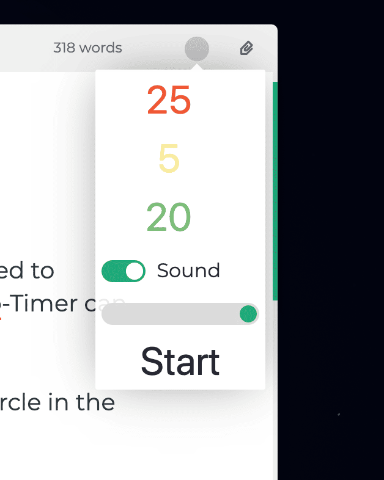
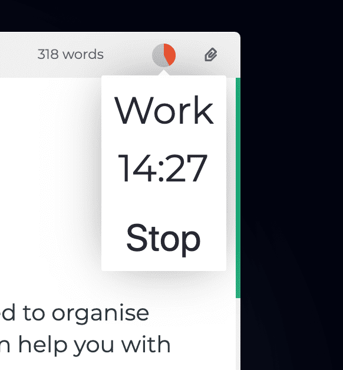

# Pomodoro-Timer

Si vous écrivez beaucoup, le moment est peut-être venu de mieux organiser votre temps. Le Pomodoro-Timer intégré peut vous y aider.

Accédez au Pomodoro-Timer en cliquant sur le cercle situé dans le coin supérieur droit de l'écran, à l'intérieur de la barre d'outils.

Vous ne savez pas ce qu'est un pomodoro timer ? Alors rendez-vous sur [le site officiel] (https://francescocirillo.com/pages/pomodoro-technique) !

## Utilisation du Pomodoro-Timer

Avant de démarrer le pomodoro timer, vous pouvez adapter certains paramètres.

Le nombre **rouge** indique le nombre de minutes utilisées pour _travailler_. La valeur par défaut est de 25 minutes.

Le nombre **jaune** indique la durée d'une _courte_ pause qui divisera des portions de travail. Après chaque phase de travail, il y aura une courte pause. La valeur par défaut est de 5 minutes.

Le chiffre **vert** indique à Zettlr la durée d'une _longue_ pause. Après quatre tâches, il y aura une pause aussi longue. La durée par défaut est de 20 minutes.

Ci-dessous, vous pouvez décider si un son doit être joué ou non à chaque fois qu'une phase est terminée. Le curseur situé sous la case à cocher permet de régler le volume. (_Attention_ : Ce n'est pas le volume de votre système, donc si le volume de votre système n'est qu'à 20 pour cent, même un volume de 100 pour cent à l'intérieur de Zettlr ne sonnera que jusqu'à 20 pour cent !)

Cliquez sur **Démarrer** pour lancer le chronomètre. Ensuite, le cercle sera rempli avec la couleur de la phase en cours (soit rouge, jaune ou vert). Une fois qu'il est rempli, la phase suivante commence.

Pour **arrêter** le chronomètre ou simplement vérifier l' **état** actuel du chronomètre, cliquez à nouveau sur le cercle. Un petit popup vous indiquera le temps restant pour la phase en cours, le type de la phase en cours et vous donnera la possibilité d'arrêter.

Le **cycle** de la minuterie pomodoro est le suivant :

1. Work
2. Short break
3. Work
4. Short break
5. Work
6. Short break
7. Work
8. Long break
9. _Repeat from step 1_
