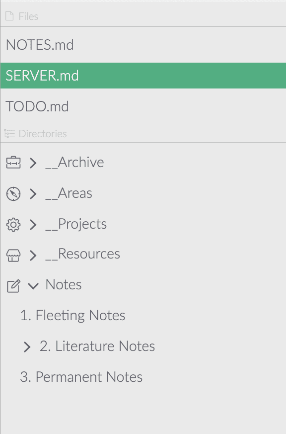

# Répertoires racines et fichiers

Zettlr contient un gestionnaire de fichiers complet basé sur notre couche d'abstraction de système de fichiers personnalisée (FSAL). Ce n'est pas un hasard, car Zettlr a été construit avec l'immersion comme principe directeur. En pratique, cela se traduit par le fait que Zettlr s'attend à ce que vous choisissiez un dossier quelque part sur votre ordinateur, dans lequel vous effectuerez la plupart de votre travail avec Zettlr.

<iframe width="560" height="315" src="https://www.youtube-nocookie.com/embed/2YX5n8-XVbU" frameborder="0" allow="accelerometer; autoplay; encrypted-media; gyroscope; picture-in-picture" allowfullscreen></iframe>

> Tout au long de la documentation, nous utiliserons les termes «dossier» et «répertoire» de manière interchangeable car ils désignent la même chose. La seule différence est que «dossier» est le terme que la plupart des utilisateurs connaissent, alors que «répertoire» est le terme technique désignant les dossiers sur votre ordinateur.

## Répertoires racines

Un répertoire racine constitue la base d'une arborescence de fichiers. Comme vous le savez peut-être, les fichiers sont enregistrés hiérarchiquement dans des dossiers sur votre ordinateur. Chaque répertoire sur votre ordinateur que vous ouvrez avec Zettlr est appelé un répertoire «racine», car il forme la racine de tout son contenu.

Vous pouvez charger plusieurs répertoires racine en même temps, par exemple si vous souhaitez séparer différents morceaux de travail (par exemple un répertoire racine nommé "Zettelkasten" et un autre nommé "Projets"). Si vous souhaitez mettre en œuvre le principe dit "PARA" pour l'archivage de documents, il est judicieux de créer quatre dossiers sur votre ordinateur, "Projets", "Archive", "Ressources" et "Zones" et de charger chacun comme leur propre racine dans l'application (voir la capture d'écran).

Zettlr surveillera tous les changements que vous faites à distance dans les fichiers de vos racines. Par exemple, si vous utilisez un service cloud pour sauvegarder vos fichiers, par exemple Google Drive, Dropbox ou une instance Nextcloud, il se peut que votre application cloud synchronise les modifications d'un fichier uniquement après avoir démarré Zettlr. Alors Zettlr le détectera et reflétera ces changements de manière appropriée dans l'application.

> Il est fortement recommandé d'avoir au moins un répertoire racine ouvert avec l'application. Il est également possible d'ouvrir uniquement les fichiers de votre ordinateur et de travailler dessus, mais cela est déconseillé, car vous perdrez beaucoup de fonctionnalités liées aux répertoires racine, et comme Zettlr a été construit autour de ce concept, vous serez probablement moins productif avec cette approche.

## Fichiers racine

Il existe un deuxième type de «racines» dans le contexte de Zettlr: les fichiers racine. Nous les appelons racines, car ils forment eux-mêmes un élément dans l'arborescence de fichiers de Zettlr, mais contrairement aux répertoires, ces "arborescences" ne sont constituées que d'un seul fichier.

Vous ne pouvez pas ouvrir les fichiers racine directement à partir de l'application. Au contraire, ils sont ouverts lorsque vous double-cliquez sur un fichier quelque part sur votre ordinateur. Si ce fichier est situé dans un répertoire racine, Zettlr naviguera simplement vers ce répertoire racine et ouvrira le fichier en conséquence. Mais si ce fichier est introuvable dans aucun des répertoires racine de Zettlr, Zettlr l'ouvrira en tant que fichier autonome ou racine.

Les fichiers racine sont toujours triés au-dessus des répertoires racine, où vous y avez facilement accès. Vous pouvez également les «fermer», ce qui signifie qu'ils seront simplement retirés de l'application, mais laissés intacts, ou les supprimer, ce qui signifie que Zettlr les retirera de l'application et les déplacera également dans la corbeille.

> Ce comportement simplifie le chargement d'un ou deux fichiers Markdown supplémentaires dans l'application qui ne résident pas dans l'un des répertoires racine. Cela a du sens, par exemple, pour les développeurs de logiciels qui souhaitent uniquement modifier le fichier Readme de leur projet sans charger le répertoire complet dans Zettlr.