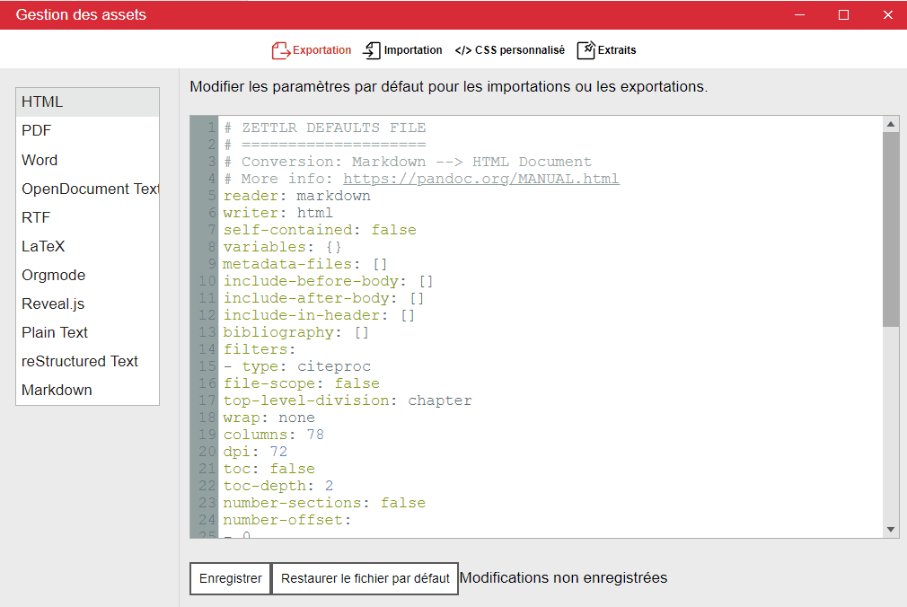

# Assets Manager

Zettlr 2.0 a introduit un nouveau gestionnaire d'assets qui vous permet de gérer tous les assets statiques qui sont stockés sous forme de fichiers dans votre répertoire de données utilisateur. Parmi ceux-ci figurent les nouveaux fichiers par défaut, votre CSS personnalisé et des extraits. Bien qu'il soit possible de modifier ces fichiers en externe, le gestionnaire d'assets vous offre un moyen complet de le faire depuis l'application elle-même.



You pouvez accéder au gestionnaire d'Assets via "Zettlr -> Assets Manager" (macOS) ou "Fichier -> Preferences -> Gérer les Assets" (Windows/Linux).

Le gestionnaire d'Assets vous permet d'éditer vos fichiers en utilisant la coloration syntaxique correcte et le rend plus facile que les éditeurs externes. Pour voir ce que vous pouvez modifier et comment le faire de manière productive, consultez les parties correspondantes de la documentation :

* [Defaults files](defaults-files.md)
* [Custom CSS](custom-css.md)
* [Snippets](snippets.md)

> The assets manager replaces the old PDF preferences dialog. The new assets manager gives you not just all the settings of the PDF preferences dialog, but many more.

## How to Adapt the PDF Preferences

Since 2.0, there is no dedicated PDF Preferences dialog anymore. Rather, you can now fine tune those settings which were present in that dialog along side a magnitude of more settings. To simply restore the old PDF preferences and then adapt them, you can easily copy the following snippet into the `variables`-section of the exporting defaults file for PDF documents:

```yaml
# Omitted content of the defaults file ...
variables:
  # mainfont and sansfont work for the default pdf-engine "xelatex"
  # Should you choose to use pdflatex, you can set the font using the property
  # "fontfamily". For more information, see https://pandoc.org/MANUAL.html#fonts
  mainfont: "Times New Roman"
  sansfont: "Arial"
  linestretch: 1.3 # 1.3 means 130% linespacing
  papersize: a4 # Can also be a5, letter, legal, etc.
  margin-left: 2cm
  margin-right: 2cm
  margin-top: 2cm
  margin-bottom: 2cm
# Further omitted content ...
```

All variables that you can set here are [documented in the Pandoc manual](https://pandoc.org/MANUAL.html#variables).

> Tip: You can define every variable also within the YAML frontmatter of any file. The only difference is that there you simply use the properties *without* nesting them under `variables`.
