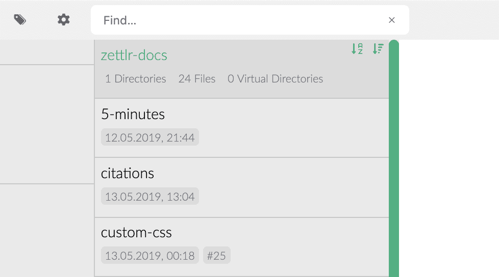

# La liste de fichiers

Ensuite, il y a la liste des dossiers. La liste de fichiers est quelque chose de très spécial car elle comporte des fonctions puissantes qui facilitent votre travail avec de nombreux fichiers et répertoires. Alors, jetons-y un coup d'œil !

## Generalités

En mode barre latérale étendue, l'arborescence et la liste des fichiers sont toutes deux visibles. En mode barre latérale fine, vous pouvez toujours afficher ou masquer la liste en appuyant sur `Cmd/Ctrl+!`.

> **Note** : Veuillez consulter le [manuel des paramètres](../reference/settings.md) pour plus d'informations sur les modes de la barre latérale.

The file list shows you all directories and files inside the directory that is currently selected in the tree view, but not like a normal file browser: La liste des fichiers vous montre tous les répertoires et fichiers à l'intérieur du répertoire qui est actuellement sélectionné dans l'arborescence, mais pas comme un navigateur de fichiers normal : **la liste des fichiers traite tous les sous-répertoires comme des égaux et vous les montre tous l'un après l'autre **  Il n'est donc pas nécessaire d'aller plus loin dans l'arborescence pour atteindre les répertoires enfouis.

Si vous avez désactivé les méta-informations, les répertoires et les fichiers seront affichés sous la forme d'une seule ligne (?). Si vous affichez les informations sur les fichiers, vous verrez des informations supplémentaires : les répertoires vous indiqueront le nombre d'enfants qu'ils ont. Les fichiers, en revanche, affichent leur date de dernière modification. S'ils contiennent un identifiant ou des étiquettes, ces informations seront affichées après la date de modification. En survolant le compteur de balises, vous pouvez voir une petite infobulle qui vous montre toutes les balises présentes dans le fichier.

> Vous pouvez basculer les informations du dossier via le menu "Affichage" ou en appuyant sur `Cmd/Ctrl+Alt+S`.

### Méta-information sur les fichiers

Les informations supplémentaires que vos dossiers font apparaître dans la liste des dossiers peuvent être utiles pour plusieurs raisons. Tout d'abord, vous pouvez vérifier si l'identification du dossier est correcte ou non. Parfois, Zettlr peut détecter une mauvaise ID, et c'est la première façon de vérifier si Zettlr utilise réellement votre ID, ou s'il a simplement saisi une partie d'une URL qui contient beaucoup de chiffres. De plus, vous pouvez survoler le nombre de balises pour les afficher dans une info-bulle.

### Writing Targets

Since version `1.2`, Zettlr supports writing targets. To set a target, right-click a file and choose "Set writing target …". Enter the amount of words or characters and click "Set". Zettlr will count towards your goal and show you the progress showing a small indicator if you have snippets activated. Hover over it to see the absolute number of words or characters that you've written.

> To remove the writing target from a file, simply set the writing counter to zero.

### Trier

Si vous souhaitez trier des répertoires, vous pouvez le faire à partir de la liste des fichiers. Il suffit de passer la souris sur un répertoire et deux indicateurs apparaîtront pour vous montrer l'état actuel du tri. Cliquez sur le premier (avec une flèche de A à Z) pour basculer le tri par nom. Le second permet de basculer le tri selon la dernière heure de modification. Les sous-répertoires ne seront pas triés de cette façon - seulement les fichiers.

Vous pouvez également parcourir l'arborescence des répertoires en cliquant sur les répertoires. Un simple clic permet de sélectionner le répertoire, tandis qu'un `ALT`-click sélectionnera son répertoire parent. Ceci est utile si vous devez changer de répertoire souvent, mais préférez le mode fin de la barre latérale et ne voulez pas passer à l'arborescence de façon répétée.

## Implications structurelles

Chaque fois que vous sélectionnez un répertoire dans l'arborescence, la liste des fichiers affichera _tous_ les fichiers et répertoires de ce répertoire. En termes simples, cela aplatit tous vos différents sous-répertoires et fichiers de la structure arborescente que la liste des répertoires rassemble en une liste unidimensionnelle. La liste changera toujours de contenu chaque fois que vous sélectionnerez un répertoire différent dans l'arborescence.

> La liste n'affiche _tous_ les répertoires et fichiers que _dans_ le répertoire actuellement sélectionné. Elle fonctionne donc un peu comme une fonction de recherche très rapide. Vous ne voyez que les fichiers dans un répertoire spécifique et, lorsque vous descendez de niveau en niveau, de moins en moins de fichiers sont visibles jusqu'à ce qu'un seul répertoire et ses fichiers soient visibles. Avec une bonne structure à l'intérieur de votre racine, c'est un moyen efficace de n'avoir dans la liste que les fichiers dont vous avez réellement besoin.

Comme la liste de fichiers aplatit votre arborescence complexe de répertoires, elle doit faire quelques suppositions sur la façon d' _afficher_ correctement les fichiers. Les règles suivantes vous aident donc à distinguer où les fichiers sont réellement présents sur votre disque :

1. Le répertoire actuellement sélectionné sera en tête de la liste des fichiers. Toujours.
2. Tous les fichiers qui se trouvent à l'intérieur de ce répertoire sont placés directement sous ce nom de répertoire.
3. Tous les sous-répertoires qui se trouvent _à l'intérieur_ de ce répertoire seront toujours en bas de la liste des fichiers, c'est-à-dire _après_ les fichiers du répertoire sélectionné.
4. Si les répertoires sont vides, ils seront placés immédiatement l'un après l'autre sans aucun fichier entre eux.

Il est donc important de s'en souvenir : tous les répertoires seront affichés comme s'ils résidaient au même niveau, comme s'ils n'étaient pas imbriqués. Pour identifier quels répertoires contiennent quoi, veuillez vous référer à l'arborescence.

> Si vous n'aimez pas le tri "naturel" de Zettlr (pour que 10 vienne après 2), vous pouvez passer au tri "ASCII" dans les paramètres (pour que 2 vienne après 10).

## Actions dans la liste des fichiers

De nombreuses actions font référence à cette liste. Tout d'abord, il suffit de sélectionner une tuile pour ouvrir un fichier et afficher son contenu dans l'éditeur. Cliquez sur un répertoire pour le sélectionner.

Vous pouvez déplacer vos fichiers dans différents endroits. Il vous suffit de les faire glisser de la liste des fichiers vers un répertoire de l'arborescence. Le répertoire que vous survolez recevra un léger scintillement pour indiquer l'endroit où votre fichier va être déplacé. Il suffit de déposer le fichier à cet endroit pour le déplacer ou de déposer le fichier partout ailleurs pour annuler le déplacement et remettre le fichier à sa position initiale.

Si vous faites glisser un fichier en dehors de l'application, vous pouvez le partager avec d'autres programmes. Pour annuler ce glissement, il suffit de relâcher la souris sur votre application.

> Pour faire glisser un dossier dans d'autres applications, veillez à **maintenir la touche `Ctrl`ou la touche `Alt`avant de glisser votre fichier** Cela indiquera à Zettlr que vous ne voulez pas déplacer le fichier dans Zettlr, mais en dehors de l'application.

## Carte thermique de la fonction de Recherche

Une autre caractéristique utile de la liste de fichiers est de vous aider à distinguer les résultats de recherche les plus pertinents. Une fois que vous avez effectué une recherche, la liste change de couleur comme un caméléon. Tous les dossiers seront peints en 50 nuances de vert (ouais, on vient de faire _cette_ blague). Plus un fichier est vert, plus il est pertinent pour votre recherche actuelle.

Il s'agit d'une fonction que l'on pourrait appeler "carte thermique" pour les recherches en texte intégral.

N'oubliez pas que la liste est très adaptable et qu'elle se transformera beaucoup lorsque vous utiliserez l'application. Par exemple, non seulement elle affichera tous les fichiers et répertoires du répertoire sélectionné, mais elle cachera également les fichiers sans résultat de la liste de prévisualisation, lorsque la liste est en mode recherche.
