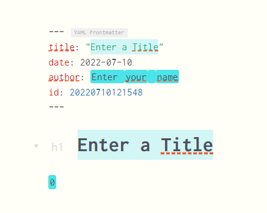

# Extraits

Depuis la version 2.0, Zettlr est livré avec un système complet d'extraits et de modèles. Cela vous permet de définir certains morceaux de texte que vous avez tendance à écrire plus souvent, et également d'insérer des variables dynamiques. Le système lui-même est basé sur la syntaxe TextMate et en tant que tel, dans une certaine mesure, interopérable avec les extraits que vous possédez déjà pour TextMate ou d'autres systèmes prenant en charge cette syntaxe, tels que VisualStudio Code.


## Gestion de vos extraits

You can manage your snippets using the [assets manager](./assets-manager.md).

À gauche, vous pouvez trouver une liste de tous les extraits ; initialement, il sera vide. Vous pouvez ajouter un nouvel extrait en cliquant sur le bouton "+" en bas de la liste. Il sera initialement nommé "snippet-X" (où X est un nombre). Si vous sélectionnez un extrait, l'éditeur d'extraits affichera le contenu du fichier dans l'éditeur et le nom dans le champ de texte au-dessus.

Après avoir apporté des modifications à l'extrait de code, assurez-vous de cliquer sur "Enregistrer" ou d'appuyer sur `Cmd/Ctrl+S` pour conserver vos modifications. Pour renommer un extrait, tapez simplement le nouveau nom dans le champ de texte du nom au-dessus de l'éditeur d'extraits et cliquez sur le bouton.

> Notez que le nom de votre extrait ne peut contenir que les lettres A à Z, des chiffres, des traits d'union et des traits de soulignement. En effet, le nom de l'extrait de code sera utilisé pour la saisie semi-automatique dans l'éditeur. Si vous tapez d'autres lettres, elles seront remplacées par un trait d'union.

Enfin, l'éditeur prend en charge la coloration syntaxique spéciale qui vous aide à écrire vos extraits. Les variables qui ne sont pas prises en charge seront marquées en rouge afin que vous voyiez immédiatement qu'il pourrait y avoir une erreur.

> Vos extraits sont en fait des fichiers qui résident dans un répertoire au sein de vos données d'application. Veuillez vous référer au [manuel d'installation](../install.md) pour connaître l'emplacement précis de ce dossier. Les fichiers d'extraits suivent toujours le modèle `<nom>.tpl.md`, où `<nom>` fait référence au nom que vous donnez aux extraits dans l'interface graphique. Cela peut être utile à des fins de sauvegarde ou de partage.


## La syntaxe des extraits
Les extraits suivent la syntaxe de TextMate qui peut être facilement résumée :

* `$[1-9]`: By typing a dollar sign followed by a number, you add a tabstop. After you inserted a snippet, this will allow you to guide your tabs according to the numbers (so repeatedly typing `Tab` will move through these by number ascending).
* `$0`: The zero is a special tabstop. It's not the first tabstop, but the last one. If you omit this, the cursor will end up after the inserted snippet, but by placing this somewhere in the text, you can control this behaviour.
* `${[0-9]:[.]}`: By surrounding the tabstop with curly brackets and adding a colon, you can define some text that will be placed by default at this position. As soon as you get to the specified tabstop, this text will be selected. You can either leave it in place by simply pressing `Tab` again, or easily overwrite it. Example: `${5:Some text}` would result in the text "Some text" to be placed at tabstop number five, which will be selected when you get there by pressing `Tab`.
* `$[A-Z_]`: If you use Latin characters instead of numbers, you define a variable that can be replaced when you insert a snippet. Variables consist only of uppercase characters and underscores. If you make a typo, you can spot this because the variable will be coloured red.
* `${[A-Z_]:[.]}`: Just like with tabstops, you can define default text for variables, which will be inserted if the variable cannot be inserted (e.g. the `CLIPBOARD` variable can be empty if no text is in the clipboard).

Enfin, les variables disponibles sont :

* `CURRENT_YEAR`: The current year (4 digits)
* `CURRENT_YEAR_SHORT`: The abridged current year (2 digits)
* `CURRENT_MONTH`: The current month (2 digits)
* `CURRENT_MONTH_NAME`: The full name of the month (localised according to your app settings)
* `CURRENT_MONTH_NAME_SHORT`: The short month name (localised according to your app settings)
* `CURRENT_DATE`: The current day of the month (2 digits)
* `CURRENT_HOUR` The current hour (24 hour format; 2 digits)
* `CURRENT_MINUTE`: The current minute (2 digits)
* `CURRENT_SECOND` The current second (2 digits)
* `CURRENT_SECONDS_UNIX`: The current unix timestamp in seconds
* `UUID`: A UUID version 4
* `CLIPBOARD`: The contents of your clipboard (text only)
* `ZKN_ID`: Generate a Zettelkasten ID (according to your pattern)
* `CURRENT_ID`: Holds the currently assigned Zettelkasten ID to the file
* `FILENAME`: Holds the filename of the current file
* `DIRECTORY`: Holds the directory path for the current file
* `EXTENSION`: Holds the file extension for the current file

## Travailler avec vos extraits

Après avoir créé vos extraits de code, vous pouvez les utiliser avec la syntaxe de saisie semi-automatique connue. Vous pouvez activer la saisie semi-automatique des extraits en tapant deux-points (`:`), ce qui ouvrira une liste avec vos extraits disponibles. Vous pouvez rechercher un extrait en tapant quelques caractères de son nom. Étant donné que les noms d'extraits de code ne peuvent pas contenir d'espaces, les deux-points sont un moyen simple d'activer ceci : si vous ne souhaitez pas insérer d'extrait de code, tapez simplement un espace (ou tout caractère non alphanumérique) pour refermer la liste déroulante.

Après avoir sélectionné un extrait, Zettlr insérera d'abord l'extrait, puis remplacera toutes les variables selon la syntaxe décrite ci-dessus. Ensuite, il créera des marqueurs de texte indiquant la position de tous les tabulations et activera une nouvelle configuration de clavier temporaire qui remappera deux touches : `Tab` et `Esc`. Chaque fois que vous appuyez sur `Tab`, Zettlr passera au tabstop suivant. Si vous souhaitez arrêter prématurément la tabulation dans ces tabulations, vous pouvez appuyer sur "Échap". Le keymap sera supprimé et vos touches `Tab` et `Esc` fonctionneront normalement lorsque tous les tabstops ont été atteints ou lorsque vous appuyez sur `Esc`.

## Un extrait pour commencer

Si vous êtes intéressé par ce que les extraits peuvent faire, copiez et collez simplement ce qui suit dans un nouvel extrait. Essaye le!


```markdown
---
title: "${1:Enter a Title}"
date: $CURRENT_YEAR-$CURRENT_MONTH-$CURRENT_DATE
author: ${2:Enter your name}
id: $ZKN_ID
---

# ${1:Enter a Title}

$0
```
Voici à quoi cela ressemble après avoir complété automatiquement le nom de l'extrait de code. Vous pouvez clairement voir que les tabstops restants sont colorés afin qu'ils soient facilement discernables.


