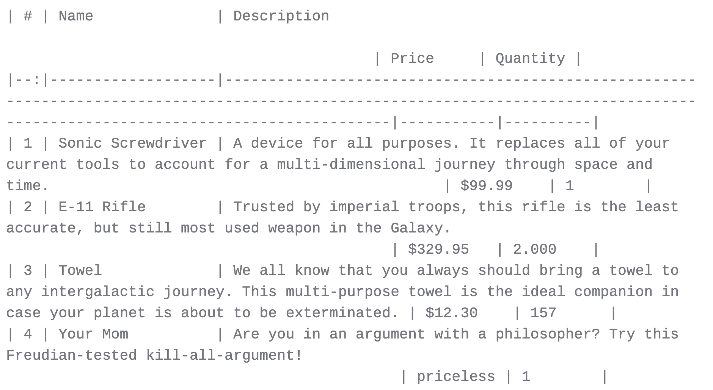
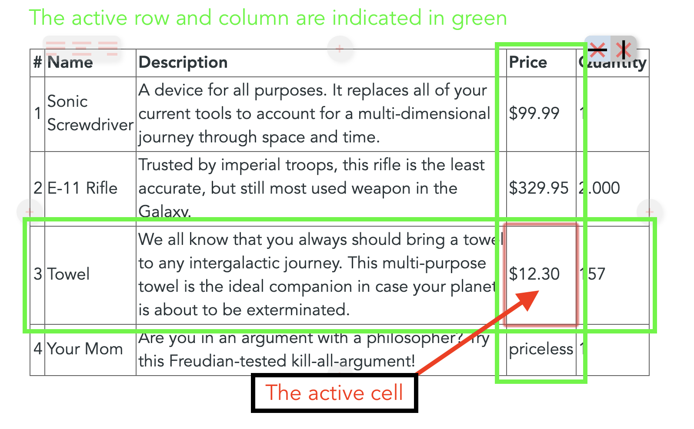

# Les tableaux dans Zettlr

Les tableaux dans Markdown sont une chose difficile. La nature de markdown étant d'être aussi simple que possible, c'est la complexité qui en souffre le plus. Markdown est le choix parfait pour écrire du texte et la plupart des éléments que nous utilisons pendant l'écriture (par exemple, les liens, les images, les titres ou les citations) sont parfaitement gérés dans Markdown. Cependant, de temps en temps, nous voulons aussi inclure certaines données dans nos travaux, ou les tableaux sont simplement un meilleur moyen de visualiser les idées.

## Introduction aux Tableaux

Les tableaux dans Markdown sont écrits en utilisant une syntaxe très basique -- chaque ligne ressemble à une rangée et les cellules du tableau sont encapsulées avec des caractères pipe :

```
| Cell A:A | Cell A:B |
| Cell B:A | Cell B:B |
```

En option, vous pouvez également ajouter une ligne de titre, qui peut aussi indiquer l'alignement des colonnes (à gauche, à droite ou au centre) :

```
| Left aligned | Centered content | Right aligned |
|--------------|:----------------:|--------------:|
| Lorem        | Ipsum            | Dolor         |
```

Notez que la façon dont vous alignez le contenu de la table dans vos documents importe peu, à condition que les deux points soient placés en conséquence. Le tableau sera exporté ultérieurement en utilisant l'alignement correct.

Mais comme vous pouvez le constater, même avec seulement deux mots par colonne, le tableau de Markdown a tendance à devenir assez long. Comme vous ne pouvez pas utiliser plusieurs lignes pour les cellules, c'est là que vous avez tendance à rencontrer de sérieux problèmes lorsque vous devez insérer une phrase entière dans chaque cellule. Prenez par exemple l'exemple suivant :

```
| # | Name              | Description                                                                                                                                                                     | Price     | Quantity |
|--:|-------------------|---------------------------------------------------------------------------------------------------------------------------------------------------------------------------------|-----------|----------|
| 1 | Sonic Screwdriver | A device for all purposes. It replaces all of your current tools to account for a multi-dimensional journey through space and time.                                             | $99.99    | 1        |
| 2 | E-11 Rifle        | Trusted by imperial troops, this rifle is the least accurate, but still most used weapon in the Galaxy.                                                                         | $329.95   | 2.000    |
| 3 | Towel             | We all know that you always should bring a towel to any intergalactic journey. This multi-purpose towel is the ideal companion in case your planet is about to be exterminated. | $12.30    | 157      |
| 4 | Your Mom          | Are you in an argument with a philosopher? Try this Freudian-tested kill-all-argument!                                                                                          | priceless | 1        |
```

Dans Zettlr, cela ressemblerait à ce qui suit :




Même si les cellules du tableau sont alignées de manière à correspondre à la largeur totale de chaque colonne, vous ne pouvez pas vous rendre compte qu'il s'agit bien d'un tableau markdown valide, car chaque ligne est enveloppée et la structure du tableau est impossible à voir. Sans le compteur dans la première colonne, vous auriez même du mal à distinguer le nombre de lignes qu'elle contient.

## L'éditeur de tableau

Il est évident que la rédaction de tableaux de markdown est parfois inévitable, mais toujours douloureuse. Ce serait bien si vous pouviez simplement modifier le tableau comme vous en avez l'habitude, par exemple à partir d'un traitement de texte, non ? C'est là que l'éditeur de **tableaux** intégré de Zettlr (disponible à partir de `1.4`) entre en jeu !

Bien que Zettlr maintienne une politique stricte sur [WYSIWYG](https://en.wikipedia.org/wiki/WYSIWYG) ("What You See Is What You Get"), car elle tend à brouiller votre perception de ce que vous écrivez réellement, les tableaux en sont exempts. En effet, même si l'approche [WYSIWYM](https://en.wikipedia.org/wiki/WYSIWYM) ("What You See Is What You Mean") est supérieure à l'approche WYSIWYG, il est tout simplement inutile de l'appliquer aux tableaux.

Par conséquent, pour vous aider à écrire des tableaux, Zettlr vous propose désormais un puissant éditeur de tableaux qui vous apporte tout ce dont vous avez besoin pour ne pas perdre complètement la tête en créant des tableaux dans vos documents. Avec l'éditeur de tableaux, le tableau mentionné ci-dessus ressemble à ceci :


Beaucoup mieux, n'est-ce pas ? L'éditeur de tableau de Zettlr prend tous les tableaux Markdown trouvés dans votre document, les convertit en une représentation HTML avec des cellules de contenu modifiables, et les affiche à la place du Markdown sous-jacent. Cela masque complètement la source du Markdown, mais comme nous l'avons dit, dans ce cas, cette approche est beaucoup plus favorable.

Vous pouvez **entrer dans le mode édition** en cliquant simplement dans une des cellules du tableau et en ajoutant votre contenu. La cellule active sera mise en évidence pour vous. En outre, la navigation au clavier des traitements de texte célèbres  que vous connaissez a également été implémentée afin que vous puissiez utiliser `Tab`, `Return`, et les touches fléchées pour naviguer dans le tableau. En outre, l'ajout et la suppression de colonnes et de lignes sont également possibles grâce aux **boutons de bord** de l'éditeur de tableau. Il s'agit de boutons qui apparaissent lorsque vous survolez le tableau et qui vous permettent d'effectuer diverses actions sur le tableau.

> Attention ! Lorsque vous activez le tableau en cliquant à l'intérieur d'une des cellules, vous entrez en mode édition. Pour enregistrer vos modifications, assurez-vous de **cliquer à l'extérieur du tableau une fois que vous avez terminé**, pour sortir du mode d'édition ! Ce n'est qu'alors que les modifications que vous avez apportées au tableau seront appliquées au tableau Markdown sous-jacent.

## Navigation au clavier

Mais passons d'abord à la navigation au clavier. Vous avez à votre disposition les raccourcis suivants :

- `Tab`: Passez à la cellule suivante. Si la dernière colonne est active, passez à la première cellule de la ligne suivante. Si votre curseur se trouvait dans la dernière colonne de la dernière ligne, une nouvelle ligne sera automatiquement ajoutée.
- `Shift-Tab`: Passez à la cellule précédente. Si votre curseur était dans la première colonne, passez à la dernière cellule de la colonne précédente.
- `Return`: Passez à la même colonne dans la rangée suivante. Si votre curseur se trouvait dans la dernière ligne, une nouvelle ligne sera automatiquement ajoutée.
- `Arrow Up/Arrow Down`: Passez à la même colonne dans la ligne précédente/suivante. Aucune nouvelle ligne ne sera ajoutée si vous êtes dans la première ou la dernière ligne.
- `Arrow Left/Arrow Right`: Déplacez le curseur à gauche/droite. Si le curseur se trouve au début/à la fin du contenu de la cellule, déplacez-vous vers la cellule précédente/suivante.

Grâce à ces raccourcis, vous pouvez facilement entrer du contenu dans vos tableaux en utilisant des mouvements naturels. Vous devez d'abord remplir l'en-tête du tableau, puis ajouter un ensemble de données par ligne. Par conséquent, `Tab` est ici votre ami :


## Les boutons du bord

Un autre avantage de l'éditeur de tableaux est ce qu'on appelle les **boutons de bord**. Il s'agit de deux groupes de boutons et de quatre boutons directionnels qui apparaissent lorsque vous survolez une table :


Ils sont transparents au début pour ne pas masquer le contenu de votre tableau. Déplacez votre curseur sur un bouton de bord pour le rendre opaque. Les boutons doivent être assez explicites. Les quatre boutons `(+)` au centre des bords du tableau **ajoutera une ligne ou une colonne respectivement** à la position indiquée. Cliquez donc sur le bouton d'ajout de gauche pour ajouter une colonne à gauche de la cellule active, et cliquez sur le bouton d'ajout du bas pour ajouter une ligne sous la cellule active.

En haut de chaque tableau, il y a deux groupes de boutons supplémentaires. Le groupe de boutons de gauche contient trois boutons qui **alignent la colonne du tableau actuellement actif** à gauche, au centre ou à droite. Cliquez sur l'un des boutons pour appliquer l'alignement. Le changement sera affiché immédiatement pour votre confirmation visuelle.

Le groupe de boutons de droite contient deux boutons pour **supprimer la ligne ou la colonne du tableau actuellement active**. Il suffit de placer votre curseur dans une cellule de la ligne ou de la colonne que vous souhaitez supprimer et de cliquer sur l'un des boutons.

> Veillez toujours à placer votre curseur dans la bonne cellule avant de supprimer des colonnes ou des lignes pour vous éviter de devoir quitter l'édition de tableaux et d'appliquer la commande "Annuler".



## Tableaux complexes

Jusqu'à présent, nous n'avons couvert que les tableaux de base. Mais que faire si vous avez besoin d'afficher des tableaux plus complexes ? Alors, même l'éditeur de tableaux est à la fin. Les cellules couvrant plusieurs lignes ou colonnes sont tout simplement impossibles étant donné la syntaxe limitée des tableaux Markdown. Pour les ajouter, vous devrez utiliser des commandes HTML ou LaTeX natives. Celles-ci vous donnent un maximum de liberté pour faire ce que vous voulez.

N'oubliez jamais : Les tableaux dans Markdown sont utilisés comme une _aide_ à votre _écriture_. Cela signifie que si vous avez affaire à des ensembles de données complexes que vous devez ajouter à un document, par exemple dans la section des sources, il existe d'excellents outils pour [transformer votre RDataset](https://tex.stackexchange.com/questions/364225/export-tables-from-r-to-latex) ou votre fichier de données Stata en LaTeX ou HTML.

Une idée pour insérer des ensembles de données dans vos documents sans trop de copier-coller serait de combiner plusieurs caractéristiques de Zettlr :

- Créer un projet pour votre papier
- Créez les fichiers nécessaires pour structurer votre papier (par exemple, `01 - Chapter 1.md`, `02 - Chapter 2.md`, `03 - Chapter 3.md`, `04 - Chapter 4.md`)
- Dans votre projet R-Project ou Stata, ajoutez une commande qui exporte vos données vers un fichier `05 - Data.md` dans le répertoire de votre projet chaque fois que quelque chose change.
- Dès que vous exportez votre papier, le fichier géré en externe `05 - Data.md` sera automatiquement ajouté, en s'assurant que vos données sont expédiées avec votre document.