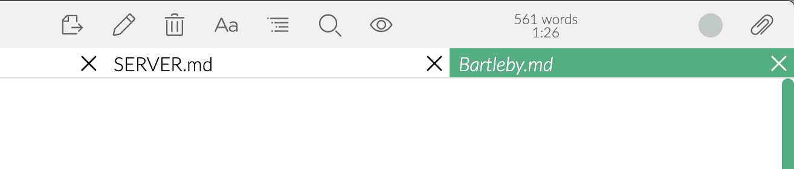

# Onglets de documents

Zettlr permet d'ouvrir plusieurs documents en même temps dans des onglets.

Ces onglets fonctionnent de façon similaire à ceux d'autres programmes, mais certaines de leurs fonctionalités diffèrents des onglets de navigateur par exemple.

Tous les onglets sont restaurés lorsque vous ouvrez à nouveau Zettlr.

## Éphémérité

Il y a deux types d'onglets : les « normaux », où le nom de fichier apparaît avec un style standard, et les onglets dits « éphémères », où le nom de fichier est écrit en italique.
Un onglet éphémère devient normal si le fichier qu'il contient est modifié.

Si l'onglet actif est éphémère, l'ouverture d'un nouveau document ne se passera pas dans un nouvel onglet, mais remplacera le document affiché dans cet onglet.
Au contraire, si l'onglet actif n'est pas éphémère, le nouveau document sera ouvert dans un nouvel onglet.

Les onglets éphémères sont utiles pour rapidement parcourir plusieurs documents, qui se remplaceront successissement à moins que vous n'en modifiez un.
