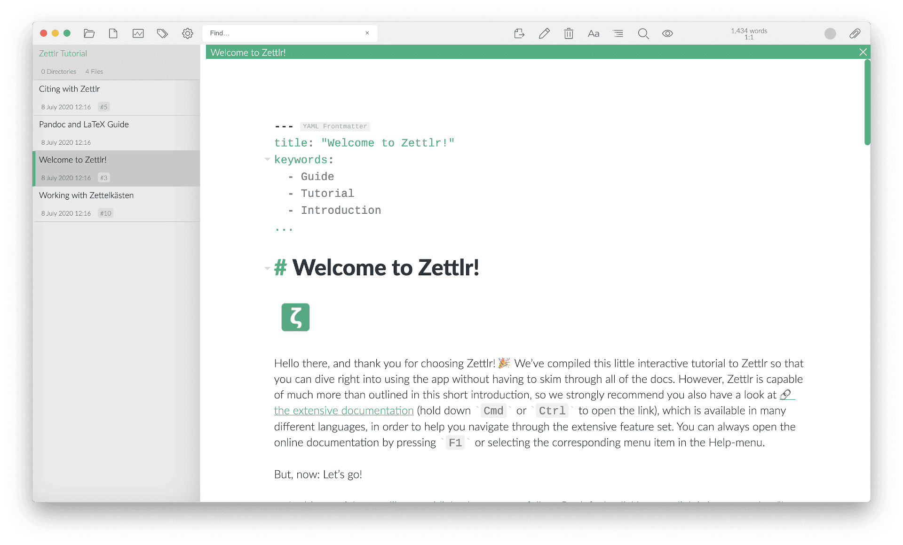

# Démarrage rapide

Après avoir configuré Zettlr, vous souhaiterez probablement commencer tout de suite. Au premier démarrage, Zettlr copiera un répertoire spécial dans votre dossier Documents qui contient un didacticiel interactif très utile qui vous guidera lors de vos premiers pas avec l'application. Suivez simplement les instructions; il vous dirigera même vers des sections spécifiques de cette documentation où vous pourrez en savoir plus sur l'application !

Si vous avez des questions qui ne semblent pas trouver de réponse dans cette documentation, assurez-vous de consulter les [Foire Aux Questions](faq.md) et demandez à la communauté sur [Reddit](https://www.reddit.com/r/Zettlr/) et le [forum](https://forum.zettlr.com/)! Nous proposons également une [chaîne YouTube](https://www.youtube.com/c/Zettlr/) où nous mettons parfois en ligne des vidéos expliquant comment utiliser l'application et les outils associés.

Vous pouvez visionner une série de vidéos de présentation en suivant [ce lien vers notre playlist Zettlr contenant les guides](https://www.youtube.com/playlist?list=PL2ydvDwV-1u5ncnkxQWZhbHQdwpY2fx5f).

> Le tutoriel interactif vous proposera d'installer Pandoc et LaTeX sur votre ordinateur. Zettlr dépend de ces programmes pour importer et exporter des fichiers. Sans Pandoc, vous ne pourrez exporter que des documents HTML et l'importation est désactivée. Sans LaTeX, vous ne pourrez pas exporter de fichiers PDF. Mais si vous n'avez pas l'intention d'importer ou d'exporter quoi que ce soit, vous n'en avez pas besoin - ils peuvent être installés à tout moment, si vous changez d'avis.

Toutes les fonctionnalités utilisées dans ce didacticiel sont décrites dans la documentation, donc si vous souhaitez en savoir plus sur elles, recherchez simplement la fonctionnalité ici. Il est recommandé de suivre le tutoriel lors de votre premier démarrage de l'application pour vous habituer à différents concepts tels que la barre latérale, l'arborescence des fichiers, les liens internes et les onglets de documents.

Une fois que vous avez terminé le didacticiel, vous pouvez soit fermer le répertoire pour le décharger de l'application, soit le supprimer complètement et vous pouvez ouvrir un autre dossier avec lequel travailler.
