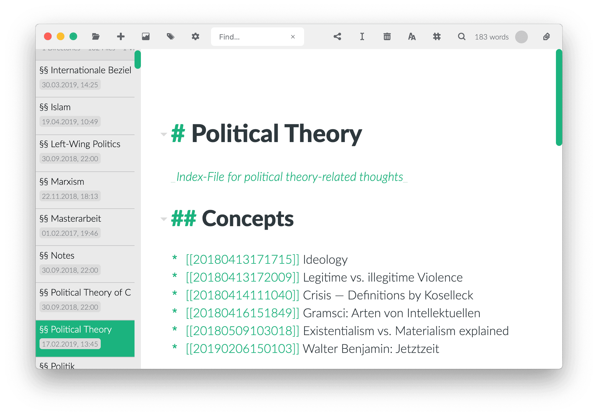

# Guide : Zettlr comme Zettelkasten

Zettlr peut être utilisé comme un système Zettelkasten sophistiqué mettant en œuvre de nombreuses fonctionnalités pour organiser et structurer vos fichiers. Pour commencer à créer votre propre Zettelkasten, suivez les étapes suivantes.

> Grâce à ce guide, vous pouvez configurer Zettlr pour remplacer des applications telles que nvALT, zkn ou The Archive.

**Le concept de Zettelkasten est-il nouveau pour vous ? Alors nous vous recommandons de  [lire notre article sur le fonctionnement d'un Zettelkasten réussi](https://www.zettlr.com/post/what-is-a-zettelkasten) and [et [regardez notre vidéo d'accompagnement](https://youtu.be/c5Tst3-zcWI)!**

## Étape 1 : Ajustement des paramètres

La première chose que vous souhaitez faire pour créer votre Zettelkasten est de consulter vos préférences. Les paramètres suivants permettent de convertir le Zettlr en un Zettelkasten suralimenté :

- OngletGeneral
    - Activer les informations sur le fichier
    - Barre latérale : Mode fin.
- Onglet Editeur
    - Éteindre tous les dictionnaires
- Onglet Export
    - Désactivez la suppression des identifiants Zettelkasten et choisissez de ne pas toucher aux liens internes
- Onglet Zettelkasten
    - Il s'agit de l'onglet le plus important pour une installation de Zettelkasten, car vous pouvez y régler les paramètres d'interaction entre Zettlr et votre Zettelkasten. Veuillez vous référer à la section sur l'onglet Zettelkasten [dans le chapitre Paramètres ](../reference/settings.md)pour en savoir plus sur ces options.

## Étape 2 : Créer un répertoire

Après avoir configuré les variables de base que Zettlr utilise pour sa fonctionnalité Zettelkasten, il est temps de créer un répertoire. Il est courant de n'avoir qu'un seul grand répertoire dans lequel vous pouvez tout jeter et travailler avec celui-ci, donc un seul répertoire racine devrait suffire. Vous aurez alors une liste énorme de tous vos fichiers à chaque démarrage de l'application et vous pourrez immédiatement commencer à travailler.

Pour ajouter un nouveau répertoire à Zettlr, cliquez sur `Cmd/Ctrl+O`, cliquez sur le premier bouton de la barre d'outils ou faites glisser le répertoire du Finder ou de l'Explorer vers l'application.

## Étape 3 : Écrivez !

Vous allez maintenant utiliser Zettlr comme système de gestion du Zettelkasten. Deux opérations sont importantes dans un Zettelkasten :

1. Création d'un identifiant pour une note, afin de pouvoir établir un lien avec celle-ci : Vous pouvez le faire en appuyant sur `Cmd/Ctrl+L` lors de l'édition de n'importe quelle note, qui collera un identifiant généré à votre note.
2. Lien vers d'autres notes : Insérer l'ouverture du lien (par défaut : `[[`) en cours d'édition pour afficher la liste déroulante d'auto-complétion, dans laquelle vous pouvez choisir une note à lier.

Si vous souhaitez approfondir la question du fonctionnement et de l'apparence d'un Zettelkasten, consultez l'immense quantité de ressources sur les Zettelkästen, disponibles sur le web. Un bon point de départ est [Zettelkasten.de](https://www.zettelkasten.de/). Les auteurs ont rassemblé une longue liste d'articles de blog (en anglais) sur la manière d'enrichir vos écrits à l'aide d'un Zettelkasten.
