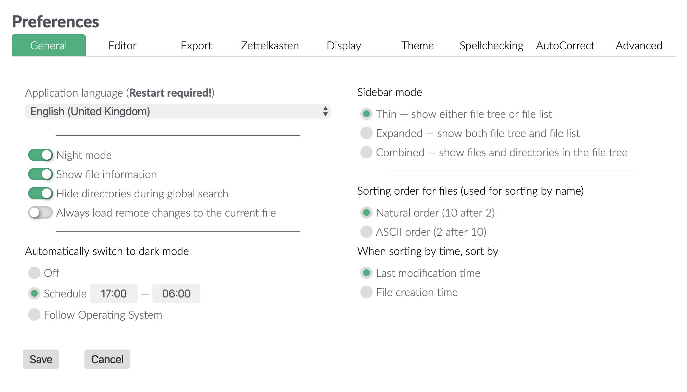
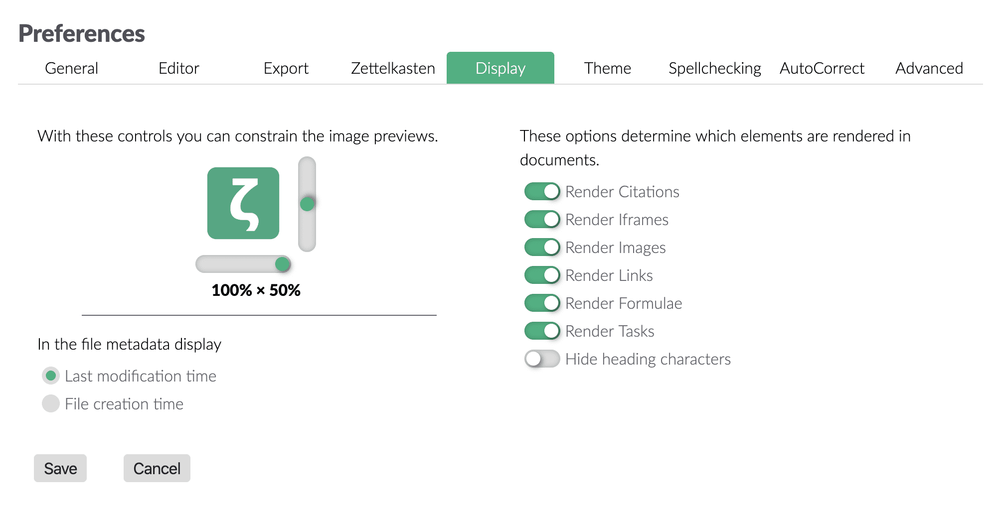
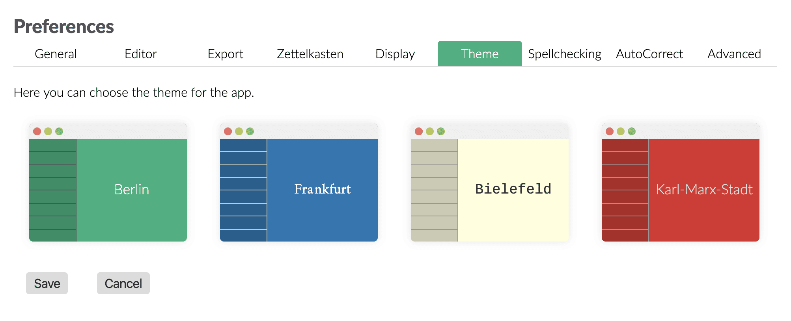
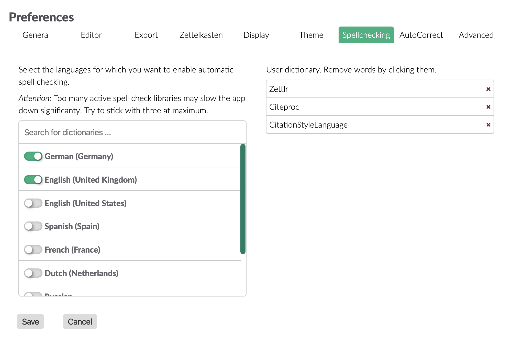

# Paramétrage

Zettlr vous offre une pléthore d'options pour personnaliser votre expérience avec l'application. Elle est livrée avec trois boîtes de dialogue de paramétrage dont l'une  est le [gestionnaire d'assets expliqué ailleurs](../core/assets-manager.md), une boîte de dialogue de préférences générales et un gestionnaire de balises.

## Préférences générales

Vous pouvez afficher le dialogue des préférences générales en utilisant soit le raccourci `Cmd/Ctrl+, `, le bouton de la barre d'outils (le rouage) ou l'élément de menu correspondant. La boîte de dialogue s'affiche alors et vous présente toutes les options de configuration que vous pouvez personnaliser. Elles sont classées en neuf onglets que vous pouvez voir en haut de la boîte de dialogue.

* [Général](#general) : Ces options affectent Zettlr dans son ensemble.
* [Editeur](#editeur) : Ces paramètres ne concernent que l'éditeur lui-même.
* [Export](#export) : Contrôlez la façon dont vos fichiers sont exportés dans cet onglet.
* [Zettelkasten](#zettelkasten) : Adaptez Zettlr pour qu'il corresponde à votre système Zettelkasten.
* [Affichage](#affichage) : Contrôlez la façon dont l'éditeur affiche certains éléments, tels que les images ou les liens.
* [Thème](#theme) : Sélectionnez le thème de l'application ici.
* Vérification de l'orthographe : Trouvez les dictionnaires installés et votre dictionnaire utilisateur ici.
* [AutoCorrection](#verification-orthographique) : Choisissez le texte à remplacer et déterminez également les citations que vous souhaitez utiliser.
* [Avancé](#autocorrection) : Options pour les utilisateurs expérimentés.

### Général

Dans l'onglet général, vous trouverez des options que vous voudrez peut-être ajuster si vous commencez à utiliser Zettlr pour l'adapter à vos besoins.

* **Langue de l'application**: Définit la langue dans laquelle l'application sera affichée. Sont affichées les langues qui ont un nombre suffisant de traductions complètes. Vos modifications sont appliquées après un redémarrage.
* **Mode Sombre**: Whether the application is set to dark mode. Can also be triggered using `Cmd/Ctrl+Alt+L` and via automatic scheduling.
* **Propriétés du fichier**: Controls whether the file *list* (available in thin and expanded file manager modes) shows some meta information about your files, such as tags, or writing targets.
* **toujours actualiser le fichier en cours**: Si cette case est cochée, Zettlr rechargera automatiquement toutes les modifications à distance apportées à vos fichiers. Si décoché, il vous sera demandé pour chaque fichier.
* **Avoid opening files in new tabs if possible**: By default, Zettlr will open each file in its own tab. Selecting this will prompt Zettlr to exchange the currently active file in some circumstances.
* **Basculer automatiquement en mode sombre **:
    * **Arrêt**: Zettlr will never change the dark mode setting automatically.
    * **Horaires**: Zettlr will switch to and from dark mode at the times specified in Start/End dark mode at ….
    * **Utiliser l'horloge système**: Align the visual display at your operating system's dark mode setting (not available on Linux).
* **Start dark mode at**: Specifies a time (format: HH:MM) at which Zettlr will once automatically switch from light mode to dark mode if applicable.
* **End dark mode at**: Specifies a time (format: HH:MM) at which Zettlr will once automatically switch from dark mode to light mode if applicable.
* **File manager mode**:
    * **Thin**: Shows your directories and files separately. Select a directory to have its contents displayed in the file list. Switch between file list and directory tree by clicking on directories or the arrow button which appears at the top left corner of the file list.
    * **Expanded**: Shows your directories and files separately, but both at the same time. Select a directory to have its contents displayed in the file list.
    * **Combined**: Shows your directories and files in the same file tree. The file list is not available in this mode.
* **Display files using**:
    * **Filename only**: Always display just the filename of each file, never a title or heading level 1.
    * **Title if applicable**: Display the YAML frontmatter title of your files, if applicable. Otherwise, fall back to the filename.
    * **First heading level 1 if applicable**: Display the first heading level 1 of your files, if applicable. Otherwise, fall back to the filename.
    * **Title or first heading level 1 if applicable**: Display a YAML frontmatter title if applicable. Fall back to the first heading level 1 if applicable. If none are available, fall back to the filename.
* **Display Markdown file extensions**: By default, Zettlr hides the file extensions of known Markdown files (e.g., `*.txt`, `*.md`, `*.markdown`). With this setting you can command Zettlr to display them.
* **Sorting order for files (used for sorting by name)**:
    * **Natural order (10 after 2)**: This setting will sort your files logical, such that a number 10 would follow after a 2, even though the 2 has no preceeding 0.
    * **ASCII order (2 after 10)**: This setting sorts your file character by character, meaning that a 2 follows after a 1. To sort the 2 before the 10, prepend it with a leading zero.
* **Show folders above files**: By default Zettlr first displays your files, and only then the folders. Activating this setting will first display folders. Requires a restart to apply.
* **When sorting by time, sort by**:
    * **Last modification time**: The time at which you modified some file.
    * **File creation time**: Sort the files by the times at which you created them.
* **In the file metadata display**:
    * **Last modification time**: Display the last time you modified a file in appropriate places (e.g. the meta information in the file list).
    * **File creation time**: Display the file's creation time in appropriate places.

### Éditeur

L'onglet éditeur contrôle la plupart des fonctionnalités de l'éditeur. Comme le Markdown permet de mettre le texte en gras et en italique avec des astérisques et tirets bas (_), vous pouvez choisir ici votre préférence. Le **chemin d'image par défaut** est un chemin que vous pouvez utiliser pour indiquer à Zettlr où il doit placer vos images lorsque vous les collez à partir du presse-papiers. Il peut être absolu ou relatif. Si vous fournissez le nom `assets`, Zettlr mettra les images par défaut dans le sous-répertoire `assets` du répertoire où se trouve votre fichier. Vous pouvez même lui dire d'utiliser un répertoire relatif au répertoire parent, par exemple `../assets`. Rappelez-vous que vous pouvez toujours sélectionner le répertoire d'une image au cas par cas.

L'indentation fait référence à la quantité d'espaces insérés lorsque vous, par exemple, augmentez le niveau des listes.

L'algorithme pour le mode de lisibilité que Zettlr doit utiliser lorsque vous basculez le mode de lisibilité. Pour une brève explication des différents algorithmes disponibles, veuillez consulter [notre documentation sur le mode de lisibilité](https://www.zettlr.com/readability).

De plus, vous pouvez **muter les lignes non focalisées** pendant que vous êtes en mode sans distraction. Cela signifie que Zettlr atténue toutes les lignes sauf celle où se trouve votre curseur. L'option suivante vous permet de **fermer automatiquement certaines paires de caractères**.

La troisième option ne s'applique qu'aux utilisateurs utilisant un clavier doté des touches `Home` et `End`. Si vous les appuyez, le comportement par défaut de CodeMirror est de déplacer le curseur au début ou à la fin respectivement d'un paragraphe entier (c'est-à-dire : le début et la fin d'une ligne _logique_). Si vous souhaitez que le CodeMirror ne se déplace qu'au début et à la fin de la ligne _visible_, assurez-vous de désactiver cette option. Si vous utilisez la fonction d'habillage rigide de Markdown, et que vous habillez toujours manuellement un paragraphe, ce paramètre n'aura aucun effet pour vous.

### Export

L'onglet d'exportation vous permet de régler toutes les préférences concernant la façon dont vos fichiers sont exportés. À gauche, vous avez des options concernant la fonctionnalité Zettelkasten.

En sélectionnant "Supprimer les ID ZKN des fichiers", Zettlr supprime tous les ID qu'il trouve dans vos fichiers avant l'exportation. "Supprimer les tags des fichiers" fait la même chose mais avec des tags.

> Nous vous recommandons de ne pas désactiver l'option permettant de supprimer les identifiants Zettelkasten de vos fichiers, sauf si vous savez ce que vous faites. Certains sites web produisent des liens qui contiennent 14 chiffres consécutifs, et Zettlr ne fera que parcourir les fichiers en supprimant tout ce que l'expression régulière de votre ID détectera, ce qui pourrait casser les liens !

En dessous de ces options, vous pouvez choisir ce que vous voulez faire des liens internes (par défaut, ils sont encapsulés dans des `[[` et `]]`). La première option les supprime complètement, la seconde ne supprime que le formatage du lien, tandis que la dernière option les laisse seuls.

Sur le côté droit, vous avez des options plus générales pour l'exportation. Vous pouvez choisir d'exporter vos fichiers dans le répertoire temporaire. Cette option est recommandée, car elle vous permet de laisser les fichiers tranquilles, car ils seront automatiquement supprimés. La deuxième option permet de stocker les fichiers convertis dans le répertoire courant, en écrasant les fichiers existants sans demander. Utilisez cette option si vous avez besoin que les fichiers soient présents dans la barre latérale des pièces jointes.

Le champ de la base de données CSL JSON peut être utilisé pour ouvrir une base de données bibliographiques. Zettlr lira dans le fichier et activera le rendu des citations dans vos fichiers. Le style CSL vous permet d'écraser le style de citation par défaut (APA). Vous pouvez utiliser n'importe quel fichier présent dans le [Zotero style repository](https://www.zotero.org/styles).

> Les options de citation peuvent être écrasées pour chaque projet dans les paramètres du projet correspondant.

### Zettelkasten

Dans cet onglet, vous pouvez personnaliser la façon dont le Zettlr fonctionne avec votre système Zettelkasten existant. Dans la plupart des cas, vous n'aurez pas besoin de toucher à ces options, sauf si vous souhaitez utiliser un système personnalisé.

Vous disposez de quatre options qui sont importantes pour Zettelkästen : l'expression régulière d'ID, le début et la fin du lien, et le modèle de générateur.

#### The ID RegEx

Zettlr utilise des expressions régulières en interne pour filtrer l'ID d'un fichier. Il recherche ce modèle, et s'il trouve une chaîne qui correspond à ce modèle, il la considère comme l'ID du fichier. **Veuillez noter que la première correspondance dans un fichier sera considérée comme l'ID, jamais la dernière !** Si vous choisissez de n'utiliser que quatre chiffres comme ID, l'expression régulière correspondra également aux années dans votre fichier. Comme Zettlr prend simplement la première ID, assurez-vous que la toute première chose dans votre fichier est l'ID de ce fichier.

L'expression régulière par défaut (que vous pouvez restaurer en appuyant sur le bouton de réinitialisation à côté du champ de texte) est `(\d{14})`. Cela signifie que Zettlr cherchera 14 chiffres consécutifs -- exactement le nombre de chiffres que vous obtenez lorsque vous concaténez une année, un mois, un jour, une heure, une minute et une seconde ; comme ceci : 20181012143724. Il est extrêmement peu probable qu'un fichier contienne une deuxième chaîne de caractères comprenant quatorze ( !) chiffres, c'est donc une excellente méthode d'identification. Autre avantage, l'ID est unique à la seconde. Vous pouvez donc créer à chaque seconde un nouvel identifiant totalement unique.

Les parenthèses autour du `\d{14}` créent ce qu'on appelle un "groupe de capture". Le but d'un groupe de capture est que l'expression régulière ne corresponde pas seulement à une certaine chaîne, mais en extrait aussi une partie - dans ce cas la correspondance complète. De cette façon, vous pouvez utiliser presque toutes les structures d'ID que vous souhaitez.

> Notez que vous pouvez omettre les accolades du groupe de capture. Zettlr encapsulera votre RegEx en interne, s'il n'y a pas de groupe de capture.

#### Les liens internes

Les liens internes sont expliqués assez rapidement : il suffit de choisir comment vous souhaitez écrire les liens internes. Les liens par défaut sont de type Wiki : [[your-link]]. Vous pouvez également utiliser des accolades : {{votre-lien}}. Ou vous pouvez utiliser des points d'exclamation : !your-link ! Tout ce que vous voulez !

Les liens internes sont utilisés pour deux choses : premièrement, s'ils contiennent un nom de fichier existant ou un identifiant existant, le fait de les cliquer ouvrira directement le fichier correspondant (identifié soit par son nom sans l'extension, soit par son identifiant). Deuxièmement, s'ils ne contiennent rien de tout cela, ils n'ouvriront aucun fichier, mais ils fonctionneront comme une fonction de recherche, donc `ALT`-cliquer sur eux lancera une recherche - c'est génial pour sauvegarder les recherches que vous faites souvent !

> Notez que les fichiers ne supposent aucun lien comme identification. Si un fichier trouve une ID qui est entourée par le formatage interne du lien, il n'utilisera pas cette ID.

#### Le générateur d'ID

Le dernier champ de l'onglet Zettelkasten dans la fenêtre des préférences concerne la manière dont les identifiants sont générés. Il s'agit d'une simple chaîne de caractères qui peut contenir des variables qui sont remplacées lorsqu'un ID est généré. Actuellement, vous disposez de l'année, du mois, du jour, de l'heure, de la minute et de la seconde en cours. Le modèle par défaut du générateur d'ID est : `%Y%M%D%h%m%s`, ce qui signifie qu'il remplacera `%Y` par l'année en cours (4 chiffres), `%M` par le mois en cours (avec des zéros de tête), et ainsi de suite. Vous pouvez également inclure une partie statique dans vos identifiants, si vous le souhaitez. Ainsi, avec le modèle d'identification défini à `%Y-%M-%D_%h:%m:%s` Zettlr générerait une identification comme celle-ci : `2018-10-12_12:03:56`. Vous pouvez également réutiliser les variables de votre modèle, par exemple pour n'utiliser que les secondes comme ID. Vous pourriez utiliser quelque chose comme ceci : et vous obtiendriez `565656`.

N'oubliez pas d'adapter votre expression régulière pour qu'elle corresponde à ce que le générateur d'ID crache. Pour réussir à identifier l'ID avec le modèle, `%Y-%M-%D_%h:%m:%s`, Zettlr aurait besoin de l'expression régulière suivante : `(\d{4}-\d{2}-\d{2}_\d{2}:\d{2}:\d{2})`. Si vous utilisez `%uuid4`, vous pouvez utiliser le RegEx suivant : `[a-fA-F0-9]{8}-[a-fA-F0-9]{4}-4[a-fA-F0-9]{3}-[89aAbB][a-fA-F0-9]{3}-[a-fA-F0-9]{12}`.

Vous pouvez tester à la fois la génération des identifiants et leur détection en cliquant sur le bouton "Test" situé sous les champs de texte. Zettlr générera alors une ID et essaiera immédiatement de la faire correspondre en utilisant votre expression régulière personnalisée. Si Zettlr a pu ou non détecter l'ID sera indiqué.

### Affichage

Cet onglet contrôle la façon dont l'éditeur affiche certains éléments. Zettlr utilise une approche de semi-prévisualisation de Markdown et ne rend que certains éléments. Dans cet onglet, vous pouvez contrôler quels éléments seront rendus.

> Le paramètre iFrame définit si les iFrames doivent être rendues ou non (par exemple, les vidéos YouTube sont des iFrames intégrées).

De plus, vous pouvez limiter la taille des images, ce qui est particulièrement avantageux si vous utilisez beaucoup d'images orientées portrait. Le curseur horizontal contrôle la quantité maximale de largeur que les images peuvent occuper. Si vous le réglez à 50 %, par exemple, les images resteront à la moitié de la largeur du corps du texte. 100 % désactive cette fonction (les images ne seront jamais plus larges que 100 % de la largeur du corps du texte).

Le curseur vertical contrôle la hauteur maximale des images par rapport à la taille de la fenêtre. 50 % signifie que les images ne seront jamais plus hautes que la moitié de la taille totale de la fenêtre. 100 pour cent désactive ce comportement. Contrairement à la largeur, les images peuvent très bien dépasser 100 pour cent de la fenêtre si elles sont grandes et fines.

Enfin, vous pouvez déterminer la date que vous souhaitez voir figurer dans les métadonnées du fichier dans la liste des fichiers. Cela n'affecte pas le tri, si vous souhaitez trier par date. Pour modifier l'heure après laquelle Zettlr doit trier vos fichiers, veuillez vous référer à l'onglet général.

### Thème

Cet onglet devrait s'expliquer de lui-même : cliquez sur l'un des aperçus pour faire passer votre application à ce thème.

### Vérification orthographique

Avec l'introduction du dictionnaire utilisateur, la fonctionnalité de vérification orthographique a été déplacée vers son onglet dédié. La liste de gauche contient tous les dictionnaires disponibles qui peuvent être utilisés pour la vérification orthographique. Il vous suffit de sélectionner ceux que vous souhaitez utiliser. Vous pouvez utiliser plusieurs dictionnaires pour vérifier des textes bilingues. Filtrez la liste en utilisant la boîte de recherche en haut de la liste.

> **Astuce** : Pour désactiver la vérification orthographique, décochez tous les dictionnaires. Pour installer des dictionnaires supplémentaires, consultez le [manuel de localisation](../core/localisation.md).

Enfin, la liste située à droite de l'onglet affiche tous les mots que vous avez ajoutés à votre dictionnaire personnalisé. Cliquez dessus pour les supprimer de votre dictionnaire utilisateur.

### AutoCorrection

Cet onglet contrôle les fonctions d'auto-correction que vous pouvez utiliser à partir de la version 1.5 et que vous connaissez peut-être déjà dans LibreOffice ou Word. Vous pouvez choisir de le désactiver complètement et la saveur que vous souhaitez. La principale différence entre les deux styles est que Word est beaucoup plus rapide à remplacer ; il remplace lorsque vous tapez le dernier caractère, alors que LibreOffice ne remplace que lorsque vous appuyez sur Espace ou Retour. LibreOffice est moins harcelant, mais si vous êtes parfaitement habitué à Word, vous trouverez peut-être ce mode plus facile.

Les "Magic Quotes" font exactement référence à cela : les citations primaires et secondaires que vous souhaitez utiliser à la place des citations ASCII génériques (`"`et `'`). Nous avons inclus beaucoup de paires utilisées dans le monde entier. Si vous souhaitez désactiver cette fonctionnalité, choisissez la **première** option (les guillemets ASCII) dans les deux menus déroulants.

The last thing you can tweak is the replacement table to the right: These are simply characters you would like to replace with different ones. We’ve included a comprehensive list with most commonly needed tokens, so feel free to have a look around and also add or remove some!

### Avancé

L'onglet avancé contient des options utiles pour les utilisateurs avancés.

Le "modèle pour les nouveaux noms de fichiers" est ce à quoi le champ de texte ressemblera lorsque vous créerez un nouveau fichier. Il sera prérempli par ce que vous tapez ici. Vous pouvez utiliser les variables ci-dessous (l'ID suivant le modèle que vous avez sélectionné dans l'onglet Zettelkasten, année, mois, jour, heure, minute et seconde). Si vous cochez la case, Zettlr ne vous demandera même pas de nom de fichier lorsque vous créerez un nouveau fichier, ce qui pourrait accélérer votre travail.

Les champs **texte pandoc et xelatex** sont utilisés au cas où Zettlr ne parviendrait pas à localiser l'un de ces deux programmes. Comme vous le savez, Zettlr utilise les deux pour exporter vos fichiers. Dans de rares cas, il se peut que Zettlr ne puisse pas les trouver, bien que vous les ayez installés correctement. Si cela se produit, il suffit d'entrer le **chemin complet et absolu** des deux programmes dans les champs de texte pour aider Zettlr à les trouver.

L'option **debug** est utilisée pour contrôler si vous pouvez ou non "recharger" l'interface utilisateur graphique (GUI) en appuyant sur `F5` et afficher les outils de développement Chrome pour inspecter ce que fait l'application. Naturellement, vous voudriez faire cela en tant que développeur.

Vous pouvez également aider Zettlr en **s'abonnant aux versions bêta**. Si vous cochez cette option, Zettlr vous informera également des nouvelles versions bêta. Vous pouvez alors décider d'utiliser la version bêta ou non. Activez le **support des fichiers R-Markdown** pour permettre la détection des fichiers `.rmd` utilisés pour R-Markdown. Il est inactif par défaut, car certains autres programmes (par exemple, d'Adobe) utilisent également cette extension pour stocker des données binaires, ce qui poserait des problèmes.

La zone de texte à droite contrôle les fichiers qui seront affichés dans la barre latérale **pièce jointe**. Il s'agit simplement d'une liste, séparée par des virgules, de toutes les extensions de fichiers que vous souhaitez avoir à votre disposition. La liste initiale devrait contenir la plupart des extensions que vous pourriez utiliser.

La **commande Pandoc** vous donne un contrôle total sur le moteur d'exportation. La commande qui s'y trouve sera exécutée à l'exportation. Vous avez quelques variables à votre disposition pour personnaliser votre exportation :

- `$infile$`: Le chemin complet et absolu vers le fichier qui va être exporté.
- `$outfile$`: Le chemin d'accès complet et absolu au fichier résultant (y compris l'extension correcte).
- `$citeproc$`: Contient des directives pour le moteur `pandoc-citeproc`.
- `$format$`: Contient le format (par exemple `html` ou `docx`).
- `$outflag$`: Le code de formatage pour le pandoc (par exemple `-t docx`).
- `$standalone$`: C'est `-s` au cas où le fichier doit être exporté de manière autonome.
- `$toc$`: Selon qu'une table des matières sera générée ou non.
- `$tocdepth$`: Un code indiquant le niveau jusqu'auquel une table des matières doit être générée.
- `$tpl$`: Une directive de modèle pour le pandoc.

> **Attention** : nombre de ces variables sont adaptées aux besoins de pandoc. Bien sûr, vous pouvez complètement changer de programme en remplaçant `pandoc` par le nom du moteur d'exportation de votre choix, mais attention, il faudra savoir comment analyser les drapeaux pandoc.

## Préférences PDF

Nous avons déplacé les préférences PDF vers une autre boîte de dialogue, car vous pouvez en utiliser un grand nombre. Ces options contrôlent la façon dont le moteur LaTeX rendra vos fichiers lors de l'exportation au format PDF. Elles n'ont aucun effet sur tous les autres formats d'exportation. Vous pouvez ouvrir la boîte de dialogue en utilisant soit son raccourci `Cmd/Ctrl+Alt+`, soit l'entrée de menu correspondante. Les options du PDF sont également divisées en onglets. Actuellement, il y en a trois :

* Métadonnées : Ceci contrôle le champ de métadonnées des fichiers PDF.
* Page : Ajustez la mise en forme des pages à l'aide de cet onglet.
* Police : Toutes les options concernant la police utilisée dans vos exportations sont rassemblées dans cet onglet.

### Metadonnées

Ces données peuvent être affichées dans vos lecteurs de PDF grâce à un élément de menu dédié. Normalement, elles ne sont pas visibles, mais dans certaines circonstances, elles sont utilisées. La seule chose dont il faut se préoccuper réellement est le champ de l'auteur, qui est pré-rempli par l'information "Generated by Zettlr". Vous pouvez le modifier pour y ajouter votre propre nom (ou le nom de votre entreprise). Les mots-clés et le champ "topic" sont rarement utilisés.

### Page

Dans cet onglet, vous pouvez contrôler la mise en forme de la page. Ces options fonctionnent exactement comme vous pouvez vous y attendre avec les dialogues similaires utilisés dans LibreOffice ou Microsoft Office. Vous pouvez modifier la taille du papier, ajuster les marges autour du contenu et indiquer à Zettlr si vous souhaitez ou non utiliser des numéros de page (et quel système de numérotation vous souhaitez utiliser).

### Police de caractère

Vous pouvez ici contrôler la façon dont la police est affichée. La police principale est la police utilisée pour tout le texte. Le moteur LaTeX la récupère directement, de sorte que le nom que vous saisissez ici doit correspondre exactement à une police installée sur votre ordinateur. **Si le moteur LaTeX ne parvient pas à trouver la police, une erreur se produira. Pour savoir si vous avez rencontré une telle erreur ou une autre erreur qui n'est pas liée à la police, il suffit de rechercher le nom de la police que vous avez tapé ici dans le message d'erreur. Si le nom de votre police apparaît, il y a de fortes chances que la police soit appelée différemment. Veuillez alors ouvrir les préférences de votre système d'exploitation pour la police et vérifier le nom.**

La taille de la police devrait être assez évidente. La hauteur de ligne précise l'espacement entre les lignes (cela ne s'applique qu'aux paragraphes). Par exemple, une hauteur de ligne de 150 % créera un espace d'une demi-ligne entre les lignes (c'est-à-dire que chaque ligne est suivie d'un espace de 50 % d'une hauteur de ligne normale avant que la ligne suivante ne commence).

## Gestion des balises / mots-clés

 

Le dialogue des balises (_mots clés_) n'a pas de raccourci associé, vous devrez donc l'appeler en utilisant l'élément de menu correspondant. Ici, vous pouvez attribuer des couleurs et des descriptions aux balises.

Pour ajouter une nouvelle relation tag-couleur, il suffit d'appuyer sur le bouton `+` en bas de la boîte de dialogue. Dans le premier champ, entrez votre balise sans le symbole de hashtag précédent (par exemple, si vous voulez attribuer une couleur au hashtag `#todo`, entrez simplement `todo`. Ensuite, choisissez une couleur à attribuer à cette balise. Si vous cliquez sur la deuxième barre après le champ du nom du hashtag, un sélecteur de couleur devrait apparaître qui vous permet de choisir une couleur. Dans le troisième champ, vous pouvez entrer une courte description pour ce tag. Cette description s'affichera si vous survolez les symboles du tag dans la liste des fichiers.

Si vous souhaitez supprimer une association de couleur de balise, il suffit de cliquer sur le bouton `-` à la fin d'une telle balise (jeu de mots voulu ?!).
