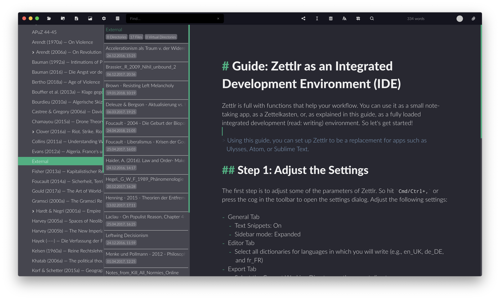

# Zettler como IDE (entorno de desarrollo integrado)

Zettlr está lleno de funciones que ayudan a tu flujo de trabajo. Puedes utilizarlo como una pequeña aplicación para tomar notas, como un Zettelkasten (fichero), o, como se explica en esta guía, como un entorno de desarrollo integrado completamente cargado (es decir, como un entorno de escritura). Así que vamos a empezar!

> Utilizando esta guía, puedes configurar Zettlr para que sustituya a aplicaciones como Ulysses, Atom o Sublime Text.

# Paso 1 : Ajustar las preferencias

El primer paso es ajustar algunos de los parámetros de Zettlr. Por lo tanto, pulsa `Cmd/Ctrl+,` o pulsa el piñón en la barra de herramientas para abrir el diálogo de configuración. Ajusta los siguientes ajustes:

- Pestaña General
    - Fragmentos de texto: activado
    - Modo de barra lateral: Expandido
- Pestaña Editor
    - Selecciona todos los diccionarios para los idiomas en los que vas a escribir (por ejemplo, en-UK, de-DE y es-ES).
- Pestaña Exportar
    - Selecciona el directorio de trabajo actual como directorio de exportación
    - Eliminar los ID de ZKN (fichero): activado
    - Eliminar etiquetas: activado
    - Quitar completamente los enlaces internos
- Pestaña Zettelkasten
    - Ajusta los ajustes según la guía Zettelkasten
- Pestaña Adjuntos
    - Introduce todas las extensiones de los archivos que probablemente vas a utilizar. De esta manera todos estos archivos se mostrarán en la barra de adjuntos a la derecha de la aplicación.

Cuando termines de configurar Zettlr, pulsa "Guardar". Ahora Zettlr debería parecer un autentico IDE con tres segmentos (árbol de carpetas, lista de archivos y editor) y todos los ajustes activos.

## Paso 2: ¡Escribe!

Esta guía es bastante corta, porque sólo muestra cómo puedes configurar Zettlr para crear un IDE completamente cargado. Lo que estés haciendo luego con él depende completamente de ti. Un buen punto de partida es leer las dos guías sobre Zettelkästen (fichero) y la toma de notas, ya que es probable que utilizas algunos de los conceptos de estas guías.

Aquí están todos los recursos que pueden ser interesantes para ti:

- Guía: [Zettlr como Zettelkasten (fichero)](guide-zettelkasten-es.md)
- Guía: [Zettlr como aplicación para tomar notas](guide-notes-es.md)
- [Proyectos en Zettlr](../académico/proyectos-es.md)
- [Directorios virtuales](../core/virtual-directories-es.md)
- [Crear presentaciones con Zettlr](../academic/presentations-es.md)
- [Markdown para Zettlr](../reference/markdown-basics-es.md)
- [Exportar a PDF](../core/export-es.md)
