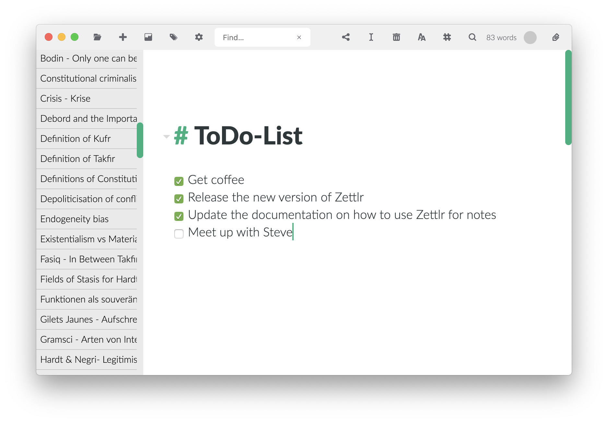

# Guía: Zettlr como app para tomar notas

Quieres usar Zettlr como un medio para tomar notas. Aunque Zettlr tiene muchas más características, está diseñado como una aplicación delgada y mínima, por lo que configurar Zettlr como una aplicación para tomar notas es fácil. Esta guía te muestra la configuración recomendada y cómo tomar notas.

> Usando esta guía, puedes configurar Zettlr para que sustituya a aplicaciones como OneNote, Evernote o nvALT.

## Paso 1: Configurar Zettlr para que parezca lo más minimalista posible.

Primero, dirígete a la pestaña de configuración (pulsa `Cmd/Ctrl+,` o haz clic en el piñón en la barra de herramientas). En las opciones, asegúrate de configurar las opciones de acuerdo con esta lista:

- Pestaña General
    - Metadatos de archivos: desactivado
    - Barra lateral: Delgada
- Pestaña Editor
    - Diccionarios: Selecciona ninguno (ralentizan el inicio de la aplicación y no son necesarios para notas simples)
    - Reducción brillo de lineas: desactivado

Los otros ajustes no son necesarios para una aplicación de toma de notas y por lo tanto pueden ser ignorados.

## Paso 2: Crear una carpeta para tus notas

Ahora es el momento de crear una carpeta para tus notas. Lo ideal sería colocarla dentro de una carpeta sincronizada con la cloud (nube) para que puedas acceder a ella en cualquier lugar, no sólo en tu ordenador actual. El nombre de esta carpeta depende totalmente de ti, pero "Notas" puede ser un buen comienzo. Si quieres usar diferentes categorías para las notas, puedes crear carpetas raíz adicionales y mantenerlas abiertas. De esta manera, puedes nombrar tus categorías de acuerdo a lo que guardas en ellas:

- Estudiantes: "Universidad", "Conferencias", "Privado"
- Maestros: "Escuela"/"Universidad", "Cursos"
- Investigador: "Universidad", "Investigación", "Mi proyecto de investigación".
- Periodista: "Tema 1", "Tema 2", "Tema 3", "Conferencias de prensa"
- Escritor: "Mi novela", "Pensamientos e ideas", "Personajes".
- Trabajador administrativo: "Lista tareas para hacer", "Reuniones"
- etc. …

Elige las carpetas utilizando las categorías que necesites personalmente. No olvides que siempre puedes reorganizar esto y arrastrar los archivos si tu flujo de trabajo cambia. La ventaja de usar diferentes carpetas _root_ (raíz) es que cada carpeta es independiente de las demás. De este modo, siempre podrás mantener oculta la lista de directorios y sólo podrás subirla si necesitas cambiar de "libreta de notas".

**Alternativa: En lugar de utilizar varias carpetas raíz, también puedes utilizar el enfoque de sub-carpetas. De esta manera la lista de directorios no parece una colección de categorías, o "libretas", sino que se parece a un directorio real (estoy hablando de cómo _te parece a ti_, ya que los visuales también son un aspecto importante para una escritura eficiente). Pero la ventaja de este enfoque es que no es necesario abrir la lista de directorios, sino que se puede cambiar de "libreta" haciendo clic primero en "ALT" o en "Ctrl" en el "libreta"/carpeta actual y, a continuación, haciendo clic en otra libreta. Zettlr lo usará como el directorio actual en el que puedes almacenar notas.

## Paso 3: Piensa en un sistema para nombrar tus notas

Con el tiempo, tus libretas _se llenarán_ de notas. Cada seminario, cada reunión y cada taller contribuirán a tu libreta. Y si tienes pensamientos repentinos que quieres escribir antes de perderlos, también se recomienda una nueva nota. Entonces, ¿qué hacer para no perder el orden de tu sistema?

Zettlr ofrece varias maneras de ordenar, clasificar y encontrar tus archivos. Si conoces el nombre del archivo, entonces es fácil llegar a él: Simplemente empieza a escribir el nombre del archivo en la barra de búsqueda global. Zettlr autocompletará el nombre por ti. Toma el primer archivo que contiene lo que ya has escrito, así que sigue escribiendo el nombre del archivo hasta que Zettlr autocomplete el archivo correcto. Luego pulsa `Return` y se abrirá el archivo.

Generalmente, se recomienda que tus archivos sigan un cierto sistema. Por ejemplo, si el tiempo es importante en la denominación de tus archivos (por ejemplo, para talleres, congresos o conferencias), es mejor utilizar la fecha en el formato estándar internacional (AAAA-MM-DD, por ejemplo, 2018-10-12) como primera parte de los nombres de los archivos. De esta manera Zettlr ordenará automáticamente los archivos de forma predeterminada (donde un 2 es mayor que un 1, por ejemplo), de modo que los archivos más nuevos se encuentran en la parte inferior por defecto. Para invertir la lista de archivos, simplemente cambia la clasificación de A-Z a Z-A. en la barra lateral a la altura del nombre de la carpeta. Usando este enfoque se hace fácil encontrar notas más antiguas, porque normalmente se recuerda la fecha aproximada en la que ha tenido lugar un taller o una reunión y puede desplazarse por la lista hasta que la encuentre.

Si el tiempo no es importante en la denominación de tus archivos, se necesita otro enfoque. Si guardas archivos de notas para diferentes conceptos, procesos o como algún tipo de manual, puede ser mejor usar categorías como la primera parte del nombre del archivo. Por ejemplo, si tomas notas sobre cómo funciona el software en tu oficina, puede ser bueno clasificarlas por procesos. Entonces, los nombres de los archivos se verían así:

- HowTo hacerlo - Finanzas - Excel
- HowTo hacerlo - Finanzas - Base de datos de la compañía
- HowTo hacerlo - Reuniones - Proyector LCD
- HowTo hacerlo - Reuniones - Conferencia telefónica  

(HowTo:=como hacerlo)

De esta forma podrás encontrar fácilmente lo que buscas buscando primero los archivos que comienzan con "HowTo" y luego desplazarse hasta encontrar el proceso (Finanzas, Reuniones, Pautas de correo, etc.).

Incluso puedes usar una combinación de eso. El resultado final es: Siempre tengas en cuenta que Zettlr ordena por nombre de archivo, así que nombre tus archivos de acuerdo a esto para minimizar la cantidad de tiempo a gastar hasta que encuentres un archivo.

## Paso 4: ¡Escribe!

Ahora que todas tus carpetas están configuradas y tienes una idea general de cómo deberían ser los nombres de tus archivo, puedes crear notas simplemente pulsando `Cmd/Ctrl+N`. Escribe el nombre de tu archivo (no necesitas añadir ninguna extensión de  archivo) y pulsa "Devolver" para crearlo. Se abrirá automáticamente. Zettlr siempre creará los archivos en tu carpeta seleccionada actualmente. Si quieres mover archivos entre carpetas, simplemente arrastra el archivo y suéltalo en la carpeta a la que quieras moverlo.

## Siguiente: Tutorial de Markdown

Ahora puedes estar interesado en saber cómo escribir rápido y eficientemente usando Zettlr. Dirígete a nuestro[Tutorial Markdown](../reference/markdown-basics-es.md)!
