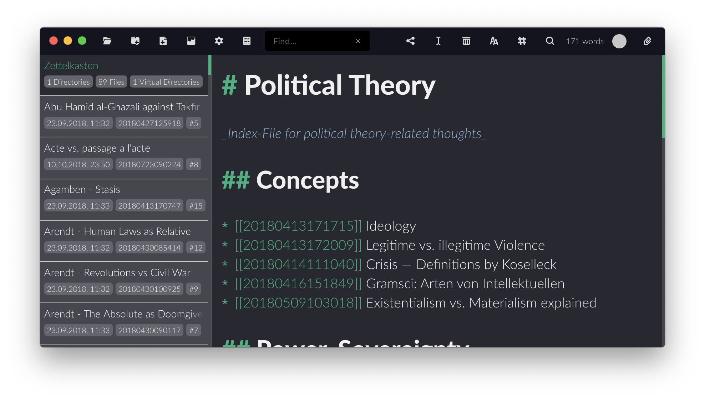

# Zettlr como Zettelkasten (fichero según Luhmann)

Zettlr puede ser utilizado como un sofisticado sistema de Zettelkasten (fichero) que implementa muchas funciones para organizar y estructurar tus archivos. Para empezar a crear tu propio Zettelkasten, sigue los siguientes pasos.

> Con esta guía, puedes configurar Zettlr para que sustituya a aplicaciones como nvALT, zkn o The Archive.

**¿Eres nuevo en el concepto de un Zettelkasten? Entonces te recomendamos que [leas nuestro post sobre cómo funciona un Zettelkasten exitoso](https://www.zettlr.com/post/what-is-a-zettelkasten) y [veas nuestro vídeo acompañante (inglés)](https://youtu.be/c5Tst3-zcWI)!**

# Paso 1 : Ajustar las preferencias

Lo primero que quieres hacer para crear tu Zettelkasten es echar un vistazo a tus preferencias. Los siguientes ajustes convierten a Zettlr en un Zettelkasten sobrealimentado:

- Pestaña General
    - Metadatos de archivo: activado
    - Barra lateral: modo delgado
- Pestaña Editor
    - Apagar todos los diccionarios
- Pestaña Exportar
    - Desactiva la eliminación de los identificadores de Zettelkasten y selecciona mantener intactos los enlaces internos.
- Pestaña Zettelkasten
    - Esta es la pestaña más importante para una instalación de Zettelkasten, porque aquí puedes ajustar la configuración de cómo Zettlr interactúa con tu Zettelkasten. Por favor, consulta la sección de la pestaña Zettelkasten [en el capítulo de ajustes ](../reference/settings-es.md)] para obtener información detallada sobre estas opciones.

## Paso 2: Crear una "libreta de notas" / carpeta / directorio

Después de haber configurado las variables básicas que Zettlr utiliza para su funcionalidad Zettelkasten, es el momento de crear un directorio. Es común tener sólo un gran directorio en el que se puede tirar todo y trabajar con esto, por lo tanto un directorio raíz debería ser suficiente. Entonces tendrás una lista enorme de todos tus archivos siempre cuando arrancas la aplicación y podrás empezar a trabajar inmediatamente.

Para añadir un nuevo directorio a Zettlr, pulsa `Cmd/Ctrl+O`, haz clic en el primer botón de la barra de herramientas o arrastra el directorio desde el Finder o el Explorer (navegador de archivos, `WIN+E`) encima de la aplicación.

## Paso 3: ¡Escribe!

Ahora estarás preparado para usar Zettlr como tu sistema de gestión de Zettelkasten. Si quieres profundizar en cómo debería funcionar un Zettelkasten y cómo debería ser, consulta la inmensa cantidad de recursos sobre Zettelkästen, disponibles en la web. Un buen punto de partida es [Zettelkasten.de (web en inglés)](https://www.zettelkasten.de/). Los autores han recopilado una larga lista de artículos (en inglés) en su blog sobre cómo sobrecargar tu escritura usando un Zettelkasten.
